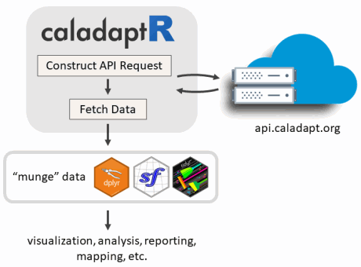
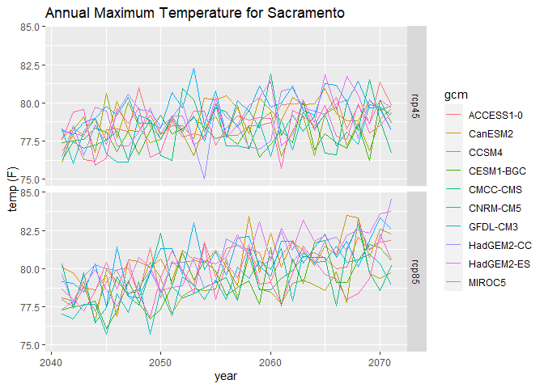

<!-- README.md is generated from README.Rmd. Please edit that file -->

# caladaptR 

<!-- badges: start -->

[](https://www.tidyverse.org/lifecycle/#experimental)
<!-- badges: end -->

See also: <https://ucanr-igis.github.io/caladaptr/>

# Main Features

`caladaptr` is an API client that makes it easier to work with data from
[Cal-Adapt.org](https://cal-adapt.org/) in R. The niche of `caladaptr`
is to bring data into R after which you can other packages to visualize
and analyze:

<p align="center">



</p>

`caladaptr` functions are designed to:

  - be pipe friendly
  - return tibbles for compatibility with tidyverse packages
  - return values with encoded units (managed by the
    [units](https://cran.r-project.org/package=units) package)
  - accept and return `sf` data frames where spatial objects are needed
  - return cropped rasters as
    [`stars`](https://r-spatial.github.io/stars/) objects for
    user-friendly space time manipulation

  

*Development Status*

  - query *any* of Cal-Adapt’s \~850 raster data layers ✔
  - retrieve values by point, a preset area-of-interest (e.g., census
    tract), or a user-provided polygon ✔  
  - cache large queries in a local SQLite database ✔  
  - download cropped rasters by a preset area-of-interest ✔  
  - download cropped rasters by a user-supplied polygon - *coming
    soon*  
  - download full rasters - *not currently planned*  
  - import station data (e.g., sea level rise) - *not currently planned*

*‘Beta’* status means:

1)  the package is still under development  
2)  the package is being updated fairly often  
3)  there’s a possibility that updates will *not* be backward
    compatible  
4)  user feedback and input is extremely welcome\! (please join the
    [caladaptR betaR](#caladaptr-betar-club) club)

# Installation

`caladaptr` is hosted on
[GitHub](https://github.com/ucanr-igis/caladaptr). To install it, you
need the `remotes` (or `devtools`) package. Windows users also need to
have [RTools](https://cran.r-project.org/bin/windows/Rtools/) installed.

``` r
library(remotes)
remotes::install_github("ucanr-igis/caladaptr")
```

# General Workflow

In general, there are three steps to getting data via the Cal-Adapt API:

1)  Create a ‘Cal-Adapt API Request’ object

2)  Feed the API Request object into a function that fetches data
    (either values or cropped rasters)

3)  Wrangle the data that comes back into the format you require

## Example 1: Get Projected Annual Temperature at a Point Location

1)  Create an **API request object** for a point location. Creating an
    API request object like filling in an order form. The request is
    essentially a description of the data you want, but by itself
    doesn’t fetch any data.

To get data from one of the [LOCA downscaled CMIP5 climate projections
from
Scripps](https://berkeley-gif.github.io/caladapt-docs/data-catalog.html),
there are a number of ‘*constructor*’ functions you can mix and match to
create an API request object. Here we’ll grab 30 years of projected
annual maximum temperature for a point location:

``` r
library(caladaptr)
#> caladaptr (version 0.4.4)
#> URL: https://ucanr-igis.github.io/caladaptr
#> Bug reports: https://github.com/ucanr-igis/caladaptr/issues
sac_tasmax_cap <- ca_loc_pt(coords = c(-121.4687, 38.5938)) %>%     ## specify a location
  ca_gcm(c("HadGEM2-ES", "CNRM-CM5", "CanESM2","MIROC5",            ## select GCM(s)
           "ACCESS1-0", "CCSM4", "CESM1-BGC", 
           "CMCC-CMS", "GFDL-CM3", "HadGEM2-CC")) %>%     
  ca_scenario(c("rcp45","rcp85")) %>%                               ## select emission scenarios(s)
  ca_cvar(c("tasmax")) %>%                                          ## select climate variables
  ca_period("year") %>%                                             ## select a temporal aggregation period
  ca_years(start = 2040, end = 2070)                                ## select start and end dates

sac_tasmax_cap
#> Cal-Adapt API Request
#> Location(s): 
#>   x: -121.469
#>   y: 38.594
#> Variable(s): tasmax
#> Temporal aggregration period(s): year
#> GCM(s): HadGEM2-ES, CNRM-CM5, CanESM2, MIROC5, ACCESS1-0, CCSM4, CESM1-BGC, CMCC-CMS, GFDL-CM3, HadGEM2-CC
#> Scenario(s): rcp45, rcp85
#> Slug(s): NA
#> Dates: 2040-01-01 to 2070-12-31
#> Options: NA
#> 
```

To help you pass arguments for the various constructor functions,
`caladpatr` provides the following constants:

``` r
## Climate Variables 
cvars
#> [1] "tasmax" "tasmin" "pr"     "swe"

## Global Climate Models
## Note: the first 4 are the 'priority' models recommended under California's 4th Climate Change Assessment.
gcms
#>  [1] "HadGEM2-ES" "CNRM-CM5"   "CanESM2"    "MIROC5"     "ACCESS1-0" 
#>  [6] "CCSM4"      "CESM1-BGC"  "CMCC-CMS"   "GFDL-CM3"   "HadGEM2-CC"
#> [11] "ens32avg"   "ens32max"   "ens32min"

## Emission scenarios
scenarios
#> [1] "rcp45"      "rcp85"      "historical"

## Temporal resolution periods
periods
#> [1] "day"    "month"  "year"   "30yavg"
```

2)  Feed your API call into a function that **fetches data**, such as
    `ca_getvals_tbl()`.

<!-- end list -->

``` r
sac_tasmax_tbl <- ca_getvals_tbl(sac_tasmax_cap)
#>   |                                                                              |                                                                      |   0%  |                                                                              |====                                                                  |   5%  |                                                                              |=======                                                               |  11%  |                                                                              |===========                                                           |  16%  |                                                                              |===============                                                       |  21%  |                                                                              |==================                                                    |  26%  |                                                                              |======================                                                |  32%  |                                                                              |==========================                                            |  37%  |                                                                              |=============================                                         |  42%  |                                                                              |=================================                                     |  47%  |                                                                              |=====================================                                 |  53%  |                                                                              |=========================================                             |  58%  |                                                                              |============================================                          |  63%  |                                                                              |================================================                      |  68%  |                                                                              |====================================================                  |  74%  |                                                                              |=======================================================               |  79%  |                                                                              |===========================================================           |  84%  |                                                                              |===============================================================       |  89%  |                                                                              |==================================================================    |  95%  |                                                                              |======================================================================| 100%
dim(sac_tasmax_tbl)
#> [1] 620   8
head(sac_tasmax_tbl)
#> # A tibble: 6 x 8
#>      id cvar   period gcm        scenario spag  dt              val
#>   <int> <fct>  <fct>  <fct>      <fct>    <fct> <chr>           [K]
#> 1     1 tasmax year   HadGEM2-ES rcp45    none  2040-12-31 298.7698
#> 2     1 tasmax year   HadGEM2-ES rcp45    none  2041-12-31 298.7150
#> 3     1 tasmax year   HadGEM2-ES rcp45    none  2042-12-31 298.5987
#> 4     1 tasmax year   HadGEM2-ES rcp45    none  2043-12-31 299.6766
#> 5     1 tasmax year   HadGEM2-ES rcp45    none  2044-12-31 299.5327
#> 6     1 tasmax year   HadGEM2-ES rcp45    none  2045-12-31 298.2451
```

3)  **Wrangle** the data as much as needed for your visualization or
    analysis. Here we’ll add a column for Fahrenheit which is more
    familiar than Kelvin.

<!-- end list -->

``` r
## Add a column with Fahrenheit units
library(dplyr)
library(units)
sac_tasmax_tbl2 <- sac_tasmax_tbl %>% mutate(temp_f = set_units(val, degF))
head(sac_tasmax_tbl2)
#> # A tibble: 6 x 9
#>      id cvar   period gcm        scenario spag  dt              val   temp_f
#>   <int> <fct>  <fct>  <fct>      <fct>    <fct> <chr>           [K]   [degF]
#> 1     1 tasmax year   HadGEM2-ES rcp45    none  2040-12-31 298.7698 78.11560
#> 2     1 tasmax year   HadGEM2-ES rcp45    none  2041-12-31 298.7150 78.01705
#> 3     1 tasmax year   HadGEM2-ES rcp45    none  2042-12-31 298.5987 77.80770
#> 4     1 tasmax year   HadGEM2-ES rcp45    none  2043-12-31 299.6766 79.74794
#> 5     1 tasmax year   HadGEM2-ES rcp45    none  2044-12-31 299.5327 79.48889
#> 6     1 tasmax year   HadGEM2-ES rcp45    none  2045-12-31 298.2451 77.17127
```

Now we can make a plot:

``` r
library(ggplot2)
ggplot(data = sac_tasmax_tbl2, 
       aes(x = as.Date(dt), y = as.numeric(temp_f))) +
  geom_line(aes(color=gcm)) +
  facet_grid(scenario ~ .) +
  labs(title = "Annual Maximum Temperature for Sacramento", x = "year", y = "temp (F)")
```



## Example 2: Query a Raster Series by its Slug

To query a raster series which *isn’t* one of the CMIP5 climate
projections from Scripps, you have to specify the raster series “slug”
(which is like an id key).

You can view all 850 raster series available thru the Cal-Adapt API and
then use the filter button in the RStudio table viewer to find the slug
of the dataset you want to query:

``` r
View(ca_catalog_rs())
## From here you can use the filter buttons in RStudio viewer pane to find the slug you want.
```

Here we’ll get 30 years of historical observed annual precipitation from
the Livneh dataset (slug = `pr_year_livneh`):

``` r
sac_precip_cap <- ca_loc_pt(coords = c(-121.4687, 38.5938)) %>%  ## Sacramento
  ca_slug("pr_year_livneh")                                      ## Livneh yearly average precipitation historical
  ca_years(start = 1980, end = 2010)                             ## Start and end dates
sac_precip_cap
#> Cal-Adapt API Request
#> Location(s): 
#>   x: -121.469
#>   y: 38.594
#> Variable(s): NA
#> Temporal aggregration period(s): NA
#> GCM(s): NA
#> Scenario(s): NA
#> Slug(s): pr_year_livneh
#> Dates: NA
#> Options: NA
#> 
```

Fetch values:

``` r
sac_precip_tbl <- sac_precip_cap %>% ca_getvals_tbl()
head(sac_precip_tbl)
#> # A tibble: 6 x 5
#>      id slug           spag  dt               val
#>   <int> <chr>          <fct> <chr>           [mm]
#> 1     1 pr_year_livneh none  1950-12-31 1.5772589
#> 2     1 pr_year_livneh none  1951-12-31 1.0809340
#> 3     1 pr_year_livneh none  1952-12-31 1.6848391
#> 4     1 pr_year_livneh none  1953-12-31 0.7950504
#> 5     1 pr_year_livneh none  1954-12-31 1.4136573
#> 6     1 pr_year_livneh none  1955-12-31 1.5759532
```

  

For more examples, including retrieving data for a preset
area-of-interest (i.e., census tracts), see the ‘R Notebooks’ menu on
the [website](https://ucanr-igis.github.io/caladaptr/).

# Convenience Functions

  - Plotting an API Request object shows the query’s location.  
  - You can view the Cal-Adapt catalog of raster series
    `ca_catalog_rs()`

# caladaptR betaR Club

The **caladaptR betaR** club is **now accepting members\!** If you would
like to be part of this elite cadre of `caladaptr` early adopters, you
should join our beta testing program. Benefits of joining the
**caladaptR betaR** club include:

  - early notification of **package updates**  
  - 24/7 **priority support**  
  - **exclusive invitations** to `caladaptr` tutorials and user feedback
    sessions
  - an **email forum** to bounce ideas around with other caladaptR users
    and the package developer

To join the **caladaptR betaR** club, please subscribe yourself to the
[caladaptR email
list](https://lists.ucdavis.edu/sympa/subscribe/caladaptr).
