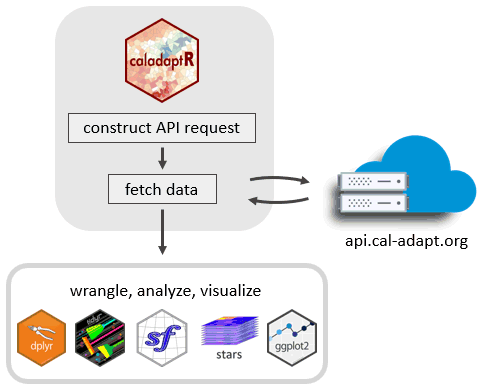
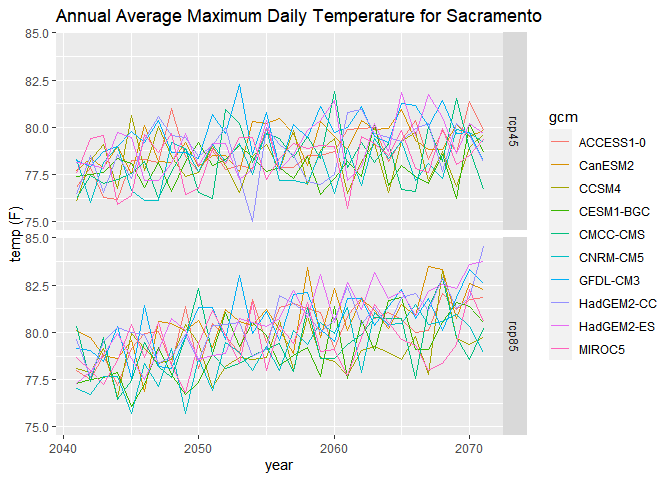
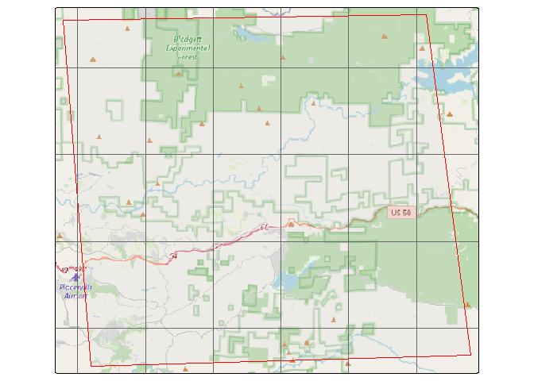
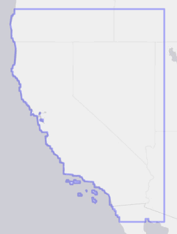

<!-- README.md is generated from README.Rmd. Please edit that file -->

# caladaptR <a href='http://ucanr-igis.github.io/caladaptr'></a>

<!-- badges: start -->

[](https://www.tidyverse.org/lifecycle/#experimental)
<!-- badges: end -->

## Features

`caladaptr` is an API client that makes it easier to work with data from
[Cal-Adapt.org](https://cal-adapt.org/) in R. The niche of `caladaptr`
is to bring data into R after which you can use other packages for
analysis and visualization:

<p align="center">

</p>

`caladaptr` allows you to:

-   query any of Cal-Adapt’s \~950 raster data layers
-   retrieve values by point, a preset area-of-interest (e.g., census
    tract), or a user-provided polygon
-   cache large queries in a local SQLite database
-   download cropped rasters as TIFs and import them into R as stars
    objects

`caladaptr` functions have been designed to:

-   be pipe friendly
-   return tibbles for compatibility with tidyverse packages
-   return values with encoded units (managed by the
    [units](https://cran.r-project.org/package=units) package)
-   accept and return `sf` data frames where spatial objects are needed
-   return rasters as spatiotemporal arrays
    ([`stars`](https://r-spatial.github.io/stars/) objects)

`caladaptr` does not support downloading the original NetCDF rasters nor
station data (e.g., sea level rise, stream gauges). For these data, see
the Data Download tool or FTP server on
[Cal-Adapt.org](https://cal-adapt.org/data/).

  

*Beta status* status means:

1.  the package is still under development  
2.  there’s a small possibility that updates will *not* be backward
    compatible  
3.  user feedback and input is extremely welcome and will be used to
    guide future development!

## Installation

`caladaptr` is available on
<a href="https://github.com/ucanr-igis/caladaptr" target="_blank" rel="noopener">GitHub</a>.
To install it, you need the `remotes` (or `devtools`) package. Windows
users also need to have
<a href="https://cran.r-project.org/bin/windows/Rtools/" target="_blank" rel="noopener">RTools</a>
installed.

    library(remotes)
    remotes::install_github("ucanr-igis/caladaptr")

## General Workflow

In general, there are three steps to retrieving Cal-Adapt data with
`caladaptr`:

1.  Create an ‘API request object’

2.  Feed the API request into a function that fetches data (either
    values or rasters)

3.  Wrangle the data that comes back into the format required for your
    analysis

## Example: Projected Annual Temperature at a Point Location

In this example, we’ll get the projected maximum daily temperature for a
point location near Sacramento, averaged by calendar year from
2040-2070, for 10 GCMs and 2 emissions scenarios. Then we’ll plot them.

  

**1. Create an API request object**

Creating an API request object is a bit like filling in an order form.
The request is essentially a description of the data you want.

There are a number of constructor functions you can mix and match to
create an API request object. Below we create a request for 30 years of
projected annual average maximum daily temperature from the [LOCA
downscaled CMIP5 climate
projections](https://berkeley-gif.github.io/caladapt-docs/data-catalog.html)
from Scripps, for a single point location.

``` r
library(caladaptr)
#> caladaptr (version 0.6.1)
#> URL: https://ucanr-igis.github.io/caladaptr
#> Bug reports: https://github.com/ucanr-igis/caladaptr/issues

sac_tasmax_cap <- ca_loc_pt(coords = c(-121.4687, 38.5938)) %>%     ## specify a location
  ca_gcm(c("HadGEM2-ES", "CNRM-CM5", "CanESM2","MIROC5",            ## select GCM(s)
           "ACCESS1-0", "CCSM4", "CESM1-BGC", 
           "CMCC-CMS", "GFDL-CM3", "HadGEM2-CC")) %>%     
  ca_scenario(c("rcp45","rcp85")) %>%                               ## select emission scenarios(s)
  ca_cvar(c("tasmax")) %>%                                          ## select climate variables
  ca_period("year") %>%                                             ## select a temporal aggregation period
  ca_years(start = 2040, end = 2070)                                ## select start and end dates

sac_tasmax_cap
#> Cal-Adapt API Request
#> Location(s): 
#>   x: -121.469
#>   y: 38.594
#> Variable(s): tasmax
#> Temporal aggregration period(s): year
#> GCM(s): HadGEM2-ES, CNRM-CM5, CanESM2, MIROC5, ACCESS1-0, CCSM4, CESM1-BGC, CMCC-CMS, GFDL-CM3, HadGEM2-CC
#> Scenario(s): rcp45, rcp85
#> Dates: 2040-01-01 to 2070-12-31
#> 
```

  

**2. Fetch data**

Functions that **fetch data** from Cal-Adapt include `ca_getvals_tbl()`,
`ca_getvals_db()` (see *Large Queries* vignette), and
`ca_getrst_stars()` (see *Rasters Part I* vignette). Below we’ll fetch
data into a tibble by passing the API request to `ca_getvals_tbl()`:

``` r
sac_tasmax_tbl <- sac_tasmax_cap %>% ca_getvals_tbl(quiet = TRUE)
head(sac_tasmax_tbl)
#> # A tibble: 6 x 8
#>      id cvar   period gcm        scenario spag  dt           val
#>   <int> <fct>  <fct>  <fct>      <fct>    <fct> <chr>        [K]
#> 1     1 tasmax year   HadGEM2-ES rcp45    none  2040-12-31  299.
#> 2     1 tasmax year   HadGEM2-ES rcp45    none  2041-12-31  299.
#> 3     1 tasmax year   HadGEM2-ES rcp45    none  2042-12-31  299.
#> 4     1 tasmax year   HadGEM2-ES rcp45    none  2043-12-31  300.
#> 5     1 tasmax year   HadGEM2-ES rcp45    none  2044-12-31  300.
#> 6     1 tasmax year   HadGEM2-ES rcp45    none  2045-12-31  298.
dim(sac_tasmax_tbl)
#> [1] 620   8
```

  

**3. Wrangle Data**

Depending what your goal it, you may need to add or delete columns,
reshape the data, group rows, etc. Below we’ll add a column for
Fahrenheit using `set_units()` from the
[`units`](https://cran.r-project.org/package=units) package.

``` r
## Add a column with Fahrenheit units
library(dplyr)
library(units)
sac_tasmax_tbl2 <- sac_tasmax_tbl %>% mutate(temp_f = set_units(val, degF))
head(sac_tasmax_tbl2)
#> # A tibble: 6 x 9
#>      id cvar   period gcm        scenario spag  dt           val temp_f
#>   <int> <fct>  <fct>  <fct>      <fct>    <fct> <chr>        [K] [degF]
#> 1     1 tasmax year   HadGEM2-ES rcp45    none  2040-12-31  299.   78.1
#> 2     1 tasmax year   HadGEM2-ES rcp45    none  2041-12-31  299.   78.0
#> 3     1 tasmax year   HadGEM2-ES rcp45    none  2042-12-31  299.   77.8
#> 4     1 tasmax year   HadGEM2-ES rcp45    none  2043-12-31  300.   79.7
#> 5     1 tasmax year   HadGEM2-ES rcp45    none  2044-12-31  300.   79.5
#> 6     1 tasmax year   HadGEM2-ES rcp45    none  2045-12-31  298.   77.2
```

Now we can plot it:

``` r
library(ggplot2)
ggplot(data = sac_tasmax_tbl2, 
       aes(x = as.Date(dt), y = as.numeric(temp_f))) +
  geom_line(aes(color=gcm)) +
  facet_grid(scenario ~ .) +
  labs(title = "Annual Average Maximum Daily Temperature for Sacramento", x = "year", y = "temp (F)")
```



  

## Constructing API Requests

API request objects are constructed by stringing together functions that
provide the key elements of the request, including the location(s),
dataset(s), and time frame.

**Location functions** (pick one):

| Function             | Location Type                              |
|----------------------|--------------------------------------------|
| `ca_loc_pt()`        | points in matrices                         |
| `ca_loc_aoipreset()` | preset areas-of-interest                   |
| `ca_loc_sf( )`       | user-supplied sf object (point or polygon) |

**Date functions** (pick one):

| Function     | Date Type      |
|--------------|----------------|
| `ca_dates()` | specific dates |
| `ca_years()` | years          |

**Dataset functions** (pick one group):

| Functions                                                  | Dataset                                                              |
|------------------------------------------------------------|----------------------------------------------------------------------|
| `ca_gcm()` + `ca_scenario()` + `ca_cvar()` + `ca_period()` | LOCA downscaled modeled climate data (including all Scripps and VIC) |
| `ca_livneh()` + `ca_cvar()` + `ca_period()`                | Livneh data (observed historical)                                    |
| `ca_slug()`                                                | Everything else                                                      |

`ca_example_apireq()` is a convenience function that returns sample API
requests for testing. You can use `ca_preflight()` to check an API
request for errors. Plotting an API request will show the location(s),
with an option to overlay the loca grid cells:

``` r
samp_cap <- ca_example_apireq(3)
samp_cap %>% ca_preflight()
#> General issues
#>  - none found
#> Issues for querying values
#>  - none found
#> Issues for downloading rasters
#>  - none found
plot(samp_cap, locagrid = TRUE, static = TRUE)
```



For more examples, including retrieving data for a preset
area-of-interest (i.e., census tracts), see the *API Requests* vignette
and ‘R Notebooks’ on the
[website](https://ucanr-igis.github.io/caladaptr/).

## Constants

To help you pass arguments for the various constructor functions,
`caladaptr` provides the following constants:

``` r
## Climate Variables 
cvars
#>  [1] "tasmax"     "tasmin"     "pr"         "swe"        "baseflow"  
#>  [6] "ET"         "rainfall"   "runoff"     "snowfall"   "soilMoist1"
#> [11] "Tair"

## Global Climate Models
## Note: the first 4 are the 'priority' models recommended under California's 4th Climate Change Assessment.
gcms
#>  [1] "HadGEM2-ES" "CNRM-CM5"   "CanESM2"    "MIROC5"     "ACCESS1-0" 
#>  [6] "CCSM4"      "CESM1-BGC"  "CMCC-CMS"   "GFDL-CM3"   "HadGEM2-CC"
#> [11] "ens32avg"   "ens32max"   "ens32min"

## Emission scenarios
scenarios
#> [1] "rcp45"      "rcp85"      "historical"

## Temporal resolution periods
periods
#> [1] "day"    "month"  "year"   "30yavg"
```

## Data Catalog

`caladaptr` can not tell you which climate data you need for your
project. Nor will it teach you how to use climate data appropriately or
wisely. However it does have a copy of the Cal-Adapt raster series data
catalog, so you can see what’s available and specify the datasets you
need.

To view the entire data catalog in a RStudio Viewer pane, run the
following. You can then use the filter button to find datasets that
match a key word.

    View(ca_catalog_rs())

You can also search for datasets using `ca_catalog_search()`, and
download a fresh copy of the catalog from Cal-Adapt using
`ca_catalog_fetch()`.

Most / all of the Cal-Adapt rasters series have been downscaled to
approximately 6km (3.7 mi) using the LOCA downscaling method, and are
available for the coverage area shown below. For a finer scale analysis,
you can download the LOCA grid cells as a polygon layer using
`ca_locagrid_geom()`.


