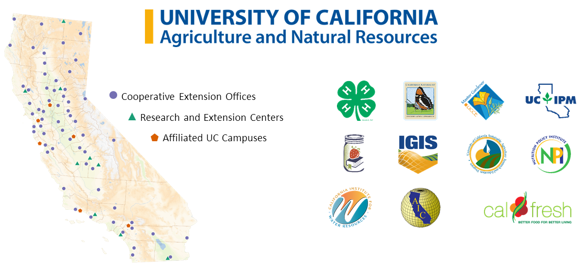
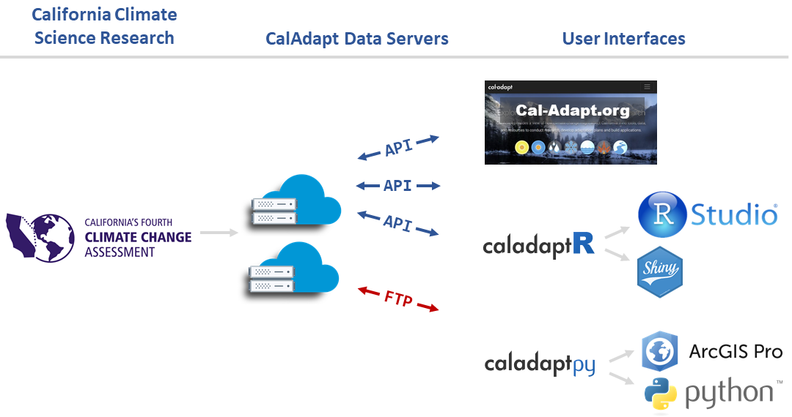
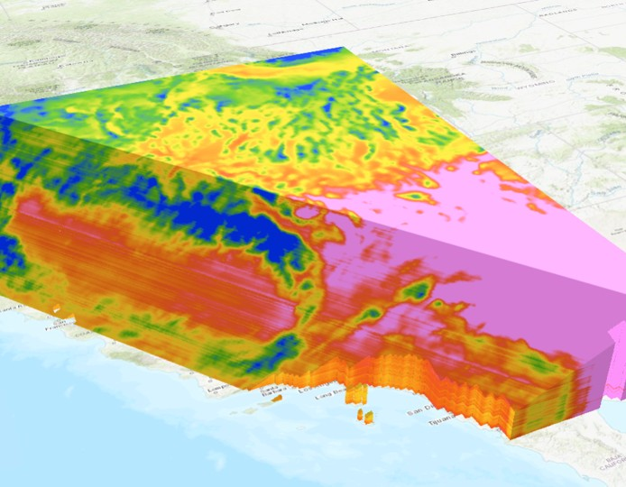
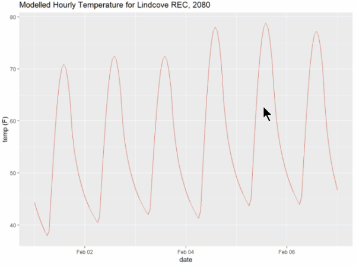
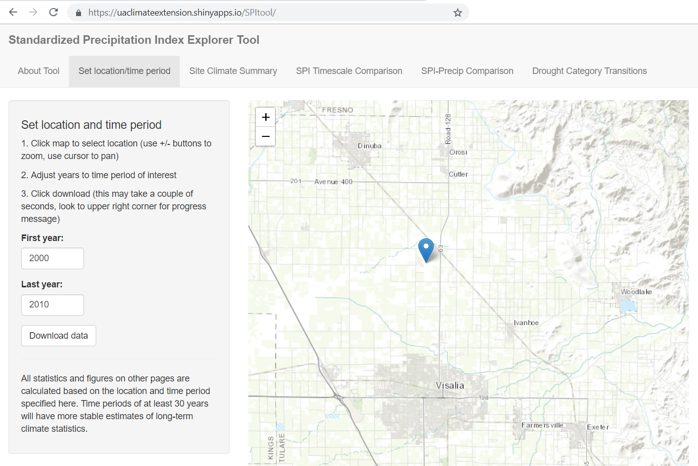
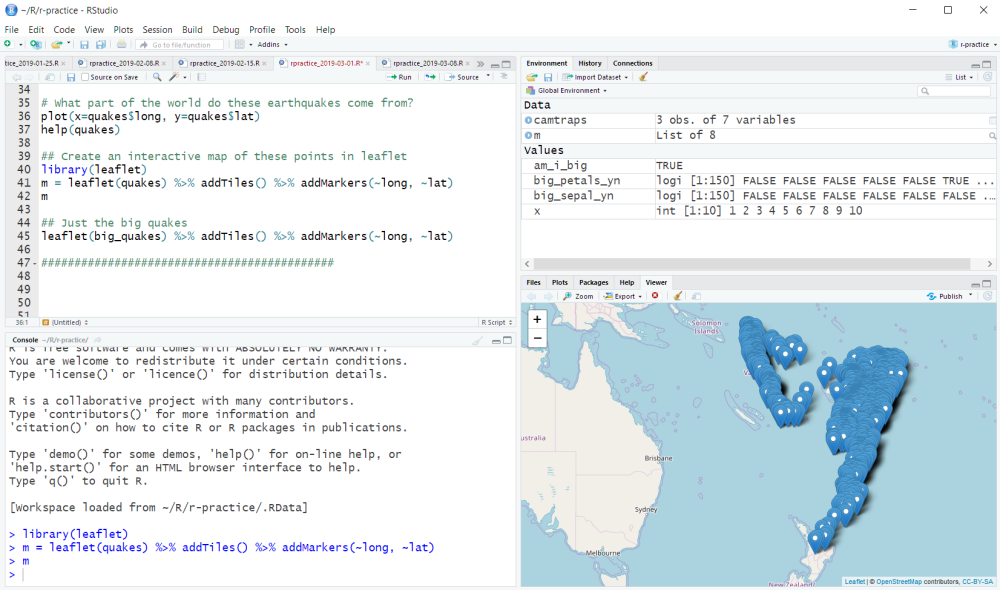
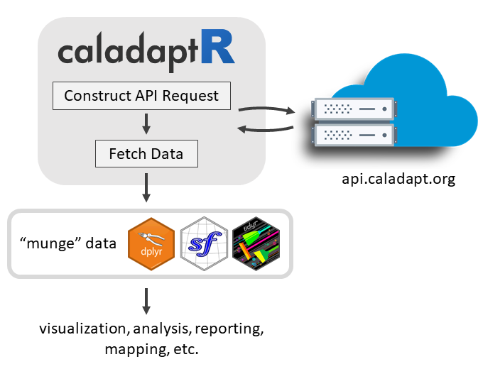

# About Us...

```{r setup, include = FALSE}
knitr::opts_chunk$set(echo = TRUE)
library(knitr)
library(kableExtra)
library(magrittr)
library(dplyr)
library(tidyr)
library(lubridate)
```

```{css echo = FALSE}
h1 {
  color:darkgreen;
}
h1.title {
  color:black;
  font-size:130%;
}
h2 {
  color:#444;
  font-size: 1.2em;
}
.indented1 {
  margin-left:1em;
}
div.indented2 {
  margin-left:2em;
}

table.borderme {
  border:4px solid #246ABF;
  border-collapse:collapse;
}

table.borderme td {
  border: 1px solid #eee;
}

table.shademe td {
  background:#eee;
  padding:8px;
}

div.li-single li {
  margin-bottom:0.1em;
} 
.test_delete {
  line-height:0.7em;
}
pre {
  font-weight:normal;
  font-size:80%;
}
```

<script type="text/javascript">w3c_slidy.mouse_click_enabled = false;</script>

```{r color, echo = FALSE, results='asis'}
# crayon needs to be explicitly activated in Rmd
options(crayon.enabled = TRUE)
# Hooks needs to be set to deal with outputs
old_hooks <- fansi::set_knit_hooks(knitr::knit_hooks, 
                                   which = c("output", "message", "error"))
```



# Session Overview

## Outline

<div class = "indented2 li-single">

- Overview of **Accessing Data** from Cal-Adapt (~5 min, Andy)  
- Working with Cal-Adapt Data in **Python & ArcGIS** (~20 min, Shane)  
- Working with Cal-Adapt Data in **R** (~20 min, Andy)  
- Q&A

</div>

\

## Goals

<div class = "indented2 li-single">

- Introduce the new tools  
- Invite to you try them out  
- Entice you get involved in testing and feedback!

</div>

\

<p style="text-align:center;">https://ucanr-igis.github.io/caladaptr/pres/overview.html</p>

# Cal-Adapt Data

{style="display:block; margin:1em auto;"}


# Why you might want to use Cal-Adapt data in GIS or R

## Custom Visualization 
 
 {style="width:560px;"}


## Join results to other data
 
 <div class="indented2 li-single">
 - census data  
 - biodiversity / habitat  
 - economic data
 </div>
 
## Research
 

 
## Custom decision support

<p style="font-size:90%; font-style:italic;"><a href="https://uaclimateextension.shinyapps.io/SPItool/" target="_blank"><br/>
https://uaclimateextension.shinyapps.io/SPItool/</a></p>

# Options for Accessing Cal-Adapt Data

```{r getting_data_options, echo=FALSE, results='asis', cache=FALSE}
tbl_vec <- c("Feature", "Cal-Adapt website", "Cal-Adapt FTP", "{style='width:160px;'}",
             "{style='width:160px;'}",
             
             "Download rasters", "", "", "", "",
             "Statewide", "x", "x", "x", "",
             "User area-of-interest", "x", "", "planned", "planned",
             "10 recommended GCMs", "x", "x", "x", "planned",
             "All 32 GCMs", "", "x", "x", "",
             
             "Query features", "", "", "", "",
             "Points (user-provided)", "x", "", "x", "x",
             "Lines (user-provided)", "x", "", "x", "",
             "Polygons (user-provided)", "x", "", "x", "x",
             "Polygons (presets, boundary layers)", "x", "", "", "x",
             
             "Other", "", "", "", "",
             "Grab values from preset charts", "x", "", "", "")

tbl_mat <- matrix(tbl_vec, byrow=TRUE, ncol=5)

knitr::kable(tbl_mat, format = "html", align = c("l", "c", "c", "c", "c"), table.attr="class='borderme'") %>% 
  column_spec(1, width = "15em") %>%
  row_spec(1, bold=TRUE, background = gray(0.80), color = "black", align = "c", extra_css = "padding:0.5em 1em;") %>% 
  row_spec(c(2,7,12), bold=TRUE, background = gray(0.9), italic = TRUE) %>% 
  kable_styling(full_width = FALSE)

```

More info:

<div class="indented2">
- [*Accessing Climate Data through Cal-Adapt*](https://cal-adapt.org/blog/2019/webinar-june-2019){target="_blank" rel="noopener"}, Cal-Adapt Quarterly Webinar, June 2019
</div>

---

{style="display:block; height:100px; margin:6em auto 4em;"}
{style="display:block; height:100px; margin:0em auto;"}

---

{style="height:80px;"}

## Outline

<div class="indented2 li-single">
- Why R?  
- `caladptR` features
- Workflow Overview  
- Code tour  
- Examples  
- How to Learn More  
</div>


---

{style="display:block; margin:5em auto; border:none;"}


# Why R?

<div style="float:left; width:250px;">
<p style="margin:0;"></p>
</div>

<div class="indented1 li-single" style="float:left; margin-bottom:2em;">
- open source software for data science  
- programming language to write scripts  
- inspired by 'S' (1976); first beta version ~2000  
- [*many*](https://rdrr.io/){target="_blank"} user-contributed packages:
    - *CRAN*: >18,400  
    - *Bioconductor*: >2,000  
    - *R-Forge*: >2,150  
    - *GitHub*: >65,000
</div>

<div style="clear:both;"></div>

<div style="float:left; width:250px;">
<p style="margin:0;"></p>
</div>

<div class="indented1 li-single" style="float:left;">
- very popular desktop environment; free
- simplifies package management, plotting, etc.
</div>

<div style="clear:both;"></div>

{style="display:block; margin:1em auto; border:1px solid grey;"}


# caladaptR Features

{style="display:block; width:680px; margin:1em auto;"}

## Key Features

<div class = "indented2 li-single">

- `caladaptr` is an **API client** package  
- main job is to provide low-level functions for **querying** and **importing** Cal-Adapt data via the API  
- intended audience is **experienced R users**  
- uses modern R programming standards:  

<div class = "indented1">
- pipe friendly functions  
- accepts and returns standard data classes (e.g., tibble, sf, raster)
- units encoded in the results
- follows development guidelines from [rOpenSci](https://devguide.ropensci.org/){target="_blank"}  
</div>

</div>

## Functions 

<div class = "indented2 li-single">
- Retrieve values from any Cal-Adapt raster series  
- Query with user-provided points, lines, and polygons  
- Query built-in preset areas-of-interest  
</div>

## Still in "Beta" status

<div class = "indented2 li-single">
- actively under development with frequent updates  
- some updates may not be backward compatible  
- user feedback and input is extremely welcome
</div>

## In development

<div class = "indented2 li-single">
- import rasters  
- cache results locally 
- improved error trapping
- code recipe 'cookbook' 
- CRAN submission in early 2021
</div>


# caladaptR workflow

In general, there are **five** steps to using caladaptR:

```{r echo = FALSE}
library(DiagrammeR)
grViz("digraph flowchart {
  node [fontname = Helvetica, shape = rectangle]
  tab1 [label = '@@1']
  tab2 [label = '@@2']
  tab3 [label = '@@3']
  tab4 [label = '@@4']
  tab5 [label = '@@5']

  # edge definitions with the node IDs
  tab1 -> tab2 -> tab3 -> tab4 -> tab5;
  }

  [1]: '1) Determine your location(s) of interest\\nand assemble the required values/objects\\n\\n(e.g., points, preset area-of-interest, own polygon)'
  [2]: '2) Create an API Request object'
  [3]: '3) Feed the API Request into a function that fetches data'
  [4]: '4) Munge the results into the format you require\\n\\n(e.g., filtering, sorting, joining, reshaping,\\nadd calculated columns, etc.)'
  [5]: '5) Continue on with your analysis or visualization'")
```

# Installation

`caladaptr` is hosted on [GitHub](https://github.com/ucanr-igis/caladaptr){target="_blank" rel="noopener"}

Prerequisites:

<div class="indented2 li-single">
- [RTools](https://cran.r-project.org/bin/windows/Rtools/){target="_blank" rel="noopener"} has to be installed  
- `devtools` package installed
</div>

Install the package using `install_github()`:

```{r install_caladaptr, eval = FALSE}
library(devtools)
devtools::install_github("ucanr-igis/caladaptr")
```

# Quick Example

1. Load the package:

```{r load_package, cache = FALSE}
library(caladaptr)
```

2. Create an API request object:

```{r cap1_make, cache = TRUE}
cap1 <- ca_loc_pt(coords = c(-121.4687, 38.5938)) %>%  ## specify a location
  ca_cvar(c("tasmax", "tasmin")) %>%                   ## climate variables
  ca_gcm(gcms[1:4]) %>%                                ## GCM(s)
  ca_scenario(scenarios[1:2]) %>%                      ## emission scenarios(s)
  ca_period("year") %>%                                ## temporal aggregation period
  ca_years(start = 2040, end = 2060)                   ## start and end dates

cap1
```

3. Fetch data:

```{r cap1_fetch, cache = TRUE}
cap1_tbl <- ca_getvals_tbl(cap1, quiet = TRUE)
```

4. View the results

```{r}
cap1_tbl
```

# Building an API Request

An API Request object consists of between 2 and 4 components:

**1. Location** (*required, pick one*)

```{r api_constructors_loc, echo=FALSE, results='asis', cache=TRUE}
col1_width <- "12em"

tbl_vec <- c("ca_loc_aoipreset()", "Query a preset location(s)",
             "ca_loc_pt()", "Question point location(s)",
             "ca_loc_sf()", "Query simple feature location(s)")

kable(matrix(tbl_vec, byrow=TRUE, ncol=2), 
      format = "html", align = c("l", "l"), table.attr="class='shademe'") %>% 
  column_spec(column = 1, monospace = TRUE, width = col1_width) %>%
  kable_styling(full_width = FALSE, position = "left")
```

\

**2. Raster series dataset**

<div class="indented1">

**Option 1**: Choose downscaled climate projection(s) from Scripps using **all 4** of the following constructor functions:

```{r api_const_loca, echo=FALSE, results='asis', cache=FALSE}
library(magrittr); library(kableExtra)

tbl_vec <- c("ca_cvar()", "Select the climate variable(s) (i.e., precip, temperature)",
             "ca_gcm()", "Pick or more of the 10 Global Climate Models",
             "ca_period()", "Select temporal aggregation period (year, month, day)",
             "ca_scenario()", "Choose your emission scenario(s)")

knitr::kable(matrix(tbl_vec, byrow=TRUE, ncol=2), 
      format = "html", align = c("l", "l"), table.attr="class='shademe'") %>% 
  kableExtra::column_spec(column = 1, monospace = TRUE, width = col1_width) %>% 
  kableExtra::kable_styling(full_width = FALSE, position = "left")
```

**Option 2**: Pick *any* of the 830 raster series datasets by their '**slug**':

```{r api_const_slug, echo=FALSE, results='asis', cache=FALSE}
tbl_vec <- c("ca_slug()", "Select a dataset by its slug")
knitr::kable(matrix(tbl_vec, byrow=TRUE, ncol=2), 
      format = "html", align = c("l", "l"), table.attr="class='shademe'") %>% 
  kableExtra::column_spec(column = 1, monospace = TRUE, width = col1_width) %>% 
  kableExtra::kable_styling(full_width = FALSE, position = "left")
```

</div>

\

**3. Start & end dates** (*optional, pick one*)

```{r api_const_start_end, echo=FALSE, results='asis', cache=FALSE}
library(magrittr)
tbl_vec <- c("ca_years()", "Specify start & end by **year**",
             "ca_dates()", "Specify start & end by **date**")
knitr::kable(matrix(tbl_vec, byrow=TRUE, ncol=2), 
      format = "html", align = c("l", "l"), table.attr="class='shademe'") %>% 
  kableExtra::column_spec(column = 1, monospace = TRUE, width = col1_width) %>% 
  kableExtra::kable_styling(full_width = FALSE, position = "left")
```

\

**4. Options** (*only required for polygons*)

```{r api_options, echo=FALSE, results='asis', cache=FALSE}
library(magrittr)
tbl_vec <- c("ca_options()", "Spatial aggregation function(s)")
knitr::kable(matrix(tbl_vec, byrow=TRUE, ncol=2), 
      format = "html", align = c("l", "l"), table.attr="class='shademe'") %>% 
  kableExtra::column_spec(column = 1, monospace = TRUE, width = col1_width) %>% 
  kableExtra::kable_styling(full_width = FALSE, position = "left")
```

# API Call Location: Preset Areas-of-Interest

The Cal-Adapt API server has 11 preset **areas of interest** (aka boundary layers).

<div class="li-single" style="float:left; width=450px; margin-left:2em;">
- Census Tracts
- Counties
- Congressional Districts
- Climatic Regions
- Watersheds
- Irrigated Water Management Districts
</div>

<div class="li-single" style="float:left; width=450px;">
- 4th Climate Change Assessment Regions
- Electrical Utilities
- WECC Load Areas
- Event Locations
- Places  
</div>

<div style="clear:both;"></div>

You can query these features **without passing a spatial object**!

Example:

```{r cap2, cache=TRUE}
cap2 <- ca_loc_aoipreset(type = "counties", 
                         idfld = "fips", 
                         idval = c("06105", "06049", "06089", "06015")) %>% 
  ca_gcm(gcms[1:4]) %>%
  ca_scenario(scenarios[1:2]) %>%
  ca_period("year") %>%
  ca_years(start = 2040, end = 2060) %>%
  ca_cvar("pr") %>% 
  ca_options(spatial_ag = "max")
```

Plot an API request to verify the location:

```{r plot_cap2, message = FALSE, warning = FALSE}
plot(cap2)
```

## Further details

To query a preset area-of-interest, use **`ca_loc_aoipreset()`** when you build your API request

`ca_loc_aoipreset()` requires these arguments:  

<div class="indented2 li-single">
- **`type`** - the preset you want 
- **`idfld`** - a field in the attribute table you'll use to speficy which feature(s) to query
- **`idval`** - the value(s) of the features you want to query 
</div>

You don't have to memorize preset types or field names! `caladaptr` provides the following constants:

```{r aoipreset_types, results = 'hold'}
##View the AOI preset types 
aoipreset_types

## For AOI preset, what field(s) can you use to identify features? 
aoipreset_idflds

## For a given field, which values can you use to identify features?
aoipreset_idval$counties$fips
```

# Downloading AOI Preset Geometry

**`ca_aoipreset_geom()`** downloads an AOI Preset as a simple feature data frame (sf).

```{r download_irwm, cache = TRUE}
irwm_sf <- ca_aoipreset_geom("irwm")

irwm_sf
```

You can manipulate and visualize AOI presets the same as you would any sf vector layer. 

Plot with `tmap`:

```{r plot_irwm, message = FALSE}
library(tmap)
tmap_mode("plot")
tm_shape(irwm_sf) + tm_polygons(col = "MAP_COLORS", palette = "Pastel1")
```

# API Call Location: Points and Polygons

To query a **single point**, pass the longitude & latitude coordinates to **`ca_loc_pt()`**:

```{r}
cap <- ca_loc_pt(coords = c(-121.4687, 38.5938)) %>% 
  ca_gcm(gcms[1:4]) %>%
  ca_scenario(scenarios[1:2]) %>%
  ca_period("year") %>%
  ca_years(start = 2040, end = 2060) %>%
  ca_cvar("tasmin")

cap
```

To query **multiple points**, prepare a matrix or data frame with the longitude & latitude coordinates. 

If you want to join the results back to the data frame, also pass a column of unique id numbers.

```{r}
my_pts_df <- data.frame(lon = c(-120.7635, -120.4285, -120.3873, -120.7377),
                     lat = c(38.90920, 38.91321, 38.66819, 38.66015))

cap <- ca_loc_pt(coords = my_pts_df, id = 21:24) %>% 
  ca_gcm(gcms[1:4]) %>%
  ca_scenario(scenarios[1:2]) %>%
  ca_period("year") %>%
  ca_years(start = 2040, end = 2060) %>%
  ca_cvar("tasmin")

cap
```

To query points or polygons in a sf object, use **`ca_loc_sf()`** in your API request:

```{r}
library(sf)
yosemite_bnd_sf <- st_read("yosemite_bnd.geojson")

cap <- ca_loc_sf(loc = yosemite_bnd_sf, idfld = "UNIT_CODE") %>% 
  ca_gcm(gcms[1:4]) %>%
  ca_scenario(scenarios[1:2]) %>%
  ca_period("year") %>%
  ca_years(start = 2040, end = 2060) %>%
  ca_cvar("tasmax") %>% 
  ca_options(spatial_ag = "mean")

cap
```

Note: when querying polygons, you must specify a spatial aggregation function in `ca_options()`.

As always, you can plot an API request to see the query location:

```{r}
plot(cap)
```

# Specifying Datasets: Downscaled Climate Projections

One of the most popular datasets on Cal-Adapt are the downscaled climate projections from Scripps.

You can specify one or more downscaled climate projections by using all four of the following functions:

```{r}
cap <- ca_loc_pt(coords = c(-121.4687, 38.5938)) %>% 
  
  ca_gcm(c("HadGEM2-ES", "CNRM-CM5", "CanESM2", "MIROC5")) %>%
  ca_scenario(c("rcp45", "rcp85")) %>%
  ca_period("year") %>%
  ca_cvar("tasmin")

cap
```

## Helper Constants

You don't have to memorize strange GCM acronyms! `caladpatr` provides the following constants which you can use to help specify downscaled climate projection data:

```{r constants, cache = TRUE}
## Climate variables
cvars

## Global Climate Models
## Note the first four GCMs are the 'priority' models recommended under 
## California's 4th Climate Change Assessment.
gcms

## Emission scenarios
scenarios

## Temporal resolution
periods
```

# Specifying Datasets: Slugs

<div style="float:right; width:90; padding:5px; margin-top:-20px;">
<br/>
<span style="font-size:80%; font-style:italic;">Source: UCSC</span>
</div>

**"Slug"** = a unique part of a URL

Every Cal-Adapt raster series has a unique slug.

To see all the raster series and their slugs, you can run:

<div style="clear:both;"></div>

```{r eval = FALSE}
View(ca_catalog_rs())
```

```{r show_catalog, echo = FALSE}
rs_cat_tbl <- caladaptr::ca_catalog_rs(quiet = TRUE) %>% 
  dplyr::select(name, slug, url) %>% 
  tibble::as_tibble()

DT::datatable(rs_cat_tbl, 
          class = 'row-border stripe hover compact', 
          rownames = F, 
          autoHideNavigation = T, 
          escape =FALSE)
```

To specify a dataset by slug, use **`ca_slug()`** when creating your API request:

```{r}
cap_et <- ca_loc_pt(coords = c(-121.4687, 38.5938)) %>%
  ca_slug("ET_month_MIROC5_rcp45") %>%
  ca_years(start = 2040, end = 2060)

cap_et
```

Note: `ca_slug()` is incompatible with `ca_gcm()`, `ca_scenario()`, `ca_cvar()`, and `ca_period()`.

# Fetch Data

To fetch data from Cal-Adapt, feed your API request object into **`ca_getvals_tbl()`**:

```{r cap1_getvals, cache = TRUE, eval = TRUE}
cap_tbl <- ca_getvals_tbl(cap, quiet = TRUE)

cap_tbl
```

Notes:

<div class="indented2 li-single">
- `ca_getvals_tbl()`returns a **tibble**  
- the first column is the **location id**
</div>

# Example 1: Plot Projected Temperature for a Point Location

Our goal in this example is to plot the projected maximum annual temperature for a specific point.

## 1\. Create the API Request

We begin by creating an API request for the maximum annual temperature for a single point, 50 year time span, projected by 4 GCMs and 2 RCPs:

```{r}
cap2 <- ca_loc_pt(coords = c(-118.955, 35.488)) %>%
  ca_gcm(gcms[1:4]) %>%
  ca_scenario(c("rcp45", "rcp85")) %>%
  ca_period("year") %>%
  ca_years(start = 2030, end = 2080) %>%
  ca_cvar(c("tasmax"))
cap2
```

To see where this is we can plot the location:

```{r}
plot(cap2)
```

## 2\. Fetch the data

```{r cap2_getvals, cache = TRUE}
cap2_tbl <- cap2 %>% ca_getvals_tbl(quiet = TRUE)

cap2_tbl
```

## 3\. Munge the results

To make our plot, we need to do two things:

<div class="indented1 li-single">
1. Pull out just those values from RCP 4.5  
1. Convert units from Kelvin to &#176;F  
</div>

```{r convert_units, results = 'hold', message= FALSE}
library(dplyr); library(units)

cap2_rcp45_tbl <- cap2_tbl %>% 
  filter(scenario == "rcp45") %>%
  mutate(temp_f = set_units(val, degF))

cap2_rcp45_tbl

```

## 4\. Plot the results

Plot these with `ggplot`:

```{r cap1_plot, message = FALSE}
library(ggplot2)
ggplot(data = cap2_rcp45_tbl, aes(x = dt, y = as.numeric(temp_f), group = gcm)) +
  geom_line(aes(color=gcm)) +
  labs(title = "Average Annual Maximum Temperature for RCP4.5", x = "year", y = "temp (F)")
```

# Example 2: Model hourly temperature from daily min / max

In this example, we'll model hourly temperature values from daily min-max using a function from the `chillR` package.


## 1\. Import the boundary of the study area

Our study area is [Lindcove Research and Extension Center](http://lrec.ucanr.edu/){target="_blank" rel="noopener"}, one of nine [field stations](http://recs.ucanr.edu/){target="_blank" rel="noopener"} maintained by UC ANR. The first step is to import the boundary which is available as a geojson file:

```{r}
lrec_sf <- st_read("https://raw.githubusercontent.com/UCANR-IGIS/caladaptr/master/docs/pres/lrec_bnd.geojson")
```

## 2\. Construct the API Request

For simplicty, we'll grab daily data for a single GCM and emission scenario. 

```{r}
cap_lrec <- ca_loc_sf(loc = lrec_sf) %>%
  ca_gcm(gcms[1]) %>%
  ca_scenario("rcp45") %>%
  ca_period("day") %>%
  ca_dates(start = "2079-12-01", end = "2080-04-30") %>%
  ca_cvar(c("tasmax", "tasmin")) %>% 
  ca_options(spatial_ag = "mean")

cap_lrec
```

```{r}
plot(cap_lrec)
```

## 3\. Fetch data


```{r cap_lrec_tbl, cache = TRUE}
cap_lrec_tbl <- cap_lrec %>% ca_getvals_tbl(quiet = TRUE)
```

## 4\. Munge the results

First we'll add a column of the temperature in Farenheit:

```{r cap_lrec_tbl_munge, cache = TRUE}
lrec_tempf_tbl <- cap_lrec_tbl %>% mutate(temp_f = set_units(val, degF))

head(lrec_tempf_tbl)
```

Next, we'll add additional columns and convert from a long to wide format, in preparation for passing the data to `make_hourly_temps()` in `chillR`.

```{r}
library(tidyr); library(lubridate)

lrec_tempf_dyr_tbl <- lrec_tempf_tbl %>%
  mutate(DATE = as.POSIXct(format(dt), tz="America/Los_Angeles")) %>%
  mutate(Year = as.integer(year(DATE)), 
         Month = as.integer(month(DATE)), 
         Day = day(DATE),
         temp_f = as.numeric(temp_f)) %>%
  select(cvar, temp_f, Year, Month, Day) %>%
  pivot_wider(names_from = cvar, values_from = temp_f) %>%
  rename(Tmax = tasmax, Tmin = tasmin)

head(lrec_tempf_dyr_tbl)
```


## 5\. Compute Hourly Temp

The `chillR` package has a function `make_hourly_temps()` that models hourly temperature based on sunrise and sunset times (which in turn are determined by date and latitude). Following the excellent  [guide](https://cran.r-project.org/web/packages/chillR/vignettes/hourly_temperatures.html) by author Eike Luedeling, we can model hourly temp in just a few steps.

Start by loading the `chillR` package:

```{r message = FALSE}
library(chillR)
```

We need to grab the latitude of the study area (which chillR uses to compute sunrise and sunset), which we can easily do using functions from `sf`:

```{r compute_lat, cache = TRUE, warning = FALSE}
aoi_lat <- (lrec_sf %>% st_centroid() %>% st_coordinates() %>% as.numeric())[2]
aoi_lat
```

Now we're ready to compute the hourly temps:

```{r compute_hourly, cache = TRUE}
lrec_hrtmp_wide <- make_hourly_temps(latitude = aoi_lat,
                                year_file = lrec_tempf_dyr_tbl,
                                keep_sunrise_sunset = FALSE)
head(lrec_hrtmp_wide)
```

To plot these, we need to convert the wide format to long. Fortunately `tidyr` has everything you need to [pivot between long and wide](https://tidyr.tidyverse.org/articles/pivot.html){target="_blank" rel="noopener"} formats: 

```{r}
lrec_dthr_tmp_tbl <- lrec_hrtmp_wide %>%
  pivot_longer(cols = starts_with("Hour_"),
               names_to = "Hour",
               names_prefix = "Hour_",
               names_transform = list(hour = as.integer),
               values_to = "temp_f") %>%
  mutate(date_hour = ISOdatetime(Year, Month, Day, Hour, 0, 0, tz = "America/Los_Angeles")) %>%
  select(date_hour, temp_f) %>%
  arrange(date_hour)

head(lrec_dthr_tmp_tbl)
```

Finally we can plot a subset of the data:

```{r plot_hourly_temp, cache = TRUE}
ts_start <- as.Date("2080-02-01")
ts_end <- as.Date("2080-02-07")

lrec_dthr_onewk_tbl <- lrec_dthr_tmp_tbl %>% 
  filter(date_hour >= ts_start, date_hour <= ts_end)

ggplot(data = lrec_dthr_onewk_tbl,
       aes(x = date_hour, y = temp_f)) +
  geom_line(aes(color="red"), show.legend = FALSE) +
  labs(title = "Modelled Hourly Temperature for Lindcove REC, 2080", x = "date", y = "temp (F)")

```


# Need Large Data?

R tries to load everything in memory. {style="width:40px; margin-left:0.5em;"}

Querying large amounts of data (i.e., >1 million values) requires special handling.

A big-data alternative to `ca_getvals_tbl()` is under development:

<div class="indented2 li-single">
 - caches downloaded values to a local SQLite database  
 - picks up where it left off if the connection interrupted  
 - results can be manipulated using the same dplyr functions (with a few differences)  
</div>

Raster download with local processing may be faster - *coming soon*
 
Attend the December 2020 workshop for more info.

# Learning More

Website: <https://ucanr-igis.github.io/caladaptr/>

<div class="indented2 li-single">
 - documentation  
 - getting started guide  
 - R notebooks  
 - presentations  
 </div>

Attend a caladaptR workshop **December 11, 2020, 10am**!

Join the community

<div class="indented2 li-single">
 - join the [caladaptR betaR Club](https://ucanr-igis.github.io/caladaptr/#caladaptr-betar-club){target="_blank" rel="noopener"}  
 - share an idea for a code recipe  
 - submit feature requests and bug reports via [GitHub Issues](https://github.com/ucanr-igis/caladaptr/issues)  
 - Mac and Linux users particularly welcome!
 </div>

{style="display:block; height:80px; margin:3em auto 0;"}

# Thanks!

{style="display:block; width:320px; margin:1em auto; margin-top:1em;"}

<div style="text-align:center; margin-top:2em;">
<div style="display:inline-block; width:18em; text-align:center;">
<br/>
Shane Feirer<br/><stfeirer@ucanr.edu>
</div>

<div style="display:inline-block; width:18em; text-align:center; margin-left:5em;">
<br/>
Andy Lyons<br/><andlyons@ucanr.edu>
</div>
</div>

<p style='text-align:center; margin-top:2em;'></p>


