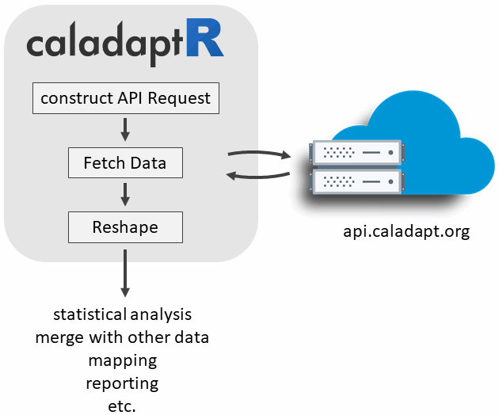

# Start with Zoom Poll or any other intro?


# About Us...

```{css echo = FALSE}
h1 {
  color:darkgreen;
}
h1.title {
  color:black;
  font-size:110%;
}
.indented1 {
  margin-left:1em;
}
div.indented2 {
  margin-left:2em;
}

div.indented2.ul.li {
  line-height:0.7em; 
  color:red;
}

```

<script type="text/javascript">w3c_slidy.mouse_click_enabled = false;</script>

```{r setwd_klippy, echo=FALSE, include=TRUE}
klippy::klippy('')
```


```{r color, echo = FALSE, results='asis'}
# crayon needs to be explicitly activated in Rmd
options(crayon.enabled = TRUE)
# Hooks needs to be set to deal with outputs
old_hooks <- fansi::set_knit_hooks(knitr::knit_hooks, 
                                   which = c("output", "message", "error"))
```


# Cal-Adapt API

{style="display:block; margin:1em auto;"}


# Why you might want to use Cal-Adapt data in GIS or R

 - Custom Visualization 

 - Joining with other data
 
 - Research
 
 - Custom decision support
 
 [ADD SCREEN SHOTS]

 
# Options for Getting Cal-Adapt Data

```{r getting_data_options, echo=FALSE, results='asis', cache=FALSE}
library(kableExtra)
library(magrittr)
library(dplyr)

tbl_vec <- c("Feature", "Cal-Adapt website", "Cal-Adapt FTP", "CalAdapt.py / ArcGIS", "caladaptR",
             
             "Download rasters", "", "", "", "",
             "Statewide", "", "x", "x", "",
             "User area-of-interest", "x", "", "planned", "planned",
             "All 32 GCMs", "", "x", "x", "",
             
             "Query features", "", "", "", "",
             "Points (user-provided)", "x", "", "x", "x",
             "Lines (user-provided)", "x", "", "x", "",
             "Polygons (user-provided)", "x", "", "x", "x",
             "Polygons (presets, boundary layers)", "x", "", "", "x",
             
             "Other", "", "", "", "",
             "Grab values from preset charts", "x", "", "", "")

tbl_mat <- matrix(tbl_vec, byrow=TRUE, ncol=5)

knitr::kable(tbl_mat, format = "html", align = c("l", "c", "c", "c", "c")) %>% 
  row_spec(1, bold=TRUE, background = gray(0.25), color = "white", align = "c", extra_css = "padding:0.5em 1em;") %>% 
  row_spec(c(2,6,11), bold=TRUE, background = gray(0.9), italic = TRUE) %>% 
  kable_styling(full_width = FALSE)

```

\* see also [*Accessing Climate Data through Cal-Adapt*](https://cal-adapt.org/blog/2019/webinar-june-2019){target="_blank" rel="noopener"}, Cal-Adapt Quarterly Webinar, June 2019


---

{style="display:block; height:100px; margin:6em auto 4em;"}
{style="display:block; height:100px; margin:0em auto;"}

# caladaptR Outline

- Why R?  
- `caladptR` features
- Installation  
- Workflow overview  
- Code snippets  
- Examples  
- How to learn more  

\

<div style="text-align:center; font-size:120%; line-height: 150%;">
Slides: **<https://ucanr-igis.github.io/caladaptr/pres/overview.html>**
</div>


---

{style="display:block; margin:5em auto; border:none;"}


# Why R?


- free open source software for data science  
- a programming language to write scripts  
- inspired by 'S' (1976), first beta version ~2000  
- [*many*](https://rdrr.io/){target="_blank"} user-contributed packages:
    - *CRAN*: >18,400  
    - *Bioconductor*: >2,000  
    - *R-Forge*: >2,150  
    - *GitHub*: >65,000  

\


{style="display:block; margin:1em auto; border:1px solid grey;"}

# caladaptR Overview

{style="display:block; width:480px; margin:1em auto;"}

- <tt>caladaptr</tt> is an **API client package** for R.

- Main job is to provide low-level functions for **querying** and **importing** Cal-Adapt data through the API.

- Utility functions  might be common data munging tasks (e.g., clipping, format conversion, reshaping, spatial/temporal aggregation, etc.) 

- The intended audience is **experienced R users** (not necessarily climate scientists).

- Uses modern R programming standards

pipe and tidyverse standards

accepts and returns standard data classes (e.g., sf)

Built using guidelines from [rOpenSci](https://devguide.ropensci.org/){target="_blank"} with plans to submit the package for peer review. 

- Enable light-weight decision support tools through RShiny that present Cal-Adapt data in user friendly terminology, combine with other datasets, produce user friendly output, etc. 

- Companion 'cookbook' of code recipes

# Development Status and Timeline

*Development Status (Aug 2020)*

- `caladaptr` only supports Cal-Adapt's raster data layers (which is most of them). There are no plans at present to support importing station data (i.e., sea level rise).  
- Currently only temperature and precipitation rasters can be queried (both projected and historic modeled). Variables from the VIC datasets and others will be coming soon.  
- Retrieving values currently works. Retrieving rasters is not yet supported.  
- Currently you can query point locations and preset areas of interest. Querying a user-provided polygon will be coming soon.


**'Beta'** status means:

1) the package is still under development  
2) the package is being updated fairly often  
3) there's a possibility that updates will *not* be backward compatible  
4) user feedback and input is extremely welcome! (please join the [caladaptR betaR](#caladaptr-betar-club) club)


# Installation

`caladaptr` is hosted on [GitHub](https://github.com/ucanr-igis/caladaptr){target="_blank" rel="noopener"}

Prerequisites:

- [RTools](https://cran.r-project.org/bin/windows/Rtools/){target="_blank" rel="noopener"} installed

- `devtools` (or `remotes`) package

\

Install the package:

```{r install_caladaptr, eval = FALSE}
library(devtools)
devtools::install_github("ucanr-igis/caladaptr")
```

# Workflow

In general, there are three steps to getting data via the Cal-Adapt API:

1) Create a ‘Cal-Adapt API Request’ object

2) Feed the API Request object into a function that fetches data

3) Massage the data that comes back into the format you require


# Creating an API Request

Load the package:

```{r load_package, cache = FALSE}
library(caladaptr)
```

Create a request object:

```{r cap1, cache = TRUE}
cap1 <- ca_loc_pt(coords = c(-121.4687, 38.5938)) %>%  ## specify a location
  ca_gcm(gcms[1:4]) %>%                                ## select GCM(s)
  ca_scenario(scenarios[1:2]) %>%                      ## select emission scenarios(s)
  ca_period("year") %>%                                ## select a precooked temporal aggregation period
  ca_years(start = 2040, end = 2060) %>%               ## select start and end dates
  ca_cvar(c("tasmax", "tasmin"))                       ## select climate variables

cap1
```

# API Request Components

An API Request object consists of between 2 and 4 pieces:

\

**1. Specify a Location** (*required, pick one*)

```{r api_constructors_loc, echo=FALSE, results='asis', cache=TRUE}
col1_width <- "12em"

tbl_vec <- c("ca_loc_aoipreset()", "Query a preset location(s)",
             "ca_loc_pt()", "Question point location(s)",
             "ca_loc_sf()", "Query simple feature location(s)")

kable(matrix(tbl_vec, byrow=TRUE, ncol=2), 
      format = "html", align = c("l", "l")) %>% 
  column_spec(column = 1, monospace = TRUE, width = col1_width) %>%
  kable_styling(full_width = FALSE, position = "left", bootstrap_options = "bordered")
```

\

**2. Specify a Raster Series Dataset** (*required*)

**Option 1**: Select one or more downscaled climate projection from Scripps using **all 4** of the following constructor functions:

```{r api_const_loca, echo=FALSE, results='asis', cache=FALSE}
library(magrittr); library(kableExtra)

tbl_vec <- c("ca_cvar()", "Select the climate variable(s) (i.e., precip, temperature)",
             "ca_gcm()", "Pick or more of the 10 Global Climate Models",
             "ca_period()", "Select temporal aggregation period (year, month, day)",
             "ca_scenario()", "Pick one of two emissions scenarios")

knitr::kable(matrix(tbl_vec, byrow=TRUE, ncol=2), 
      format = "html", align = c("l", "l")) %>% 
  kableExtra::column_spec(column = 1, monospace = TRUE, width = col1_width) %>% 
  kableExtra::kable_styling(full_width = FALSE, position = "left", bootstrap_options = "striped")
```

\

**Option 2**: Pick *any* of the 830 raster series datasets by their '**slug**':

```{r api_const_slug, echo=FALSE, results='asis', cache=FALSE}
tbl_vec <- c("ca_slug()", "Select a dataset by its slug")
knitr::kable(matrix(tbl_vec, byrow=TRUE, ncol=2), 
      format = "html", align = c("l", "l")) %>% 
  kableExtra::column_spec(column = 1, monospace = TRUE, width = col1_width) %>% 
  kableExtra::kable_styling(full_width = FALSE, position = "left")
```

\

**3. Specify Start & End dates** (*optional*)

```{r api_const_start_end, echo=FALSE, results='asis', cache=FALSE}
library(magrittr)
tbl_vec <- c("ca_years()", "Specify start & end by **year**",
             "ca_dates()", "Specify start & end by **date**")
knitr::kable(matrix(tbl_vec, byrow=TRUE, ncol=2), 
      format = "html", align = c("l", "l")) %>% 
  kableExtra::column_spec(column = 1, monospace = TRUE, width = col1_width) %>% 
  kableExtra::kable_styling(full_width = FALSE, position = "left")
```

\

**4. Specify Options** (*required for polygons*)

```{r api_options, echo=FALSE, results='asis', cache=FALSE}
library(magrittr)
tbl_vec <- c("ca_options()", "Spatial aggregreation option(s)")
knitr::kable(matrix(tbl_vec, byrow=TRUE, ncol=2), 
      format = "html", align = c("l", "l")) %>% 
  kableExtra::column_spec(column = 1, monospace = TRUE, width = col1_width) %>% 
  kableExtra::kable_styling(full_width = FALSE, position = "left")
```

# Preset areas-of-interest

The Cal-Adapt API server has 11 preset **areas of interest** (boundary layers).

If you query a dataset using features in one of these layers, you don't need to pass a spatial object. You can just pass a name or id number.

View the AOI preset types: 

```{r aoipreset_types, cache=TRUE}
aoipreset_types
```

To use one of these in your query, you have to also pass the name of a field which uniquely identifies each feature, and the values of the features you interest. Example:

```{r cap2, cache=TRUE}
library(caladaptr)
cap2 <- ca_loc_aoipreset(type = "counties", 
                         idfld = "fips", 
                         idval = c("06037", "16047", "06049", "06095", "16053")) %>% 
  ca_gcm(gcms[1:4]) %>%
  ca_scenario(scenarios[1:2]) %>%
  ca_period("year") %>%
  ca_years(start = 2040, end = 2060) %>%
  ca_cvar("pr") %>% 
  ca_options(spatial_ag = "max")

cap2

```

Tip: To identify specific features, you can use `aoipreset_idflds` and `aoipreset_idval`

```{r plot_cap2, cache=FALSE}
plot(cap2)
```


Download & plot:

```{r plot_counties, cache = TRUE, eval = FALSE}
library(sf)

counties_sf <- ca_aoipreset_geom("counties")

plot(counties_sf %>% st_drop_geometry(), col = "gray")
```

# Built-in Constants for the Scripps Downscaled Climate Projections 

To help you pass arguments for the various constructor functions, `caladpatr` provides the following constants:

```{r constants, cache = TRUE}
cvars

gcms

## Note the first four GCMs are the 'priority' models recommended under 
## California's 4th Climate Change Assessment.

scenarios

periods

```

**Note**: Cal-Adapt has data for many but by no means all permutations of the above constants.

# Slug Finder

<div style="float:right; width:210; padding:5px; border:1px solid red;">
<br/>
Source: UCSC
</div>

**"Slug"** = a unqiue part of a URL

Every Cal-Adapt raster series has a unique slug

To find the slug, you can run:

```{r eval = FALSE}
View(ca_catalog_rs())
```

```{r show_catalog, echo = FALSE}
rs_cat_tbl <- caladaptr::ca_catalog_rs(quiet = TRUE) %>% 
  dplyr::slice(1:200) %>% 
  dplyr::select(name, slug, url) %>% 
  tibble::as_tibble()

DT::datatable(rs_cat_tbl, 
          class = 'row-border stripe hover compact', 
          rownames = F, 
          autoHideNavigation = T, escape =FALSE)
```

Verify you have a good slug:

Enter it here:

ca_slug()

Note: ca_slug is incompatible with ca_gcm + ca_scenario + ca_cvar + ca_period.


# Inspecting a API Request

Type the name of the object at the console:

```{r cap1_print, cache = TRUE}
cap1
```

Plot it:

```{r plot_cap1, cache = TRUE, eval = FALSE}
plot(cap1)
```

How do I know if there are actually data layers for my request?
ca_testflight()
print(x)

# Fetch Data

```{r cap1_getvals, cache = TRUE, eval = FALSE}
cap1_tbl <- ca_getvals_tbl(cap1, quiet = TRUE)
cap1_tbl
```


# Example 1: Plot Over Time

```{r}
cap2 <- ca_loc_pt(coords = c(-121.4687, 38.5938)) %>%
  ca_gcm(gcms[1:4]) %>%
  ca_scenario(c("rcp45", "rcp85")) %>%
  ca_period("year") %>%
  ca_years(start = 2030, end = 2080) %>%
  ca_cvar(c("tasmax"))
cap2
```

Plot the location:

```{r}
plot(cap2)
```

Fetch the values:

```{r cap2_getvals, cache = TRUE}
cap2_tbl <- cap2 %>% ca_getvals_tbl(quiet = TRUE)

cap2_tbl
```

In the next statement, we do two things:

1) Pull out just those values from RCP 4.5, and 

2) Convert degrees to &#176;F

```{r convert_units, results = 'hold', message= FALSE}
library(dplyr); library(units)

cap2_rcp45_tbl <- cap2_tbl %>% 
  filter(scenario == "rcp45") %>%
  mutate(temp_f = set_units(val, degF))

cap2_rcp45_tbl

```


Plot these with `ggplot`:

```{r cap1_plot}
library(ggplot2)
ggplot(data = cap2_rcp45_tbl, aes(x = dt, y = as.numeric(temp_f), group = gcm)) +
  geom_line(aes(color=gcm)) +
  labs(title = "Average Annual Maximum Temperature for RCP4.5", x = "year", y = "temp (F)")
```

# Example 2: 

Query AOI Preset Data from a Slug, use it to make a map

Join with census data (using tidycensus)

# Example 3: Interpolate hourly temperature

Grab min-max for Lincove REC

# Example 4: Shiny app

Select a point. Retrieve data for that point

# Need Large Data?

Beta version of `ca_getvals_tbl()` under development

<div class="indented2">
 - caches downloaded values to a local SQLIte database  
 - picks up where it left off if the connection interrupted  
 - can manipulate the results using the same dplyr (few differences)  
</div>

Raster download with local processing may be faster - *coming soon*
 
Attend the workshop December workshop for more info

 
# Learning More

Attend the workshop **December 11, 2020, 10am**!

Visit **<https://ucanr-igis.github.io/caladaptr/>**

<div class="indented2">
 - documentation  
 - getting started guide  
 - R notebooks  
 - presentations  
 </div>

Join the community

<div class="indented2">
 - join the [caladaptR betaR Club](https://ucanr-igis.github.io/caladaptr/#caladaptr-betar-club){target="_blank" rel="noopener"}  
 - share an an idea for a code recipe  
 - submit feature requests and bug reports via [GitHub Issues](https://github.com/ucanr-igis/caladaptr/issues)  
 </div>

{style="display:block; height:80px; margin:1em auto;"}


