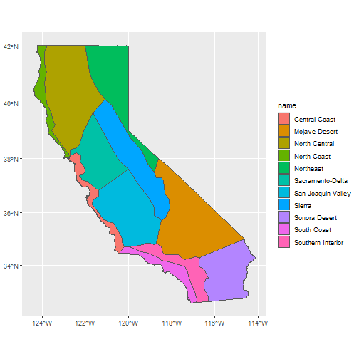
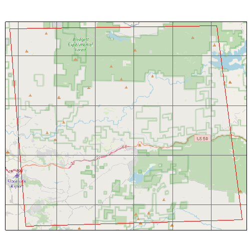

## Introduction

Before you can fetch data of any kind from Cal-Adapt, you have to construct an API request object. Creating an API request object is like filling out an order form. Once completed, you feed the API request to a function that actually retrieves data (either tabular or raster).

An API request object contains all the information needed to fetch data, including the location(s) of interest, dataset(s), and time period. In practice, you construct an API request object by stringing together a series of functions that specify the different pieces of the request. Examples:


``` r
library(caladaptr)

## Request modeled climate data (from Scripps)
sac_minmaxtemp_cap <- ca_loc_pt(coords = c(-121.4687, 38.5938)) %>%    ## pointlocation(s)
  ca_gcm(c("HadGEM2-ES", "CNRM-CM5", "CanESM2","MIROC5")) %>%          ## GCM(s)
  ca_scenario(c("rcp45","rcp85")) %>%                                  ## emission scenarios(s)
  ca_cvar(c("tasmin", "tasmax")) %>%                                   ## climate variables
  ca_period("year") %>%                                                ## temporal aggregation period
  ca_years(start = 1971, end = 2070)                                   ## start and end dates

## Specify Livneh data (observed historical) for a HUC10 watershed
huc_pr_cap <- ca_loc_aoipreset(type = "hydrounits",                    ## Preset AOI
                               idfld = "huc10",
                               idval = "1809020409") %>%
  ca_livneh(TRUE) %>%                                                  ## Livneh data
  ca_cvar("pr") %>%                                                    ## precipitation
  ca_period("day") %>%                                                 ## daily
  ca_dates(start = "1960-10-01", end = "2010-09-30") %>%               ## start and end dates
  ca_options(spatial_ag = "mean")                                      ## spatially aggregate w/ mean

## Specify desired data by slug for irrigated water management districts
irwm_ht_cap <- ca_loc_aoipreset(type = "irwm", idfld = "name") %>%     ## Preset AOI
  ca_slug(c("exheat_year_ens32avg_historical",                         ## slug(s)
            "exheat_year_ens32avg_rcp45",
            "exheat_year_ens32avg_rcp85")) %>%
  ca_options(spatial_ag = "max")                                       ## spatially aggregate w/ max
```

\

## Specifying Location

All API requests must specify the location(s) of interest. Locations can be specified by points, preset areas-of-interest, or user-provided geoms. All of these options allow you to specify a primary key field which will be included in the results so the results can be joined to the input features.

\

*1) Points*

Point locations can be included using `ca_loc_pt()` if the points are saved in a vector, matrix or data frame, and `ca_loc_sf()` if the points are in a simple feature data frame.

If points are passed in a matrix, vector or data frame, the first column should be longitude (x), and the second column should be latitude (y). Geographic coordinates are not required if the points are in a sf data frame (but its a good idea). Example:


``` r
(ca_loc_pt(coords = c(-122.1, 38.1)))
#> Cal-Adapt API Request
#> Location(s): 
#>   x: -122.1
#>   y: 38.1
#> 
```

\

*2) Preset areas-of-interest*

The Cal-Adapt API is integrated with a number of preset polygon areas-of-interest, also referred to as *boundary layers*. These are things like county boundaries, census tracts, watersheds, etc. If your study area(s) coincide with one of these layers, you can specify them by name using `ca_loc_aoipreset()`.

To see a list of the available preset layers, run:


``` r
aoipreset_types
#>  [1] "censustracts"      "counties"          "cdistricts"        "ccc4aregions"      "climregions"       "hydrounits"        "irwm"             
#>  [8] "electricutilities" "wecc-load-area"    "evtlocations"      "place"
```

When you use a preset AOI layer in an API request, you can specify which feature(s) you're interested in (if you don't want them all). For example if you want data summarized by county, you can specify which of the over 50 counties in California you're interested in. Two arguments must be passed to specify features of interest: i) `idfld` (a field in the attribute table that has unique values), and ii) `idval` (the id numbers or values of the features). Example:


``` r
(ca_loc_aoipreset(type = "counties", idfld = "fips", idval = "06013"))
#> Cal-Adapt API Request
#> Location(s): 
#>   AOI Preset: counties
#>   fips(s): 06013
#> 
```

To figure out which fields are available to specify locations for a given preset layer, you can use the built-in constant `aoipreset_idflds`. For example if you're interested in counties, you can use the following fields:


``` r
aoipreset_idflds$counties
#> [1] "fips" "id"
```

To see the valid values to specify features, use the built-in constant `aoipreset_idval`. For example, the 'Counties' preset layer has a column named 'fips' you can use to specify which county(s) you're interested in. The values look like:


``` r
aoipreset_idval$counties$fips %>% head()
#> [1] "06001" "06003" "06005" "06007" "06009" "32510"
```

\

All the preset areas of interest can be imported as sf objects using `ca_aoipreset_geom()`. For example the climate regions for the 5th climate change assessment look like:


``` r
ca_climregions_sf <- ca_aoipreset_geom("climregions")
#> Reading layer `climregions' from data source `C:\Users\Andy\AppData\Local\R\cache\R\caladaptr\climregions.gpkg' using driver `GPKG'
#> Simple feature collection with 11 features and 2 fields
#> Geometry type: MULTIPOLYGON
#> Dimension:     XY
#> Bounding box:  xmin: -13848750 ymin: 3833695 xmax: -12705800 ymax: 5163721
#> Projected CRS: WGS 84 / Pseudo-Mercator

library(ggplot2)
ggplot(ca_climregions_sf) + geom_sf(aes(fill = name))
```



\

*3) User-provided sf features*

If Cal-Adapt's preset areas-of-interest don't align with your study area(s), you can provide your own locations as a simple feature data frame. Your sf object should have a column with unique values (like OBJECTID) to join the input features to the Cal-Adapt data.

Add locations from a sf object to an API request with `ca_loc_sf()`. POINT, POLYGON, and MULTIPOLYGON geometries are supported. Lines are not supported, and multipoint features must be converted to simple point features (see `st_cast`). The `idfld` argument specifies a column in the sf object that contains unique values. If the sf object lacks a column with unique values, you can add one using `mutate()`, or provide a vector of unique id values with `idval`.

The Cal-Adapt API has limits as to how large a spatial area can be queried. If your area-of-interest is larger than a county, consider blocking the area with `ca_biggeom_blocks()`. If your locations include multiple points per 6km LOCA grid cell (Cal-Adapt's smallest spatial unit), you can group them and just make one call per grid cell (see the [Large Queries](large-queries-sqlite.html) vignette for sample code).

In the next example, we get a sf data frame of the Congressional Districts, and use it to start an API request object.


``` r
## Get Congressional Districts as a sf object
(cdistricts_sf <- ca_aoipreset_geom("cdistricts", quiet = TRUE))
#> Simple feature collection with 66 features and 9 fields
#> Geometry type: MULTIPOLYGON
#> Dimension:     XY
#> Bounding box:  xmin: -13866650 ymin: 3675964 xmax: -12138860 ymax: 6275056
#> Projected CRS: WGS 84 / Pseudo-Mercator
#> First 10 features:
#>    statefp cd114fp      affgeoid geoid lsad cdsessn        aland     awater id                           geom
#> 1       06      11 5001400US0611  0611   C2     114   1278249894   92424585  1 MULTIPOLYGON (((-13628819 4...
#> 2       06      41 5001400US0641  0641   C2     114    819873792    4240410  2 MULTIPOLYGON (((-13086531 4...
#> 3       16      02 5001400US1602  1602   C2     114 111948989280 1081502469  3 MULTIPOLYGON (((-12950296 5...
#> 4       06      50 5001400US0650  0650   C2     114   7219205047   43666727  4 MULTIPOLYGON (((-13053482 3...
#> 5       06      16 5001400US0616  0616   C2     114   7354278768  118616551  5 MULTIPOLYGON (((-13497338 4...
#> 6       49      02 5001400US4902  4902   C2     114 103638076153 2945583941  6 MULTIPOLYGON (((-12696318 4...
#> 7       06      49 5001400US0649  0649   C2     114   1432623041  512378639  7 MULTIPOLYGON (((-13105979 3...
#> 8       06      08 5001400US0608  0608   C2     114  85126210480  450307265  8 MULTIPOLYGON (((-13319259 4...
#> 9       06      20 5001400US0620  0620   C2     114  12624185548 1574913163  9 MULTIPOLYGON (((-13589114 4...
#> 10      06      32 5001400US0632  0632   C2     114    321774529    5320498 10 MULTIPOLYGON (((-13143818 4...

## Start an API request object
(ca_loc_sf(loc = cdistricts_sf, idfld = "geoid"))
#> Cal-Adapt API Request
#> Location(s): 
#>   Simple Feature MULTIPOLYGON (66 feature(s))
#>   ID field: geoid
#> 
```
## Datasets

A Cal-Adapt API request must also specify the data layers(s) to retrieve. A description of the datasets on Cal-Adapt is beyond the scope of this vignette, but some general guidelines include:

i) Review the [data documentation](https://cal-adapt.org/data/) on Cal-Adapt, including the [Introduction to Climate Data](https://cal-adapt.org/blog/2020/webinar-jan-2020/) webinar.

ii) A local copy of Cal-Adapt data catalog can be retrieved from `ca_catalog_rs()`, which returns a tibble. One way to find a dataset for your project is to view the catalog in a RStudio viewer pane and use the filter tool to find specific datasets.

```
View(ca_catalog_rs())
```

iii) To search for data layers and view their properties, you can use `ca_catalog_search()`, passing it keywords or a slug. Partial matches are returned as well.


``` r
ca_catalog_search("pr_day_gridmet")
#> 
#> pr_day_gridmet
#>   name: gridMET daily precipitation historical
#>   url: https://api.cal-adapt.org/api/series/pr_day_gridmet/
#>   tres: daily
#>   begin: 1979-01-01T00:00:00Z
#>   end: 2020-12-31T00:00:00Z
#>   units: mm
#>   num_rast: 1
#>   id: 338
#>   xmin: -124.579167
#>   xmax: -113.370833
#>   ymin: 31.545833
#>   ymax: 43.754167
```

### Specifying Datasets

Once you've identified which dataset you need, add functions to the Cal-Adapt API request. The groups of functions you use to specify datasets fall in three categories: 1) one of the main climate models, 2) observed climate data, and 3) slugs.

\

**Modeled Climate Data**

Many of Cal-Adapt's datasets are based on the direct output of global climate models (e.g., temperature, precipitation) or their derivatives (e.g., snow water equivalent, evaoptranspiration). These models have been used to predict both future and historic conditions based on specific emissions scenarios. API requests for modeled climate data should include:

- climate variable(s) - e.g., tasmin, tasmax, pr, et, etc.
- GCM(s)
- emissions scenario(s)
- temporal period - e.g., year, day, month

To help you construct an API request for modeled climate data, the following built-in constants provide valid values. Note that not all combinations have an existing dataset.


``` r
cvars
#>  [1] "tasmax"     "tasmin"     "pr"         "swe"        "baseflow"   "et"         "rainfall"   "runoff"     "snowfall"   "soilMoist1"
#> [11] "Tair"

gcms
#>  [1] "HadGEM2-ES" "CNRM-CM5"   "CanESM2"    "MIROC5"     "ACCESS1-0"  "CCSM4"      "CESM1-BGC"  "CMCC-CMS"   "GFDL-CM3"   "HadGEM2-CC"
#> [11] "ens32avg"   "ens32max"   "ens32min"

scenarios
#> [1] "rcp45"      "rcp85"      "historical"

periods
#> [1] "day"    "month"  "year"   "30yavg"
```

Example:


``` r
(ca_cvar(cvar = "tasmin") %>%
  ca_gcm(gcm = gcms[1:4]) %>%
  ca_scenario("rcp85") %>%
  ca_period("year"))
#> Cal-Adapt API Request
#> Location(s): NA
#> Variable(s): tasmin
#> Temporal aggregration period(s): year
#> GCM(s): HadGEM2-ES, CNRM-CM5, CanESM2, MIROC5
#> Scenario(s): rcp85
#> 
```

\

**Observed Data**

Livneh data are based on historic records that have been spatially interpolated. To specify a Livneh dataset, include `ca_livneh()` in the request and omit GCMs and emission scenarios:


``` r
(ex2_cap <- ca_cvar(cvar = "pr") %>%
  ca_livneh(TRUE) %>%
  ca_period("year"))
#> Cal-Adapt API Request
#> Location(s): NA
#> Variable(s): pr
#> Temporal aggregration period(s): year
#> Livneh data: TRUE
#> 
```

\

**Slugs**

Each of the nearly 950 raster series available through the Cal-Adapt API has a unique `slug`, or short name. You can look up slugs in the Cal-Adapt catalog (`ca_catalog_rs()`).

If the dataset you're interested in can't be specified using the functions above, you can use `ca_slug()` to specify it by its slug. With `ca_slug()`, you don't have to include the climate variable, period, GCM, or scenario - those are all implied by the slug. But you'll still need to specify a location and optionally dates for the API request to be complete.


``` r
(ca_slug(slug = "exheat_year_ens32avg_historical"))
#> Cal-Adapt API Request
#> Location(s): NA
#> Slug(s): exheat_year_ens32avg_historical
#> 
```

## Dates

Date ranges are optional in API requests. If a date range is not provided, data for the entire time range of the dataset will be returned. You can include a date range with `ca_dates()` or `ca_years()`. Enter years as integers, and dates as character values `"yyyy-mm-dd"`. Examples:


``` r
(ca_years(start = 2035, end = 2065))
#> Cal-Adapt API Request
#> Location(s): NA
#> Dates: 2035-01-01 to 2065-12-31
#> 
(ca_dates(start = "2050-03-15", end = "2070-10-31"))
#> Cal-Adapt API Request
#> Location(s): NA
#> Dates: 2050-03-15 to 2070-10-31
#> 
```
## Options

`ca_options()` is how you specify any other options for the request. Currently the only option in use is `spatial_ag`.  `spatial_ag` is the spatial aggregation function that should be used when querying polygon areas. If a feature intersects more than one LOCA grid cell, this function will be used to collapse the grid cells into one value.


``` r
(ca_options(spatial_ag = "mean"))
#> Cal-Adapt API Request
#> Location(s): NA
#> Options:
#>   spatial ag: mean
#> 
```

## Checking the integrity of an API request

Before you use an API request to fetch data, there are a couple of things you can do to check its validity.

To verify the API request covers the correct location, you can plot it. Below we plot a sample API request returned by `ca_example_apireq()`. Adding `locagrid = TRUE` overlay the actual LOCA grid cells.


``` r
(samp_cap <- ca_example_apireq(3))
#> Cal-Adapt API Request
#> Location(s): 
#>   Simple Feature POLYGON (1 feature(s))
#>   ID field: id
#> Variable(s): pr
#> Temporal aggregration period(s): day
#> GCM(s): CCSM4
#> Scenario(s): rcp85
#> Dates: 2010-01-01 to 2012-12-31
#> Options:
#>   spatial ag: mean
#> 

# Omit `static = TRUE` to get an interactive leaflet map
plot(samp_cap, locagrid = TRUE, static = TRUE)
```



\

`ca_preflight()` does a more complete check of an API request, double-checking that it refers to an existing dataset, data are available for the requested date range, the request doesn't have conflicting elements, it isn't too big, etc. Some warnings are specific to fetching values vs fetching rasters, and are reported accordingly:


``` r
ca_example_apireq(4) %>% ca_preflight()
#> General issues
#>  - none found
#> Issues for querying values
#>  - none found
#> Issues for downloading rasters
#>  - none found
```


