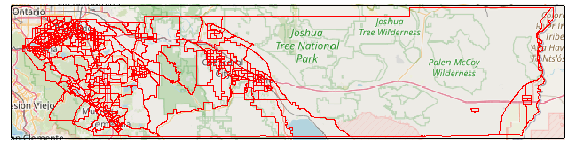
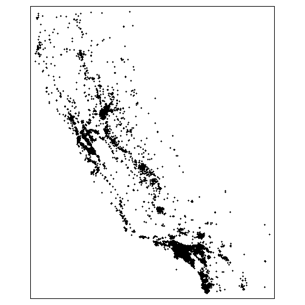
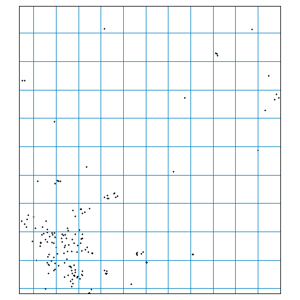

<style type="text/css">
p.indented2 {margin-left:2em;}
</style>


## Introduction

Suppose your project requires you to get climate data for every census track in California (which is over 8000). Or maybe you need daily projected temperature for every school in the state, for multiple emissions scenarios and multiple GCMs. That's a lot of data, and a lot of API calls.

When downloading large volumes of data, you generally want to run one command that does everything for you, and is smart enough not to download the same data more than once. You probably also don't want to lose what you've already gotten if your computer crashes or the internet goes down.

To address these challenges, `caldaptr` allows you to save queried data to a local database as its being downloaded. One function will start fetching data based on your API request object, save them to a database, and keep going until everything has been downloaded. If your internet drops or you turn off your computer, you can just run the function again and it will pick up where it left off.

This vignette will explain how to use `ca_getvals_db()` to download data to a local SQLite database, how to work with the data either as a remote tibble or with SQL expressions, and how to optimize the performance of the database by creating indices.

<p class="indented2">
**TIP**: An alternative approach for getting a lot of data is to download Cal-Adapt data as rasters, then use functions like `st_extract()` and `aggregate()` to query your areas-of-interest. See the [Rasters Part I](rasters-pt1.html) vignette for details.
</p>

## Example: Query Data for 450 Census Tracks

In this example, we'll get query daily historical temperature data for 453 census tracts in in Riverside County. Start by loading the required packages:


``` r
library(dplyr)
library(sf)
library(tmap)
library(caladaptr)
ca_settings(console_colors = "light", quiet = TRUE)
```

Next, we get the census tract ids for Riverside County. The easiest way to do this is using the built-in constant `aoipreset_idval`, which for census tracts includes all the 'tract' ids (geoid). The census tracts we're interested in all start with 6065 ('6' is the FIPs code for California, and '065' is the FIPs code for Riverside County):


``` r
rvrsde_trcts_int <- aoipreset_idval$censustracts$tract %>%
  as.character() %>%
  grep("^6065", ., value = TRUE) %>%
  as.numeric()

str(rvrsde_trcts_int)
#>  num [1:453] 6.07e+09 6.07e+09 6.07e+09 6.07e+09 6.07e+09 ...
```

Next, create an API request for these census tracts for the mean observed daily air temperature for 1980-2010 (i.e., Livneh data):


``` r
(rvrsde_tas_liv_cap <- ca_loc_aoipreset(type="censustracts", idfld = "tract",
                                        idval = rvrsde_trcts_int) %>%
  ca_livneh(TRUE) %>%
  ca_years(start = 1980, end = 2010) %>%
  ca_cvar(c("tasmin", "tasmax")) %>%
  ca_period("day") %>%
  ca_options(spatial_ag = "mean"))
#> Cal-Adapt API Request
#> Location(s): 
#>   AOI Preset: censustracts
#>   tract(s): 6065030101, 6065030103, 6065030104, (+ 450 more)
#> Variable(s): tasmin, tasmax
#> Temporal aggregration period(s): day
#> Livneh data: TRUE
#> Dates: 1980-01-01 to 2010-12-31
#> Options:
#>   spatial ag: mean
#> 

rvrsde_tas_liv_cap %>% ca_preflight()
#> General issues
#>  - none found
#> Issues for querying values
#>  - none found
#> Issues for downloading rasters
#>  - none found

# Omit `static = TRUE` to view an interactive map
plot(rvrsde_tas_liv_cap, static = TRUE)
```



\

We also have to define where the SQLite database file should go. A SQLite database is a single file, typically with an extension of *.db* or *.sqlite*. Ideally it should go in a stable location (i.e., not in the temp folder and not on removable media) because you'll need to keep accessing it both to populate it and read the data for analysis.

Other than picking a directory and giving it a name, you don't have to do anything special. If the file doesn't exist when you first fetch data, it will be created on the fly.

Here we'll put it in a sub-directory of the user's caladaptr 'data' directory.


``` r
## Create a folder for the database
data_dir <- tools::R_user_dir("caladaptr", which = "data")
(tracts_dir <- file.path(data_dir, "tracts_liv") %>% normalizePath(mustWork = FALSE))
#> [1] "C:\\Users\\Andy\\AppData\\Roaming\\R\\data\\R\\caladaptr\\tracts_liv"
if (!file.exists(tracts_dir)) dir.create(tracts_dir, recursive = TRUE)

## Define a new SQLite file name
rvrsde_liv_tas_fn <- file.path(tracts_dir, "rvrsde_liv_tas.sqlite") %>% normalizePath(mustWork = FALSE)
```

## Fetch Data

Next, we fetch data from the server using `ca_getvals_db()`. This is similar to fetching data with `ca_getvals_tbl()`, but we also need to give it the file name of a SQLite database, and the name of a table in the database where the values will be saved. As with `ca_getvals_tbl()`, the climate variable(s) in a table must use the same units. Hence you could save minimum and maximum temperature in the same table, but not temperature and precipitation.

The `lookup_tbls = TRUE` argument tells it to save columns of repetitive data (such as the GCM, scenario, spatial aggregation function, etc.) as integers joined to lookup tables. This is a bit like R's factor data class, and can dramatically reduce the size of a database file. `new_recs_only = TRUE` tells it to only fetch data that isn't already in the database (based on a 'hash' of the API call, which is saved in a separate table in the database).


``` r
rvrsde_liv_tas_rtbl <- rvrsde_tas_liv_cap %>%
  ca_getvals_db(db_fn = rvrsde_liv_tas_fn,
                db_tbl = "rvrsde_tas",
                lookup_tbls = TRUE,
                new_recs_only = TRUE,
                quiet = TRUE)

rvrsde_liv_tas_rtbl
#> # Source:   SQL [?? x 7]
#> # Database: sqlite 3.47.1 [C:\Users\Andy\AppData\Roaming\R\data\R\caladaptr\tracts_liv\rvrsde_liv_tas.sqlite]
#>         tract cvar   period slug              spag  dt           val
#>       <int64> <chr>  <chr>  <chr>             <chr> <chr>      <dbl>
#>  1 6065030101 tasmin day    tasmin_day_livneh mean  1980-01-01  7.41
#>  2 6065030101 tasmin day    tasmin_day_livneh mean  1980-01-02  5.30
#>  3 6065030101 tasmin day    tasmin_day_livneh mean  1980-01-03  5.62
#>  4 6065030101 tasmin day    tasmin_day_livneh mean  1980-01-04  3.57
#>  5 6065030101 tasmin day    tasmin_day_livneh mean  1980-01-05  3.25
#>  6 6065030101 tasmin day    tasmin_day_livneh mean  1980-01-06  7.05
#>  7 6065030101 tasmin day    tasmin_day_livneh mean  1980-01-07  8.45
#>  8 6065030101 tasmin day    tasmin_day_livneh mean  1980-01-08 11.5 
#>  9 6065030101 tasmin day    tasmin_day_livneh mean  1980-01-09 11.4 
#> 10 6065030101 tasmin day    tasmin_day_livneh mean  1980-01-10 10.9 
#> # ℹ more rows
```

\

<p class="indented2">
**TIP**: Adding `debug = TRUE` to `ca_getvals_db()` will show additional information including how many more calls are required to complete the request.
</p>

\

# Remote Tibbles

`ca_getvals_db()` returns a *remote tibble*, which you can think of as the front-end of a database which for the most part looks and acts like a regular tibble (with a few exceptions). However the values of remote tibble are not held in memory, which you can tell by looking at the size:


``` r
rvrsde_liv_tas_rtbl %>% object.size() %>% format(units = "Mb")
#> [1] "0 Mb"
```

\


When you print it out, you’ll notice that it mostly looks like a regular tibble, with a couple of differences. The name of the database is given, however the number of rows isn't provided because it only prints the first few rows:


``` r
rvrsde_liv_tas_rtbl
#> # Source:   SQL [?? x 7]
#> # Database: sqlite 3.47.1 [C:\Users\Andy\AppData\Roaming\R\data\R\caladaptr\tracts_liv\rvrsde_liv_tas.sqlite]
#>         tract cvar   period slug              spag  dt           val
#>       <int64> <chr>  <chr>  <chr>             <chr> <chr>      <dbl>
#>  1 6065030101 tasmin day    tasmin_day_livneh mean  1980-01-01  7.41
#>  2 6065030101 tasmin day    tasmin_day_livneh mean  1980-01-02  5.30
#>  3 6065030101 tasmin day    tasmin_day_livneh mean  1980-01-03  5.62
#>  4 6065030101 tasmin day    tasmin_day_livneh mean  1980-01-04  3.57
#>  5 6065030101 tasmin day    tasmin_day_livneh mean  1980-01-05  3.25
#>  6 6065030101 tasmin day    tasmin_day_livneh mean  1980-01-06  7.05
#>  7 6065030101 tasmin day    tasmin_day_livneh mean  1980-01-07  8.45
#>  8 6065030101 tasmin day    tasmin_day_livneh mean  1980-01-08 11.5 
#>  9 6065030101 tasmin day    tasmin_day_livneh mean  1980-01-09 11.4 
#> 10 6065030101 tasmin day    tasmin_day_livneh mean  1980-01-10 10.9 
#> # ℹ more rows
```

Note how the values in the 'gcm' column and other columns are character, even though they're saved as integers connected to lookup tables. Under the hood, the remote tibble is based on a SQL expression that joins the values table to the lookup tables.

Remote tibbles are powered on the backend by [dbplyr](https://dbplyr.tidyverse.org/), which handles the back-and-forth between your code and the database. For basic analyses, you can use the usual functions from dplyr, like `filter()`, `group_by()`, `summarize()`, etc. Data from the database will only be read into memory when absolutely necessary (i.e., when it comes time to print, plot, evaluate for input into another function, etc.).

Note that not all base R functions and operators will work with remote tibbles. Whenever possible, use the dplyr version. For example to grab a column:


``` r
## dplyr pull() works to grab a column of values
rvrsde_liv_tas_rtbl %>% pull(tract) %>% unique() %>% length()
#> [1] 453

## The $ operator does not work with remote tibbles :-(
## ERROR:
## rvrsde_liv_tas_rtbl$tract
```

To find out how many rows are in a remote tibble, `nrow()` doesn't work but you can use `dplyr::count()`:


``` r
rvrsde_liv_tas_rtbl %>% count()
#> # Source:   SQL [?? x 1]
#> # Database: sqlite 3.47.1 [C:\Users\Andy\AppData\Roaming\R\data\R\caladaptr\tracts_liv\rvrsde_liv_tas.sqlite]
#>          n
#>      <int>
#> 1 10258638
```

`filter()` and `select()` work as expected. For example to get just the values for the first tract in 1980, we can run:


``` r
rvrsde_liv_tas_rtbl %>%
  filter(tract == 6065030101, substring(dt, 1, 4) == "1980") %>%
  select(dt, val)
#> # Source:   SQL [?? x 2]
#> # Database: sqlite 3.47.1 [C:\Users\Andy\AppData\Roaming\R\data\R\caladaptr\tracts_liv\rvrsde_liv_tas.sqlite]
#>    dt           val
#>    <chr>      <dbl>
#>  1 1980-01-01  7.41
#>  2 1980-01-02  5.30
#>  3 1980-01-03  5.62
#>  4 1980-01-04  3.57
#>  5 1980-01-05  3.25
#>  6 1980-01-06  7.05
#>  7 1980-01-07  8.45
#>  8 1980-01-08 11.5 
#>  9 1980-01-09 11.4 
#> 10 1980-01-10 10.9 
#> # ℹ more rows
```


To compute the mean minimum daily temperature by census tract, we can use `group_by()` with `summarize()`:


``` r
rvrsde_liv_tas_rtbl %>%
  filter(tract <= 6065030601) %>%
  group_by(tract) %>%
  summarize(mean_daily_min = mean(val, na.rm = TRUE))
#> # Source:   SQL [?? x 2]
#> # Database: sqlite 3.47.1 [C:\Users\Andy\AppData\Roaming\R\data\R\caladaptr\tracts_liv\rvrsde_liv_tas.sqlite]
#>         tract mean_daily_min
#>       <int64>          <dbl>
#>  1 6065030101           18.6
#>  2 6065030103           18.7
#>  3 6065030104           18.7
#>  4 6065030200           18.8
#>  5 6065030300           18.8
#>  6 6065030400           18.8
#>  7 6065030501           18.4
#>  8 6065030502           18.4
#>  9 6065030503           18.4
#> 10 6065030601           18.3
```

Not every dplyr expression will work with remote tibbles however. Some valid R expressions simply don't have a SQL counterpart. The following statements work for regular tibbles but not remote tibbles. When you encounter problems like these, you can either [learn more SQL](https://www.sqlitetutorial.net/) to find a SQL approach to your objective, or convert the SQLite table to another R data class (like a regular tibble, or data.table).


``` r
## These expressions do not work with remote tibbles
## rvrsde_liv_tas_rtbl %>% slice(1:500)                                           ## doesn't work

## all_tracts <- rvrsde_liv_tas_rtbl %>% pull(tract) %>% unique()
## rvrsde_liv_tas_rtbl %>% filter(tract %in% all_tracts[1:50])                    ## doesn't work

##rvrsde_liv_tas_rtbl %>% filter(tract %in% c(6065047900,6065048100,6065048200))  ## works
```

To save or convert the results of a dplyr expression to a new tibble, add `collect()` at the end. This will force it to read values into memory:


``` r
my_new_tibble <- rvrsde_liv_tas_rtbl %>%
  filter(tract == 6065030101, substring(dt, 1, 4) == "1980") %>%
  select(dt, val) %>%
  collect()

str(my_new_tibble)
#> tibble [732 × 2] (S3: tbl_df/tbl/data.frame)
#>  $ dt : chr [1:732] "1980-01-01" "1980-01-02" "1980-01-03" "1980-01-04" ...
#>  $ val: num [1:732] 7.41 5.3 5.62 3.57 3.25 ...
```

## Mounting an existing SQLite database as a remote tibble

When you start a new R session, you'll need to reestablish the connection to your SQLite database in order to work with the data as remote tibble. If the database was created with `ca_getvals_db()`, you can re-load or 'mount' it as remote tibble with `ca_db_read()`, passing the name of a SQLite database.


``` r
rvrsde_liv_tas_fn
#> [1] "C:\\Users\\Andy\\AppData\\Roaming\\R\\data\\R\\caladaptr\\tracts_liv\\rvrsde_liv_tas.sqlite"
x_tbl <- ca_db_read(rvrsde_liv_tas_fn)
x_tbl
#> # Source:   SQL [?? x 7]
#> # Database: sqlite 3.47.1 [C:\Users\Andy\AppData\Roaming\R\data\R\caladaptr\tracts_liv\rvrsde_liv_tas.sqlite]
#>         tract cvar   period slug              spag  dt           val
#>       <int64> <chr>  <chr>  <chr>             <chr> <chr>      <dbl>
#>  1 6065030101 tasmin day    tasmin_day_livneh mean  1980-01-01  7.41
#>  2 6065030101 tasmin day    tasmin_day_livneh mean  1980-01-02  5.30
#>  3 6065030101 tasmin day    tasmin_day_livneh mean  1980-01-03  5.62
#>  4 6065030101 tasmin day    tasmin_day_livneh mean  1980-01-04  3.57
#>  5 6065030101 tasmin day    tasmin_day_livneh mean  1980-01-05  3.25
#>  6 6065030101 tasmin day    tasmin_day_livneh mean  1980-01-06  7.05
#>  7 6065030101 tasmin day    tasmin_day_livneh mean  1980-01-07  8.45
#>  8 6065030101 tasmin day    tasmin_day_livneh mean  1980-01-08 11.5 
#>  9 6065030101 tasmin day    tasmin_day_livneh mean  1980-01-09 11.4 
#> 10 6065030101 tasmin day    tasmin_day_livneh mean  1980-01-10 10.9 
#> # ℹ more rows
```

\

# Reading databases with SQL

You aren't limited to interacting with SQLite databases via remote tibbles, and you don't need caladaptr functions to access them. You can connect to them directly, and read / edit the data using SQL. SQL is powerful and flexible language for working with relational databases, and is supported in R through the [DBI](https://dbi.r-dbi.org/) package.

To help you write SQL statements, `ca_db_info()` will show you what's in a SQLite database created by `ca_getvals_db()`. You can pass the name of a SQLite database file, or a remote tibble created by `ca_getvals_db()`, to `ca_db_info()`. The output includes tables, fields, primary keys, and indices in a database. It will also show the SQL expression for the primary data table(s) if lookup tables were used.


``` r
rvrsde_liv_tas_fn %>% ca_db_info()
#> Cal-Adapt Query Database
#> Source: C:\Users\Andy\AppData\Roaming\R\data\R\caladaptr\tracts_liv\rvrsde_liv_tas.sqlite
#> 
#> Cal-Adapt data tables:
#>  rvrsde_tas
#>    - Fields: tract; cvar_id; period_id; slug_id; spag_id; dt; val
#>    - Num rows: 10258638
#>    - Indices: rvrsde_tas.tract
#>    - SQL: SELECT tract, cvar, period, slug, spag, dt, val FROM rvrsde_tas LEFT JOIN cvars ON rvrsde_tas.cvar_id = cvars.cvar_id LEFT JOIN periods ON rvrsde_tas.period_id = periods.period_id LEFT JOIN slugs ON rvrsde_tas.slug_id = slugs.slug_id LEFT JOIN spags ON rvrsde_tas.spag_id = spags.spag_id
#> 
#> Lookup tables:
#>  cvars
#>    - Fields: cvar_id*; cvar
#>    - Num rows: 11
#>    - Indices: none
#> 
#>  periods
#>    - Fields: period_id*; period
#>    - Num rows: 4
#>    - Indices: none
#> 
#>  slugs
#>    - Fields: slug_id*; slug
#>    - Num rows: 2
#>    - Indices: none
#> 
#>  spags
#>    - Fields: spag_id*; spag
#>    - Num rows: 6
#>    - Indices: none
#> 
#> API Request Hashes Tables:
#>  rvrsde_tas_hashes
#>    - Fields: hash_int*
#>    - Num rows: 906
#>    - Indices: none
#> 
#> 
```

SQL is beyond the scope of this vignette, but below are some example of using DBI to send SQL statements to a SQLite database to query a table. See the documentation from [DBI](https://dbi.r-dbi.org/articles/dbi) and [SQLite Tutorial](https://www.sqlitetutorial.net/) for more information and examples.


``` r
library(DBI); library(RSQLite)

## Grab the active database connection.
## db_conn <- rvrsde_liv_tas_rtbl$src$con

## If there wasn't an active connection, we could open one directly with
db_conn <- dbConnect(SQLite(), dbname = rvrsde_liv_tas_fn)

## List the tables
dbListTables(db_conn)
#> [1] "cvars"             "periods"           "rvrsde_tas"        "rvrsde_tas_hashes" "slugs"             "spags"

## Import one table in its entirety
(dbReadTable(db_conn, "slugs"))
#>   slug_id              slug
#> 1       1 tasmin_day_livneh
#> 2       2 tasmax_day_livneh

## Use a SELECT query to read the first 12 records from rvrsde_tas
first12_qry <- dbSendQuery(db_conn, "SELECT * FROM rvrsde_tas LIMIT 12;")
(first12_tbl <- dbFetch(first12_qry))
#>         tract cvar_id period_id slug_id spag_id         dt    val
#> 1  6065030101       2         1       1       2 1980-01-01  7.415
#> 2  6065030101       2         1       1       2 1980-01-02  5.295
#> 3  6065030101       2         1       1       2 1980-01-03  5.620
#> 4  6065030101       2         1       1       2 1980-01-04  3.575
#> 5  6065030101       2         1       1       2 1980-01-05  3.250
#> 6  6065030101       2         1       1       2 1980-01-06  7.050
#> 7  6065030101       2         1       1       2 1980-01-07  8.450
#> 8  6065030101       2         1       1       2 1980-01-08 11.460
#> 9  6065030101       2         1       1       2 1980-01-09 11.380
#> 10 6065030101       2         1       1       2 1980-01-10 10.935
#> 11 6065030101       2         1       1       2 1980-01-11 11.345
#> 12 6065030101       2         1       1       2 1980-01-12 13.175
dbClearResult(first12_qry)

## Get the mean and standard deviation of tasmax by tract and year
tract_yr_tasmax_qry <- dbSendQuery(db_conn, "SELECT tract, cvar, substr(dt, 1, 4) as year,
                                   avg(val) as avg_val, stdev(val) as sd_val
                                   FROM rvrsde_tas LEFT JOIN cvars ON rvrsde_tas.cvar_id = cvars.cvar_id
                                   WHERE cvar = 'tasmax'
                                   GROUP BY tract, substr(dt, 1, 4)
                                   LIMIT 40;")
(tract_yr_tasmax_tbl <- dbFetch(tract_yr_tasmax_qry))
#>         tract   cvar year  avg_val   sd_val
#> 1  6065030101 tasmax 1980 26.21607 6.852663
#> 2  6065030101 tasmax 1981 26.34479 7.350711
#> 3  6065030101 tasmax 1982 23.53210 7.387218
#> 4  6065030101 tasmax 1983 25.14408 7.513801
#> 5  6065030101 tasmax 1984 26.83633 7.069716
#> 6  6065030101 tasmax 1985 25.93858 7.863726
#> 7  6065030101 tasmax 1986 26.52530 6.510764
#> 8  6065030101 tasmax 1987 25.36882 7.144761
#> 9  6065030101 tasmax 1988 26.46512 7.067632
#> 10 6065030101 tasmax 1989 26.54858 7.057848
#> 11 6065030101 tasmax 1990 26.55011 7.615560
#> 12 6065030101 tasmax 1991 26.15068 6.723376
#> 13 6065030101 tasmax 1992 26.40520 7.267906
#> 14 6065030101 tasmax 1993 25.93308 6.787862
#> 15 6065030101 tasmax 1994 26.03052 7.195865
#> 16 6065030101 tasmax 1995 26.25166 7.524154
#> 17 6065030101 tasmax 1996 26.99464 7.454512
#> 18 6065030101 tasmax 1997 27.09871 7.136586
#> 19 6065030101 tasmax 1998 25.47475 7.428966
#> 20 6065030101 tasmax 1999 26.48893 6.935570
#> 21 6065030101 tasmax 2000 27.02283 6.932329
#> 22 6065030101 tasmax 2001 26.40905 7.781031
#> 23 6065030101 tasmax 2002 26.80597 6.768257
#> 24 6065030101 tasmax 2003 27.23386 7.296919
#> 25 6065030101 tasmax 2004 26.89044 7.072354
#> 26 6065030101 tasmax 2005 26.25752 7.259982
#> 27 6065030101 tasmax 2006 27.78707 7.590995
#> 28 6065030101 tasmax 2007 27.32666 7.516599
#> 29 6065030101 tasmax 2008 26.72738 7.864197
#> 30 6065030101 tasmax 2009 27.45423 7.349510
#> 31 6065030101 tasmax 2010 26.02900 7.585175
#> 32 6065030103 tasmax 1980 26.28562 6.856170
#> 33 6065030103 tasmax 1981 26.45149 7.315280
#> 34 6065030103 tasmax 1982 23.77380 7.349562
#> 35 6065030103 tasmax 1983 25.21624 7.458894
#> 36 6065030103 tasmax 1984 26.99472 7.132914
#> 37 6065030103 tasmax 1985 26.03365 7.810316
#> 38 6065030103 tasmax 1986 26.61862 6.484041
#> 39 6065030103 tasmax 1987 25.53032 7.147122
#> 40 6065030103 tasmax 1988 26.58549 7.030189
dbClearResult(tract_yr_tasmax_qry)
```

<p class="indented2">
**TIP**: SQL/SQLite and dplyr/R are good at different things. Databases are a good way to save large amounts of tabular data, and SQL works pretty well to filter rows, join tables, and compute simple summaries. dplyr/tidyverse/R are good at reshaping data, more complex summaries, and integration with other packages and methods. If you hit a wall in your analysis, think about how you can mix and match SQL and dplyr to leverage the strengths of each.
</p>

\

# Optimizating Database Performance

Two aspects of database optimization are managing the size of the database on disk, and speed of querying the data. Below are some general considerations for managing both of these aspects in SQLite databases.

## How many databases?

When you save data to a database with `ca_getvals_db()`, you get to choose how much data to put in a single table, how many tables to put in one database, and how many databases to create. Below are some general guidelines on how many databases to use:

- SQLite databases are contained in a single file, and can hold many tables. However there is little or no performance gain in having multiple tables in a single database (aside from lookup tables), compared to separate databases. There may also be a performance hit if you have multiple large tables in a database. Also if you need access to them simultaneously, you may have to manage the connections yourself (i.e., dbplyr may limit the number of parallel connections or queries to a single database).

- At the other end of the spectrum, you generally don't want to have lots of database connections open simultaneously. Even if you don't see the connections (because dbplyr manages them for you), each database requires it's own connection, which takes a bit of overhead. If you access database files in a loop, be sure to delete the remote tibbles or manually close the connections so they don't accumulate.

## How many tables?

In terms of how much data to put in one table, some general points to consider:

- Databases like SQLite are designed to handle millions of records, that's what they're designed for. It's unlikely you would reach the technical limits of what the database can handle.

- As a general guide, aim to have all the data for each analysis or summary in a single table. For example if you need minimum and maximum temperature for your analysis (maybe to compute growing degree days), put those values in the same table. This will perform better than retrieving the data from two different tables, and combining them in R.

- A exception to the above rule is when data can't be combined in a single table for technical reasons. For example the following types of data generally can't be combined in the same table:

    - Livneh and non-Livneh data (different columns)
    - climate variables with different units (e.g., windspeed and precipitation)

- As a general rule, large tables can be slower to query than smaller tables (although this can be improved with indices, see below). Thus once you get all the data for a single analysis in a single table, start a new table the next batch of data.

<p class="indented2">
**TIP**: When in doubt, save one dataset in one data table, and one data table in one database. Delete remote tibbles when you no longer need them to free up the database connections.
</p>

## Indices

You can create indices for specific fields in specific tables. Indices are like a phone book for a field, and improve the speed of operations that utilize that field (such as filters or joins). The downside to indices is they increase the size of the database on disk. A general good practice is to create indices for fields that you expect to use for joins, filters, and sorting (including the location id field), but not others. For more info, see the documentation on  [SQLite.org](https://www.sqlite.org/queryplanner.html).

You can create indices by passing field name(s) to the `indices` argument when you first populate a table with `ca_getvals_db()`. The downside is a slightly slower write speed, because the index has to be updated every time data is written to the table. Once a database is created, additional data brought in via  `ca_getvals_db()` will be automatically indexed, but additional indices can not be created with the indices argument.

An alternative approach is to skip indices while downloading, and instead add them after all the data have been downloaded, but before you start analysis. You can see which fields have indices using `ca_db_info()` (above), or directly using functions from DBI.

You can add or delete indices to an existing database using `ca_db_indices()`. For example to add an index on the 'tract' column (which will speed up filters and joins on this column), you could run:


``` r
rvrsde_liv_tas_rtbl %>%
  ca_db_indices(tbl = "rvrsde_tas", idx_fld_add = "tract") %>%
  ca_db_info()
#> rvrsde_tas.tract is already indexed, skipping
#> No indices added
#> No indices deleted
#> Cal-Adapt Query Database
#> Source: C:/Users/Andy/AppData/Roaming/R/data/R/caladaptr/tracts_liv/rvrsde_liv_tas.sqlite
#> 
#> Cal-Adapt data tables:
#>  rvrsde_tas
#>    - Fields: tract; cvar_id; period_id; slug_id; spag_id; dt; val
#>    - Num rows: 10258638
#>    - Indices: rvrsde_tas.tract
#>    - SQL: SELECT tract, cvar, period, slug, spag, dt, val FROM rvrsde_tas LEFT JOIN cvars ON rvrsde_tas.cvar_id = cvars.cvar_id LEFT JOIN periods ON rvrsde_tas.period_id = periods.period_id LEFT JOIN slugs ON rvrsde_tas.slug_id = slugs.slug_id LEFT JOIN spags ON rvrsde_tas.spag_id = spags.spag_id
#> 
#> Lookup tables:
#>  cvars
#>    - Fields: cvar_id*; cvar
#>    - Num rows: 11
#>    - Indices: none
#> 
#>  periods
#>    - Fields: period_id*; period
#>    - Num rows: 4
#>    - Indices: none
#> 
#>  slugs
#>    - Fields: slug_id*; slug
#>    - Num rows: 2
#>    - Indices: none
#> 
#>  spags
#>    - Fields: spag_id*; spag
#>    - Num rows: 6
#>    - Indices: none
#> 
#> API Request Hashes Tables:
#>  rvrsde_tas_hashes
#>    - Fields: hash_int*
#>    - Num rows: 906
#>    - Indices: none
#> 
#> 
```

<p class="indented2">
**TIP**: You might want to wait to see how slow your analyses are before deciding to create  indices, which will increase the size of the database. If the wait time is tolerable, and you don't have to run the summary very often, adding indices may not be necessary.
</p>

## Reducing the Number of API Calls by Grouping Locations by Loca Grid Cell

LOCA grid cells are approximately 6km (3.7 mi) on each side. All locations within the same grid cell will therefore have the same values for any LOCA downscaled climate variables, projected or historic, modeled or observed. If you have more than one point location per grid cell, it doesn't make sense to query the server for each one because they'll all return the same values. This provides a way to reduce the number of total calls to the server.

In the next example, we'll get climate data for all the schools in CA (over 10,000). Because there are so many schools, and many of them are close together (especially in cities), we'll first spatial join them to the LOCA grid. Next we'll take grids that have schools in them, find their centroids, create an API request object for the centroids, and fetch data. We can then join the results back to the schools by the LOCA grid id.

First we import the schools which we get from the [California Department of Education GeoHub](https://data-cdegis.opendata.arcgis.com/):


``` r
library(sf)
ca_schools_url <- "https://raw.githubusercontent.com/ucanr-igis/caladaptr-res/main/geoms/ca_schools.geojson"
ca_schools_sf <- st_read(ca_schools_url, quiet = TRUE)
dim(ca_schools_sf)
#> [1] 10043     4
ca_schools_sf
#> Simple feature collection with 10043 features and 3 fields
#> Geometry type: POINT
#> Dimension:     XY
#> Bounding box:  xmin: -124.2856 ymin: 32.54807 xmax: -114.3958 ymax: 41.98865
#> Geodetic CRS:  WGS 84
#> First 10 features:
#>    OBJECTID                              SchoolName       SchoolType                   geometry
#> 1         1  Envision Academy for Arts & Technology             High POINT (-122.2684 37.80468)
#> 2         2 Community School for Creative Education       Elementary POINT (-122.2386 37.78464)
#> 3         3                         Yu Ming Charter       Elementary POINT (-122.2836 37.84737)
#> 4         4                Urban Montessori Charter       Elementary  POINT (-122.188 37.78676)
#> 5         5                            Epic Charter           Middle POINT (-122.2296 37.77711)
#> 6         6      Alameda County Juvenile Hall/Court   Juvenile Court POINT (-122.1182 37.71595)
#> 7         7                Alameda County Community County Community POINT (-122.0979 37.65835)
#> 8         8                    Oakland Unity Middle           Middle POINT (-122.1908 37.75908)
#> 9         9    Connecting Waters Charter - East Bay             K-12 POINT (-122.0251 37.60378)
#> 10       10                     Opportunity Academy County Community POINT (-122.0979 37.65835)
tm_shape(ca_schools_sf) + tm_dots(col = "gray")
```



\

Next, import the LOCA grid:


``` r
(locagrid_sf <- ca_locagrid_geom())
#> Reading layer `locagrid' from data source `C:\Users\Andy\AppData\Local\R\cache\R\caladaptr\locagrid.gpkg' using driver `GPKG'
#> Simple feature collection with 26517 features and 1 field
#> Geometry type: POLYGON
#> Dimension:     XY
#> Bounding box:  xmin: -124.5625 ymin: 31.5625 xmax: -113.375 ymax: 43.75
#> Geodetic CRS:  WGS 84
#> Simple feature collection with 26517 features and 1 field
#> Geometry type: POLYGON
#> Dimension:     XY
#> Bounding box:  xmin: -124.5625 ymin: 31.5625 xmax: -113.375 ymax: 43.75
#> Geodetic CRS:  WGS 84
#> First 10 features:
#>       id                           geom
#> 1  23693 POLYGON ((-124.1875 43.75, ...
#> 2  23694 POLYGON ((-124.125 43.75, -...
#> 3  23695 POLYGON ((-124.0625 43.75, ...
#> 4  23696 POLYGON ((-124 43.75, -123....
#> 5  23697 POLYGON ((-123.9375 43.75, ...
#> 6  23698 POLYGON ((-123.875 43.75, -...
#> 7  23699 POLYGON ((-123.8125 43.75, ...
#> 8  23700 POLYGON ((-123.75 43.75, -1...
#> 9  23701 POLYGON ((-123.6875 43.75, ...
#> 10 23702 POLYGON ((-123.625 43.75, -...
```

To illustrate the distribution of points relative to LOCA grid cells, we can overlay them to a zoomed in area in the central valley:


``` r
tm_shape(ca_schools_sf, bbox = c(-121.0896, 37.56298, -120.38750, 38.17253)) +
  tm_dots(col = "#333333") +
tm_shape(locagrid_sf) +
  tm_borders(col = "#0080c0")
#> Warning: Current projection unknown. Long lat coordinates (wgs84) assumed.
```



Next, we do a spatial join of the points and the LOCA grid cells. The end result will be a new column `id` in the schools layer, which is the id number of the LOCA grid cell it falls in:


``` r
ca_schools_loca_sf <- ca_schools_sf %>% st_join(locagrid_sf)
ca_schools_loca_sf %>% st_drop_geometry() %>% head()
#>   OBJECTID                              SchoolName     SchoolType    id
#> 1        1  Envision Academy for Arts & Technology           High 39897
#> 2        2 Community School for Creative Education     Elementary 39898
#> 3        3                         Yu Ming Charter     Elementary 39750
#> 4        4                Urban Montessori Charter     Elementary 39898
#> 5        5                            Epic Charter         Middle 39898
#> 6        6      Alameda County Juvenile Hall/Court Juvenile Court 40047
```

Next, grab the unique values of the `id` column:


``` r
loca_ids_schools <- ca_schools_loca_sf %>% pull(id) %>% unique()
str(loca_ids_schools)
#>  int [1:1624] 39897 39898 39750 40047 40191 40337 40046 40486 40045 40044 ...
```

This means instead of 10,043 locations, we only have to query 1,624. That's a pretty big savings, particularly considering that in our example each location requires 4 API calls (one for each GCM).

Next we create a point layer for the 1,624 LOCA grid cells that contain schools. We could pass the grid cells as polygons, but passing them as points means we don't have to worry about the Cal-Adapt server getting values for adjacent cells, and we don't have to specify a spatial aggregation function.


``` r
loca_ctr_sf <- locagrid_sf %>%
  filter(id %in% loca_ids_schools) %>%
  st_centroid()
#> Warning: st_centroid assumes attributes are constant over geometries
loca_ctr_sf %>% head()
#> Simple feature collection with 6 features and 1 field
#> Geometry type: POINT
#> Dimension:     XY
#> Bounding box:  xmin: -124.1563 ymin: 41.90625 xmax: -120.2812 ymax: 41.96875
#> Geodetic CRS:  WGS 84
#>      id                       geom
#> 1 28679 POINT (-121.9063 41.96875)
#> 2 28686 POINT (-121.4687 41.96875)
#> 3 28705 POINT (-120.2812 41.96875)
#> 4 28817 POINT (-124.1563 41.90625)
#> 5 28843 POINT (-122.5312 41.90625)
#> 6 28846 POINT (-122.3437 41.90625)
```

Next, create the API request. Here we'll get monthly evapotranspiration at the end of the century:


``` r
locaschl_et_cap <- ca_loc_sf(loc = loca_ctr_sf, idfld = "id") %>%
  ca_gcm(gcms[1:4]) %>%
  ca_scenario("rcp85") %>%
  ca_cvar("et") %>%
  ca_period("month") %>%
  ca_years(start = 2080, end = 2099)

locaschl_et_cap %>% ca_preflight()
#> General issues
#>  - none found
#> Issues for querying values
#>  - none found
#> Issues for downloading rasters
#>  - none found
```

Next, we fetch the data. Because this is still a lot of locations, we'll use `ca_getvals_db()` to save it in a database:


``` r
data_dir <- tools::R_user_dir("caladaptr", which = "data")
schools_dir <- file.path(data_dir, "schools") %>% normalizePath(mustWork = FALSE)
if (!file.exists(schools_dir)) dir.create(schools_dir, recursive = TRUE)

## Define a new SQLite file name
locaschl_fn <- file.path(schools_dir, "loca_schl.sqlite") %>% normalizePath(mustWork = FALSE)

## Fetch data
locaschl_et_rtbl <- locaschl_et_cap %>%
  ca_getvals_db(db_fn = locaschl_fn, db_tbl = "locaschl_et", new_recs_only = TRUE, quiet = TRUE)

head(locaschl_et_rtbl)
#> # Source:   SQL [?? x 8]
#> # Database: sqlite 3.47.1 [C:\Users\Andy\AppData\Roaming\R\data\R\caladaptr\schools\loca_schl.sqlite]
#>      id cvar  scenario gcm        period spag  dt           val
#>   <int> <chr> <chr>    <chr>      <chr>  <chr> <chr>      <dbl>
#> 1 28679 et    rcp85    HadGEM2-ES month  none  2080-01-31 0.626
#> 2 28679 et    rcp85    HadGEM2-ES month  none  2080-02-29 0.870
#> 3 28679 et    rcp85    HadGEM2-ES month  none  2080-03-31 1.75 
#> 4 28679 et    rcp85    HadGEM2-ES month  none  2080-04-30 2.82 
#> 5 28679 et    rcp85    HadGEM2-ES month  none  2080-05-31 3.05 
#> 6 28679 et    rcp85    HadGEM2-ES month  none  2080-06-30 2.09
```

Suppose your analysis calls for mean ET for all years and all GCMs combined. You can generate that metric for each LOCA grid with:


``` r
locaschl_meanet_tbl <- locaschl_et_rtbl %>%
  group_by(id) %>%
  summarise(mean_et = mean(val, na.rm = TRUE)) %>%
  collect()

locaschl_meanet_tbl %>% head()
#> # A tibble: 6 × 2
#>      id mean_et
#>   <int>   <dbl>
#> 1 28679   1.02 
#> 2 28686   0.802
#> 3 28705   1.77 
#> 4 28817   2.18 
#> 5 28843   1.19 
#> 6 28846   1.41
```

We can now join the summary of ET for each LOCA grid cell back to the schools layer, using the grid `id` as the join field.


``` r
ca_schools_et_sf <- ca_schools_loca_sf %>%
  left_join(locaschl_meanet_tbl, by = "id")

ca_schools_et_sf %>% head()
#> Simple feature collection with 6 features and 5 fields
#> Geometry type: POINT
#> Dimension:     XY
#> Bounding box:  xmin: -122.2836 ymin: 37.71595 xmax: -122.1182 ymax: 37.84737
#> Geodetic CRS:  WGS 84
#>   OBJECTID                              SchoolName     SchoolType    id   mean_et                   geometry
#> 1        1  Envision Academy for Arts & Technology           High 39897 0.5725853 POINT (-122.2684 37.80468)
#> 2        2 Community School for Creative Education     Elementary 39898 0.4645488 POINT (-122.2386 37.78464)
#> 3        3                         Yu Ming Charter     Elementary 39750 0.4560700 POINT (-122.2836 37.84737)
#> 4        4                Urban Montessori Charter     Elementary 39898 0.4645488  POINT (-122.188 37.78676)
#> 5        5                            Epic Charter         Middle 39898 0.4645488 POINT (-122.2296 37.77711)
#> 6        6      Alameda County Juvenile Hall/Court Juvenile Court 40047 1.0476258 POINT (-122.1182 37.71595)
```

