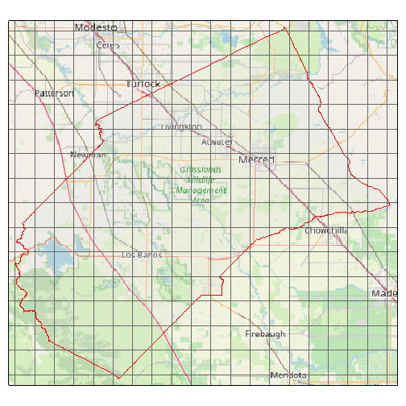
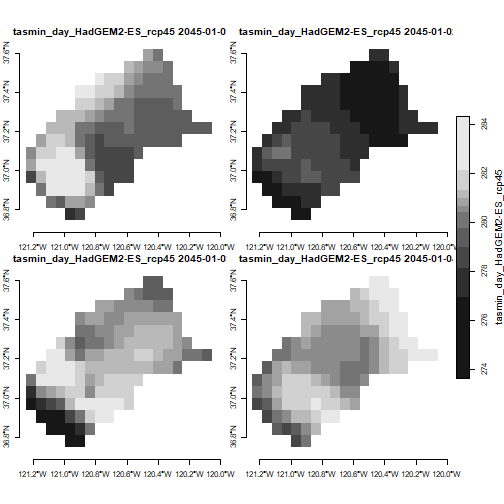
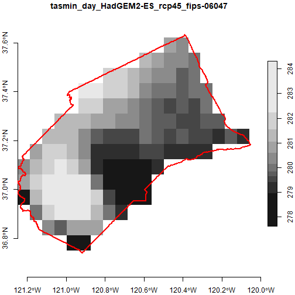
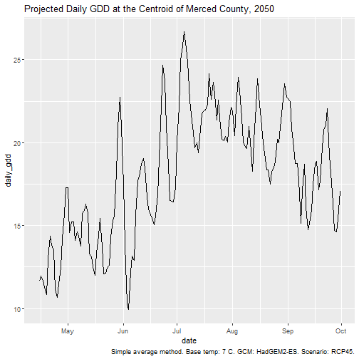
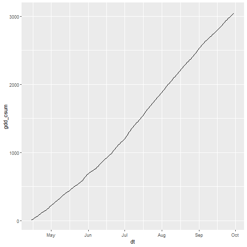
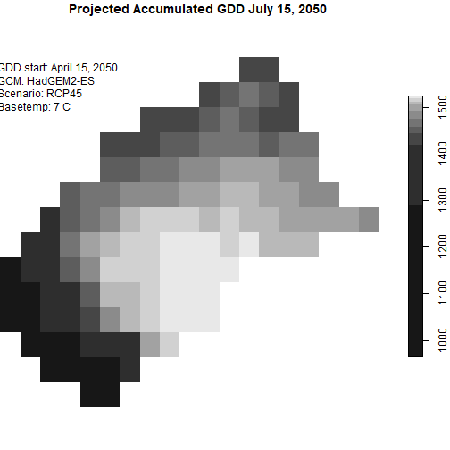

<style type="text/css">
p.indented2 {margin-left:2em;}
</style>


## Introduction

A great deal of climate data, including the bulk of data from Cal-Adapt, are inherently raster. The x and y dimensions represent space, the third dimension represents time, and the values of the 'cells' represent a climate variable like maximum temperature.

Raster data can be more challenging to work with than querying values for a specific location, because the files can be large and you need special tools to work with them. However if you are working with large areas, or your analysis calls for something out-of-the-box, then getting the data as rasters may be the way to go.

There are three commonly used ways to download raster data from Cal-Adapt:

1. NetCDF files for the [full extent](https://ucanr-igis.github.io/caladaptr-res/images/loca_grid_extent_600x646x256.png) of the LOCA downscaled data are available for download from the [Cal-Adapt Data Server](http://albers.cnr.berkeley.edu/data/). The NetCDF files will be not be discussed further here (but see Part III).

2. Rasters can be downloaded for specific variables and areas-of-interest using the Cal-Adapt [Data Download Tool](https://cal-adapt.org/data/download/).

3. Rasters can be requested programmatically through the Cal-Adapt API.

Downloading rasters is relatively easy with `caladaptr`. The same API request object that you use to query values can be used to download rasters by passing it to `ca_getrst_stars()`. This function saves the rasters to disk as TIF files, with additional 'sidecar' files that store additional metadata that the TIF format can't handle. To do analysis, you next import the TIFs into R with `ca_stars_read()`, where they come in as 'stars' objects. From there, you can use functions from the [stars](https://cran.r-project.org/package=stars) package, which is well-equipped to handle spatiotemporal arrays of raster data.

The rest of this vignette demonstrates how to download and work with Cal-Adapt data as rasters. Only the first 20% actually involves functions from caladpatr. The rest of the tutorial, and the bulk of most work flows, will use functions from stars to combine, subset, and analyze Cal-Adapt raster data.

## Download Practice Data

To illustrate, we'll download 20 years of daily temperature data for Merced County for 4 GCMs and 2 emissions scenarios. Start by loading the packages we'll need:


``` r
library(caladaptr)
library(dplyr)
library(sf)
library(stars)
library(magrittr)
library(ggplot2)
library(lubridate)
```

The FIPs code for Merced County is "06047"[^1]. As always we first create an API request:

[^1]: To find the FIPS code, you can run `ca_aoipreset_geom("counties", quiet = TRUE) %>% st_drop_geometry() %>% select(name, state_name, fips, id) %>% filter(name == "Merced")`


``` r
merced_cap <- ca_loc_aoipreset(type = "counties", idfld = "fips", idval = "06047") %>%
  ca_gcm(gcms[1:4]) %>%
  ca_period("day") %>%
  ca_cvar(c("tasmin", "tasmax")) %>%
  ca_scenario(c("rcp45", "rcp85")) %>%
  ca_years(start = 2045, end = 2065)
```

Note: normally when you construct an API request object for polygon features, you're supposed to include `ca_options()` to specify how you want to spatially aggregate the climate values. This is optional (and in fact ignored) for downloading rasters, because we are not spatially aggregating anything. (For an example of spatially aggregating raster data after it's been downloaded, see Part III.)

It's generally a good idea to plot your API request before using it to ensure you've got the right area:


``` r
plot(merced_cap, locagrid = TRUE, static = TRUE)
```



That all looks good. Next let's download the data as TIFs by passing `merced_cap` to `ca_getrst_stars()`. This function does two important things:

i) downloads data and saves them as standard TIFs in `out_dir`, and

ii) creates a little 'sidecar' file for each TIF which saves additional metadata about the TIF (such as the GCM and emissions scenario).


``` r
data_dir <- tools::R_user_dir("caladaptr", which = "data")
merced_dir <- file.path(data_dir, "merced")
if (!file.exists(merced_dir)) dir.create(merced_dir, recursive = TRUE)

merced_stars_fn <- merced_cap %>%
  ca_getrst_stars(out_dir = merced_dir, mask = TRUE, quiet = TRUE,
                  normalize_path = TRUE, overwrite = FALSE)
```

We can see what was downloaded. Note for each TIF there is a sidecar rds file with additional metadata:


``` r
list.files(merced_dir)
#>  [1] "mercd_bos_dist.geojson"                          "tasmax_day_CanESM2_rcp45_fips-06047.attr.rds"   
#>  [3] "tasmax_day_CanESM2_rcp45_fips-06047.tif"         "tasmax_day_CanESM2_rcp85_fips-06047.attr.rds"   
#>  [5] "tasmax_day_CanESM2_rcp85_fips-06047.tif"         "tasmax_day_CNRM-CM5_rcp45_fips-06047.attr.rds"  
#>  [7] "tasmax_day_CNRM-CM5_rcp45_fips-06047.tif"        "tasmax_day_CNRM-CM5_rcp85_fips-06047.attr.rds"  
#>  [9] "tasmax_day_CNRM-CM5_rcp85_fips-06047.tif"        "tasmax_day_HadGEM2-ES_rcp45_fips-06047.attr.rds"
#> [11] "tasmax_day_HadGEM2-ES_rcp45_fips-06047.tif"      "tasmax_day_HadGEM2-ES_rcp85_fips-06047.attr.rds"
#> [13] "tasmax_day_HadGEM2-ES_rcp85_fips-06047.tif"      "tasmax_day_MIROC5_rcp45_fips-06047.attr.rds"    
#> [15] "tasmax_day_MIROC5_rcp45_fips-06047.tif"          "tasmax_day_MIROC5_rcp85_fips-06047.attr.rds"    
#> [17] "tasmax_day_MIROC5_rcp85_fips-06047.tif"          "tasmin_day_CanESM2_rcp45_fips-06047.attr.rds"   
#> [19] "tasmin_day_CanESM2_rcp45_fips-06047.tif"         "tasmin_day_CanESM2_rcp85_fips-06047.attr.rds"   
#> [21] "tasmin_day_CanESM2_rcp85_fips-06047.tif"         "tasmin_day_CNRM-CM5_rcp45_fips-06047.attr.rds"  
#> [23] "tasmin_day_CNRM-CM5_rcp45_fips-06047.tif"        "tasmin_day_CNRM-CM5_rcp85_fips-06047.attr.rds"  
#> [25] "tasmin_day_CNRM-CM5_rcp85_fips-06047.tif"        "tasmin_day_HadGEM2-ES_rcp45_fips-06047.attr.rds"
#> [27] "tasmin_day_HadGEM2-ES_rcp45_fips-06047.tif"      "tasmin_day_HadGEM2-ES_rcp85_fips-06047.attr.rds"
#> [29] "tasmin_day_HadGEM2-ES_rcp85_fips-06047.tif"      "tasmin_day_MIROC5_rcp45_fips-06047.attr.rds"    
#> [31] "tasmin_day_MIROC5_rcp45_fips-06047.tif"          "tasmin_day_MIROC5_rcp85_fips-06047.attr.rds"    
#> [33] "tasmin_day_MIROC5_rcp85_fips-06047.tif"
```

\

Other useful arguments of `ca_getrst_stars()` include:

- if `mask = TRUE` and the area of interest is a polygon, pixels outside the area of interest will be given `NA` values

- if there are multiple locations in the API request, `merge_geoms = TRUE` will have it merge all the geoms together and return a single TIF that covers all locations (assuming they're not too far apart and the extent of their union is small enough to be queried by the Cal-Adapt API). See also the vignette on downloading rasters for large areas.

- `overwrite = FALSE` tells `ca_getrst_stars()` to first see if the TIF file has already been downloaded (based on the automatically generated file name). This can help you re-run code very quickly because the files won't have to be re-downloaded each time.

<p class="indented2">**TIP: Managing downloaded TIF files**. There is no way to import Cal-Adapt data into R as rasters without first downloading TIF files. To help you manage potentially large numbers of downloaded TIF files, a good practice is to create separate data directories for each location or project, and use the `out_dir` argument to put the downloaded files where they need to be. If you have no desire to keep the TIF files, you can download them to `tempdir()` and then delete them programatically with `unlink()` (remember to get the rds files also).</p>

## Read TIFs into R

The object returned by `ca_getrst_stars()` is a vector of TIF file names. The easiest and recommended way to work with those rasters in R is to import the TIFs with `ca_read_stars()`. You can read a whole bunch of TIFs with this function by passing it a vector of TIF file names. `ca_read_stars()` returns a **list of stars objects** attributed with additional metadata from Cal-Adapt:


``` r
mercd_stars_lst <- merced_stars_fn %>% ca_stars_read()
class(mercd_stars_lst)
#> [1] "list"
length(mercd_stars_lst)
#> [1] 16
```

Note: stars objects are read into memory by default. If your rasters are really large, and/or you are getting a lot of climate variables, there are ways of controlling what gets loaded and when. Passing `proxy = TRUE` to `ca_stars_read()` will create a list of 'stars proxy' objects, which are just like stars objects but reading data from disk is postponed until needed. See the [stars documentation](https://r-spatial.github.io/stars/articles/stars2.html) for details.

Let's look at the elements of our stars list:


``` r
names(mercd_stars_lst)
#>  [1] "tasmin_day_HadGEM2-ES_rcp45_fips-06047" "tasmax_day_HadGEM2-ES_rcp45_fips-06047" "tasmin_day_CNRM-CM5_rcp45_fips-06047"  
#>  [4] "tasmax_day_CNRM-CM5_rcp45_fips-06047"   "tasmin_day_CanESM2_rcp45_fips-06047"    "tasmax_day_CanESM2_rcp45_fips-06047"   
#>  [7] "tasmin_day_MIROC5_rcp45_fips-06047"     "tasmax_day_MIROC5_rcp45_fips-06047"     "tasmin_day_HadGEM2-ES_rcp85_fips-06047"
#> [10] "tasmax_day_HadGEM2-ES_rcp85_fips-06047" "tasmin_day_CNRM-CM5_rcp85_fips-06047"   "tasmax_day_CNRM-CM5_rcp85_fips-06047"  
#> [13] "tasmin_day_CanESM2_rcp85_fips-06047"    "tasmax_day_CanESM2_rcp85_fips-06047"    "tasmin_day_MIROC5_rcp85_fips-06047"    
#> [16] "tasmax_day_MIROC5_rcp85_fips-06047"
```

We can see from the above that our list contains 16 stars objects for different combos of GCM, emissions scenario, and climate variable.

\

For simplicity, the rest of this vignette will just use one or two of these stars objects. Normally you'd want to work with all your rasters, which may involve writing code loops to work through the list of stars objects. Below we'll see how to generate an index for your stars objects to make code loops a little easier. Part II will introduce an even better way of processing multiple stars objects by combining them into a single six-dimensional climate data cube.

## Explore a stars object

Let's look at the properties of the first stars object in our list:


``` r
mercd_stars_lst[[1]]
#> stars object with 3 dimensions and 1 attribute
#> attribute(s), summary of first 1e+05 cells:
#>                                     Min.  1st Qu.   Median    Mean  3rd Qu.     Max.  NA's
#> tasmin_day_HadGEM2-ES_rcp45...  266.4809 280.8343 285.1293 284.897 289.0701 302.3545 58748
#> dimension(s):
#>      from   to     offset   delta refsys point x/y
#> x       1   20     -121.2  0.0625 WGS 84 FALSE [x]
#> y       1   16      37.69 -0.0625 WGS 84 FALSE [y]
#> date    1 7670 2045-01-01  1 days   Date    NA
```

We see this stars object has 3 dimensions. The first two are columns (x) and rows (y), and the third one is date.

In general, the layers of rasters downloaded from Cal-Adapt represent different time periods. In this case, we asked for daily temperature data, so each of the 7670 layers represents the temperature for one day. The values of the cells are the minimum daily temperature (tasmin). There's another stars object somewhere in our list with the corresponding daily maximum temperature (tasmax).

Let's look at the cell values of the first stars object. We can use [[i]] notation to get the values of the ith attribute of a stars object (our stars objects only have one attribute so [[1]] works).

<p class="indented2">**TIP**: if you prefer dplyr functions, you can use `pull(1)` instead of the second `[[]]` to get the values.</p>


``` r
mercd_stars_lst[[1]][[1]] %>% mode()
#> [1] "numeric"
mercd_stars_lst[[1]][[1]] %>% summary()
#>    Min. 1st Qu.  Median    Mean 3rd Qu.    Max.    NA's 
#>   263.7   279.6   284.2   284.3   289.1   306.7 1441960
# mercd_stars_lst[[1]] %>% pull(1) %>% summary()
```

- `mode()` tells us the values of each element (pixel) are numeric (R's data type for double precision numbers).

- `summary()` reports the quantiles. These numbers are degrees Kelvin, which we would have known by reading the Cal-Adapt documentation. There are a lot of NA's because we told it to mask the data, so any pixel that lies outside the boundary of Merced County will be full of NAs.

\

## Subsetting stars objects

Before we go any further, we need to talk about subsetting stars objects. We've already been subsetting a list of stars objects using standard R list notation (e.g., `mercd_stars_lst[[1]]`). This helps us grab an individual stars object of interest. But stars objects can also be subsetted.

It's helpful to remember that stars objects are essentially lists of arrays. Those arrays could be two-dimensional, like a traditional raster, or they could have 3 or more dimensions. We've already seen a 3-dimensional stars object, where the third dimension is time.

Subsetting stars objects along their dimensions is a common step in analysis. Fortunately, the dimensions of stars objects are named (e.g., *x*, *y*, *date*). Hence when we subset along dimensions, we can write filter expressions that use the name of dimension to make it more readable (e.g., `date > as.Date("2050-01-01")`)

You can subset stars objects the dplyr verbs `filter()` and `slice()`. For example if we just wanted to select 3 rows and 3 columns, we could pass integers to `slice()`. Note however we need to tell it which dimensions we're slicing, using the `along` argument:


``` r
mercd_stars_lst[[1]] %>%
  slice(10:12, along = "x") %>%
  slice(7:10, along = "y")
#> stars object with 3 dimensions and 1 attribute
#> attribute(s):
#>                                     Min.  1st Qu.   Median     Mean  3rd Qu.     Max.
#> tasmin_day_HadGEM2-ES_rcp45...  263.7848 279.8704 284.5147 284.5306 289.4701 300.6826
#> dimension(s):
#>      from   to     offset   delta refsys point x/y
#> x      10   12     -121.2  0.0625 WGS 84 FALSE [x]
#> y       7   10      37.69 -0.0625 WGS 84 FALSE [y]
#> date    1 7670 2045-01-01  1 days   Date    NA
```

`filter()` works similarly to `slice()`, but uses logical values (or more commonly an expression that generates logical values), rather than indices. If we wanted to further subset our data to just values in January 2055, we could add a filter expression:


``` r
mercd_stars_lst[[1]] %>%
  slice(10:12, along = "x") %>%
  slice(7:10, along = "y") %>%
  filter(date >= as.Date("2055-01-01"), date <= as.Date("2055-01-31"))
#> stars object with 3 dimensions and 1 attribute
#> attribute(s):
#>                                     Min.  1st Qu.   Median     Mean  3rd Qu.     Max.
#> tasmin_day_HadGEM2-ES_rcp45...  268.9576 276.7619 279.2449 278.5362 281.6215 284.0545
#> dimension(s):
#>      from to     offset   delta refsys point x/y
#> x       1  3     -120.7  0.0625 WGS 84 FALSE [x]
#> y       1  4      37.31 -0.0625 WGS 84 FALSE [y]
#> date    1 31 2055-01-01  1 days   Date    NA
```

We will see more example of subsetting with dplyr verbs below. One caveat of subsetting with dplyr is that it may not work if the stars object has only one row or column. Part II will show examples of subsetting with square bracket notation, the alternative to dplyr verbs.

\

## Plotting stars objects

You would need a big sheet of paper to plot 7670 layers as facets. So we need to either combine the values (e.g., take the mean for each pixel), or plot a small number of them.

Let's plot the first four dates of the first stars object in our list. But since this raster has 3 dimensions, we have to tell it which dimension to subsample using the `along` argument. Each day will be plotted separately.


``` r
plot(mercd_stars_lst[[1]] %>% slice(index = 1:4, along = "date"),
     axes = TRUE,
     main = attributes(mercd_stars_lst[[1]])$ca_metadata$slug)
```



<p class="indented2">
**TIP**: If you get an error message saying 'figure margins too large', it means either your plot window is too small (resize it in RStudio), or the stars object you're trying to plot has way too many layers.
</p>

### Overlay a vector feature

Overlaying a vector layer on top of plots reassures us that we have the right area. Let's include the county boundary in our plot. First we get the Merced County boundary using `ca_aoipreset_geom()`, and make sure its in geographic coordinates (epgs 4326) so we can overlay it:


``` r
mercd_bnd_sf <- ca_aoipreset_geom("counties", quiet = TRUE) %>%
  filter(fips == "06047") %>%
  st_geometry() %>%
  st_transform(4326)
```

To plot them together, we'll use the basic `plot()` function, which the stars package has tailored to work with stars rasters (including automatic resampling). To overlay vector layers using `plot()`, we have to:

i) add `reset = FALSE` to the first plot statement (so it doesn't reset the axes after drawing the plot, which get a little funky because of the legend)

ii) include `add = TRUE` in all subsequent plot statements


``` r
plot(mercd_stars_lst[[1]] %>% slice(index = 1, along = "date"), axes = TRUE, reset = FALSE)
plot(mercd_bnd_sf, border = "red", lwd = 2, axes = TRUE, add = TRUE)
```



\

## Create a List Index

At this point we have a list with 16 stars objects. To help us figure out which is which, we'll create an index of them using `ca_index_starslist()`. This function reads the extra metadata for each stars object (saved in those sidecare files), and returns a tibble:


``` r
(mercd_stars_tbl <- ca_stars_index(mercd_stars_lst))
#> # A tibble: 16 × 14
#>      idx cvar   units scenario gcm        period slug                        livneh start      end        idfld idval  rows  cols
#>    <int> <chr>  <chr> <chr>    <chr>      <chr>  <chr>                       <lgl>  <chr>      <chr>      <chr> <chr> <dbl> <dbl>
#>  1     1 tasmin K     rcp45    HadGEM2-ES day    tasmin_day_HadGEM2-ES_rcp45 FALSE  2045-01-01 2065-12-31 fips  06047    20    16
#>  2     2 tasmax K     rcp45    HadGEM2-ES day    tasmax_day_HadGEM2-ES_rcp45 FALSE  2045-01-01 2065-12-31 fips  06047    20    16
#>  3     3 tasmin K     rcp45    CNRM-CM5   day    tasmin_day_CNRM-CM5_rcp45   FALSE  2045-01-01 2065-12-31 fips  06047    20    16
#>  4     4 tasmax K     rcp45    CNRM-CM5   day    tasmax_day_CNRM-CM5_rcp45   FALSE  2045-01-01 2065-12-31 fips  06047    20    16
#>  5     5 tasmin K     rcp45    CanESM2    day    tasmin_day_CanESM2_rcp45    FALSE  2045-01-01 2065-12-31 fips  06047    20    16
#>  6     6 tasmax K     rcp45    CanESM2    day    tasmax_day_CanESM2_rcp45    FALSE  2045-01-01 2065-12-31 fips  06047    20    16
#>  7     7 tasmin K     rcp45    MIROC5     day    tasmin_day_MIROC5_rcp45     FALSE  2045-01-01 2065-12-31 fips  06047    20    16
#>  8     8 tasmax K     rcp45    MIROC5     day    tasmax_day_MIROC5_rcp45     FALSE  2045-01-01 2065-12-31 fips  06047    20    16
#>  9     9 tasmin K     rcp85    HadGEM2-ES day    tasmin_day_HadGEM2-ES_rcp85 FALSE  2045-01-01 2065-12-31 fips  06047    20    16
#> 10    10 tasmax K     rcp85    HadGEM2-ES day    tasmax_day_HadGEM2-ES_rcp85 FALSE  2045-01-01 2065-12-31 fips  06047    20    16
#> 11    11 tasmin K     rcp85    CNRM-CM5   day    tasmin_day_CNRM-CM5_rcp85   FALSE  2045-01-01 2065-12-31 fips  06047    20    16
#> 12    12 tasmax K     rcp85    CNRM-CM5   day    tasmax_day_CNRM-CM5_rcp85   FALSE  2045-01-01 2065-12-31 fips  06047    20    16
#> 13    13 tasmin K     rcp85    CanESM2    day    tasmin_day_CanESM2_rcp85    FALSE  2045-01-01 2065-12-31 fips  06047    20    16
#> 14    14 tasmax K     rcp85    CanESM2    day    tasmax_day_CanESM2_rcp85    FALSE  2045-01-01 2065-12-31 fips  06047    20    16
#> 15    15 tasmin K     rcp85    MIROC5     day    tasmin_day_MIROC5_rcp85     FALSE  2045-01-01 2065-12-31 fips  06047    20    16
#> 16    16 tasmax K     rcp85    MIROC5     day    tasmax_day_MIROC5_rcp85     FALSE  2045-01-01 2065-12-31 fips  06047    20    16
```

### Subset the list by GCM & emissions scenario

To simplify things, we'll only work with temperature data for one GCM and one emissions scenario. We can use our index tibble to extract the indices of the elements of our list that use the same GCM and scenario:


``` r
(lst_idx <- mercd_stars_tbl %>%
  filter(gcm == "HadGEM2-ES", scenario == "rcp45") %>%
  pull(idx))
#> [1] 1 2
```

Now we can create a list of stars objects that use this GCM and emissions scenario. At this point, we're still just working with a regular list.

We'll subset the list using `extract()` (magrittr package) which is the equivalent of subsetting a list with [].


``` r
one_gcm_scen_lst <- mercd_stars_lst %>% extract(lst_idx)
class(one_gcm_scen_lst)
#> [1] "list"
names(one_gcm_scen_lst)
#> [1] "tasmin_day_HadGEM2-ES_rcp45_fips-06047" "tasmax_day_HadGEM2-ES_rcp45_fips-06047"
```

We now have a list with two stars objects. The two stars objects have the same spatial area, dates, GCM and emission scenario. But one is `tasmin` and the other is `tasmax`. Our goal is to compute growing degree days, which is computed by `(tasmin + tasmax / 2) - basetemp`. So we need to get `tasmin` and `tasmax` in the same stars object as a new dimension we'll call 'cvar'.

To get them into a single stars object, we'll 'merge' them together using `c()`. The stars package provides a special version of `c()` which has been adapted for combining stars objects. The stars `c()` has an optional 'along' argument, which is how we tell it that we want the values from the two stars objects to be turned into another dimension (as opposed to a 2nd attribute).


``` r
c(one_gcm_scen_lst[[1]], one_gcm_scen_lst[[2]], along = list(cvar = c("tasmin", "tasmax")))
#> stars object with 4 dimensions and 1 attribute
#> attribute(s), summary of first 1e+05 cells:
#>                                     Min.  1st Qu.   Median    Mean  3rd Qu.     Max.  NA's
#> tasmin_day_HadGEM2-ES_rcp45...  266.4809 280.8343 285.1293 284.897 289.0701 302.3545 58748
#> dimension(s):
#>      from   to     offset   delta refsys point         values x/y
#> x       1   20     -121.2  0.0625 WGS 84 FALSE           NULL [x]
#> y       1   16      37.69 -0.0625 WGS 84 FALSE           NULL [y]
#> date    1 7670 2045-01-01  1 days   Date    NA           NULL    
#> cvar    1    2         NA      NA     NA    NA tasmin, tasmax
```

Note the appearance of a new attribute with two values.

That does the job, but we can do better. In the next chunk we'll modify the above by:

- calling `c()` as part of a `do.call` (which is programmatically more flexible)
- programatically create the values for the new dimension, which we pass as named list to `along`
- tack on `setNames()` at the end to rename the attribute to something easier on the eye


``` r
## Get the names of the climate variables in these two stars objects from the index tibble
(cvars_these_two <- mercd_stars_tbl %>%
   slice(lst_idx) %>%
   pull(cvar))
#> [1] "tasmin" "tasmax"

## Combine the two stars objects into one
(tasmin_tasmax_combined <- do.call(c, c(one_gcm_scen_lst,
                                    list(along = list(cvar = cvars_these_two)))) %>%
  setNames("val"))
#> stars object with 4 dimensions and 1 attribute
#> attribute(s), summary of first 1e+05 cells:
#>          Min.  1st Qu.   Median    Mean  3rd Qu.     Max.  NA's
#> val  266.4809 280.8343 285.1293 284.897 289.0701 302.3545 58748
#> dimension(s):
#>      from   to     offset   delta refsys point         values x/y
#> x       1   20     -121.2  0.0625 WGS 84 FALSE           NULL [x]
#> y       1   16      37.69 -0.0625 WGS 84 FALSE           NULL [y]
#> date    1 7670 2045-01-01  1 days   Date    NA           NULL    
#> cvar    1    2         NA      NA     NA    NA tasmin, tasmax
```

\

## Time Filters

### Date Filter

To filter by date, we can write a filter expression that references the 'date' dimension. The following will return just days between March 15 and April 14, 2050 (which you can verify by looking at the range of the date dimension).


``` r
tasmin_tasmax_combined %>% filter(date >= as.Date("2050-03-15"), date <= as.Date("2050-04-14"))
#> stars object with 4 dimensions and 1 attribute
#> attribute(s):
#>          Min. 1st Qu.   Median    Mean  3rd Qu.     Max.  NA's
#> val  270.9343 278.897 284.9836 287.165 295.5038 303.8904 11656
#> dimension(s):
#>      from to     offset   delta refsys point         values x/y
#> x       1 20     -121.2  0.0625 WGS 84 FALSE           NULL [x]
#> y       1 16      37.69 -0.0625 WGS 84 FALSE           NULL [y]
#> date    1 31 2050-03-15  1 days   Date    NA           NULL    
#> cvar    1  2         NA      NA     NA    NA tasmin, tasmax
```

### Month Filter

In a similar fashion, we can use `lubridate::month()` to just get the days in March:


``` r
(tasmin_tasmax_march <- tasmin_tasmax_combined %>% filter(month(date) == 3))
#> stars object with 4 dimensions and 1 attribute
#> attribute(s):
#>          Min.  1st Qu.   Median     Mean  3rd Qu.     Max.   NA's
#> val  267.8101 280.1277 286.4186 287.2461 294.2314 308.7601 244776
#> dimension(s):
#>      from  to offset   delta refsys point                    values x/y
#> x       1  20 -121.2  0.0625 WGS 84 FALSE                      NULL [x]
#> y       1  16  37.69 -0.0625 WGS 84 FALSE                      NULL [y]
#> date    1 651     NA      NA   Date    NA 2045-03-01,...,2065-03-31    
#> cvar    1   2     NA      NA     NA    NA            tasmin, tasmax
```

Note how the result includes the actual date values for the dimension fields (which is critical actually because they're not regularly spaced). We can visually verify we only got March values by looking at a random sample of the date values. `st_get_dimension_values()` return the values for a dimension:


``` r
st_get_dimension_values(tasmin_tasmax_march, which = "date") %>% sample(20)
#>  [1] "2047-03-28" "2062-03-20" "2058-03-27" "2052-03-31" "2045-03-21" "2059-03-05" "2046-03-13" "2061-03-16" "2061-03-22" "2063-03-20"
#> [11] "2056-03-30" "2055-03-13" "2057-03-22" "2063-03-22" "2063-03-01" "2050-03-10" "2052-03-04" "2049-03-24" "2046-03-28" "2065-03-08"
```

### Julian Day Filter

We can also filter on the day-of-the-year (Julian day). First get the Julian day for the start and end dates using `lubridate::yday()`:


``` r
(jday_start <- yday(as.Date("2021-04-15")))
#> [1] 105
(jday_end <- yday(as.Date("2021-10-01")))
#> [1] 274
```

Filter our daily temperature stars object using these Julian dates:


``` r
(tasmin_tasmax_ag_season <-  tasmin_tasmax_combined %>%
    filter(yday(date) >= jday_start, yday(date) <= jday_end))
#> stars object with 4 dimensions and 1 attribute
#> attribute(s), summary of first 1e+05 cells:
#>          Min.  1st Qu.   Median     Mean 3rd Qu.     Max.  NA's
#> val  274.1193 285.6643 288.6104 288.2912  291.05 302.3545 58748
#> dimension(s):
#>      from   to offset   delta refsys point                    values x/y
#> x       1   20 -121.2  0.0625 WGS 84 FALSE                      NULL [x]
#> y       1   16  37.69 -0.0625 WGS 84 FALSE                      NULL [y]
#> date    1 3570     NA      NA   Date    NA 2045-04-15,...,2065-10-01    
#> cvar    1    2     NA      NA     NA    NA            tasmin, tasmax
```

To verify, let's look at the first few values of the date dimension:


``` r
tasmin_tasmax_ag_season %>% st_get_dimension_values("date") %>% head()
#> [1] "2045-04-15" "2045-04-16" "2045-04-17" "2045-04-18" "2045-04-19" "2045-04-20"
```

\

## Compute GDD

Bringing this all together, we'll next compute growing degree days (GDD) for one season, one GCM, and one emission scenario. Accumulated GDD is commonly used in agriculture to predict when tree crops will be ready to harvest (amongst other things). The are many flavors of GDD but we'll use a basic formula:

$$GDD = (tasmin + tasmax / 2) - basetemp$$

Where *basetemp* is crop-specific (we'll use 7 degree Celsius which is the base temperature for Pistachios).

### Prepare one season of daily min/max in Celsius

First, let's filter `tasmin_tasmax_combined` down to one growing season starting from mid-April (roughly when Pistachio bloom occurs):


``` r
season_start <- as.Date("2050-04-15")
season_end <- as.Date("2050-09-30")

(one_season_kelvin <- tasmin_tasmax_combined %>%
  filter(date >= season_start, date <= season_end))
#> stars object with 4 dimensions and 1 attribute
#> attribute(s):
#>          Min. 1st Qu.   Median     Mean  3rd Qu.     Max.  NA's
#> val  274.7148 288.101 295.9296 297.4148 307.0851 317.9881 63544
#> dimension(s):
#>      from  to     offset   delta refsys point         values x/y
#> x       1  20     -121.2  0.0625 WGS 84 FALSE           NULL [x]
#> y       1  16      37.69 -0.0625 WGS 84 FALSE           NULL [y]
#> date    1 169 2050-04-15  1 days   Date    NA           NULL    
#> cvar    1   2         NA      NA     NA    NA tasmin, tasmax
```

We need to convert the values from Kelvin to Celsius, which we can do by making a copy and then subtracting 273 from the first array:


``` r
one_season_c <- one_season_kelvin
one_season_c[[1]] <- one_season_c[[1]] - 273.15
one_season_c
#> stars object with 4 dimensions and 1 attribute
#> attribute(s):
#>          Min.  1st Qu.   Median     Mean  3rd Qu.    Max.  NA's
#> val  1.564752 14.95095 22.77963 24.26485 33.93511 44.8381 63544
#> dimension(s):
#>      from  to     offset   delta refsys point         values x/y
#> x       1  20     -121.2  0.0625 WGS 84 FALSE           NULL [x]
#> y       1  16      37.69 -0.0625 WGS 84 FALSE           NULL [y]
#> date    1 169 2050-04-15  1 days   Date    NA           NULL    
#> cvar    1   2         NA      NA     NA    NA tasmin, tasmax
```

### Compute Daily GDD

Now we can compute GDD. We start by writing the function that takes an argument x, which will be numeric vector of length 2 containing the min and max temp for a day, plus the basetemp.


``` r
gdd_daily <- function(x, basetemp) {((x[1] + x[2]) / 2) - basetemp}
```

Caveat: this simple GDD function doesn't check for negative GDD. Negative GDD values are generally changed to 0 because plant and insect growth generally do not go backwards.

We call our custom function in `st_apply()`. Our function will be called for each element of the dimensions we loop over given in MARGIN. Below, we're looping over x, y, and date. That leaves cvar, a dimension which has a range of two. This means our GDD function will receive a numeric vector of length two (min and max temp). The character value passed with `.fname` will become the name of the new attribute.


``` r
(one_season_gdd_dly <- one_season_c %>%
  st_apply(MARGIN = c("x", "y", "date"), FUN = gdd_daily, basetemp = 7, .fname = "gdd_dly"))
#> stars object with 3 dimensions and 1 attribute
#> attribute(s):
#>              Min. 1st Qu.   Median     Mean  3rd Qu.     Max.  NA's
#> gdd_dly  4.349542 14.2549 17.41654 17.26485 20.50904 27.19601 31772
#> dimension(s):
#>      from  to     offset   delta refsys point x/y
#> x       1  20     -121.2  0.0625 WGS 84 FALSE [x]
#> y       1  16      37.69 -0.0625 WGS 84 FALSE [y]
#> date    1 169 2050-04-15  1 days   Date    NA
```

<p class="indented2">**TIP**: An alternative way of writing our GDD function is to make separate arguments for tasmin and tasmax. This can be a [lot faster](https://r-spatial.github.io/stars/reference/st_apply.html#details) (4x as fast in this case). Separating the arguments is viable in this case because we know that exactly two values will be passed to the function. If we were passing a big array of values it wouldn't possible. If your aggregation function expects the input array elements as separate arguments, you also have to add `single_arg = FALSE` to `st_apply()`. Example:</p>


``` r
gdd_daily_2args <- function(x1, x2, basetemp) {((x1 + x2) / 2) - basetemp}

(one_season_c %>% st_apply(MARGIN = c("x", "y", "date"),
                           FUN = gdd_daily_2args, basetemp = 7,
                           .fname = "gdd", single_arg = FALSE))
#> stars object with 3 dimensions and 1 attribute
#> attribute(s):
#>          Min. 1st Qu.   Median     Mean  3rd Qu.     Max.  NA's
#> gdd  4.349542 14.2549 17.41654 17.26485 20.50904 27.19601 31772
#> dimension(s):
#>      from  to     offset   delta refsys point x/y
#> x       1  20     -121.2  0.0625 WGS 84 FALSE [x]
#> y       1  16      37.69 -0.0625 WGS 84 FALSE [y]
#> date    1 169 2050-04-15  1 days   Date    NA
```

### Explore results

Let's drill down and get the GDD values for a point in the center of the county:


``` r
(mercd_ctr_sf <- st_centroid(mercd_bnd_sf))
#> Geometry set for 1 feature 
#> Geometry type: POINT
#> Dimension:     XY
#> Bounding box:  xmin: -120.7186 ymin: 37.19131 xmax: -120.7186 ymax: 37.19131
#> Geodetic CRS:  WGS 84
#> POINT (-120.7186 37.19131)
```

Get the values at that location using `st_extract()`:


``` r
(gdd_ctr_stars <- one_season_gdd_dly %>% st_extract(mercd_ctr_sf))
#> stars object with 2 dimensions and 1 attribute
#> attribute(s):
#>              Min.  1st Qu.   Median     Mean  3rd Qu.     Max.
#> gdd_dly  9.925531 15.15791 18.35623 18.03055 20.98876 26.69079
#> dimension(s):
#>          from  to     offset  delta refsys point               values
#> geometry    1   1         NA     NA WGS 84  TRUE POINT (-120.7 37.19)
#> date        1 169 2050-04-15 1 days   Date    NA                 NULL
```

Look closely at the results. `st_extract()` returned an array where the first dimension represents not x values (i.e., columns in a raster), but vector features (in this case points). Dimension two (usually is reserved for 'y') now represents dates, and the values of the elements represent the daily GDD. There is no 3rd dimension. Hence when we pull out the array with [[ ]] we should expect a two-dimensional array where the rows represent features, the columns represent days, and the values to represent GDD:


``` r
dim(gdd_ctr_stars[[1]])
#>      date 
#>    1  169
summary(gdd_ctr_stars[[1]][1,])
#>    Min. 1st Qu.  Median    Mean 3rd Qu.    Max. 
#>   9.926  15.158  18.356  18.031  20.989  26.691
```

Using our knowledge of how the results of `st_extract()` are structured, we can make a scatter plot of the daily GDD over time:


``` r
gdd_ctr_dates <- gdd_ctr_stars %>% st_get_dimension_values("date")
str(gdd_ctr_dates)
#>  Date[1:169], format: "2050-04-15" "2050-04-16" "2050-04-17" "2050-04-18" "2050-04-19" "2050-04-20" "2050-04-21" "2050-04-22" "2050-04-23" "2050-04-24" ...

ggplot(data.frame(date = gdd_ctr_dates, daily_gdd = gdd_ctr_stars[[1]][1,]),
       aes(x = date, y = daily_gdd)) +
  geom_line() +
  labs(title = "Projected Daily GDD at the Centroid of Merced County, 2050",
       caption = "Simple average method. Base temp: 7 C. GCM: HadGEM2-ES. Scenario: RCP45.")
```



### Accumulated GDD

Next, we compute the accumulated GDD by looping over x and y, and passing the remaining dimensions (in this case 169 values of daily GDD) to `cumsum()`. For each pixel, we'll get back 169 values that will be placed in a new dimension we'll call 'date'. While we're at it we can also set the name of the attribute (values) to 'gdd_csum'.


``` r
one_season_gdd_csum <- one_season_gdd_dly %>%
  st_apply(c("x", "y"), cumsum, .fname = "date") %>%
  setNames("gdd_csum")

one_season_gdd_csum
#> stars object with 3 dimensions and 1 attribute
#> attribute(s):
#>               Min. 1st Qu.   Median    Mean  3rd Qu.     Max.  NA's
#> gdd_csum  6.511469 548.138 1285.735 1365.29 2152.067 3102.194 31772
#> dimension(s):
#>      from  to offset   delta refsys point x/y
#> date    1 169     NA      NA     NA    NA    
#> x       1  20 -121.2  0.0625 WGS 84 FALSE [x]
#> y       1  16  37.69 -0.0625 WGS 84 FALSE [y]
```

This worked but we lost the properties of the new dimension that was returned by `st_apply()`. We know the new dimension still represents the original dates, so we can copy over the the 'date' dimension from `one_season_gdd_dly`:


``` r
st_dimensions(one_season_gdd_csum)$date <- st_dimensions(one_season_gdd_dly)$date
one_season_gdd_csum
#> stars object with 3 dimensions and 1 attribute
#> attribute(s):
#>               Min. 1st Qu.   Median    Mean  3rd Qu.     Max.  NA's
#> gdd_csum  6.511469 548.138 1285.735 1365.29 2152.067 3102.194 31772
#> dimension(s):
#>      from  to     offset   delta refsys point x/y
#> date    1 169 2050-04-15  1 days   Date    NA    
#> x       1  20     -121.2  0.0625 WGS 84 FALSE [x]
#> y       1  16      37.69 -0.0625 WGS 84 FALSE [y]
```

To verify, we can get the values for one pixel and plot them:


``` r
one_pt_gddcsum <- one_season_gdd_csum %>%
  slice(10, along = "x") %>%
  slice(8, along = "y") %>%
  pull(gdd_csum)

ggplot(data.frame(dt = one_season_gdd_csum %>% st_get_dimension_values("date"),
                  gdd_csum = one_pt_gddcsum),
       aes(x = dt, y = gdd_csum)) +
  geom_line()
```



That looks right!

### Plot a Accumulated GDD Surface

Plot what GDD looks like on July 15, 2050:


``` r
plot(one_season_gdd_csum %>%
       filter(date == as.Date("2050-07-15")),
     main = "Projected Accumulated GDD July 15, 2050",
     reset = FALSE)
## Add some details about the data
text(-121.2600, 37.61369, "GDD start: April 15, 2050\nGCM: HadGEM2-ES\nScenario: RCP45\nBasetemp: 7 C", adj = c(0,1))
```



\

## Save to disk

You can save stars objects as TIF files with `write_stars()`:


``` r
tif_fn <- file.path(tempdir(), "merced_2050_cum-gdd-base7.tif")
# write_stars(one_season_gdd_csum, dsn = tif_fn)
```

Note however that TIF files are limited to 3-dimensional rasters (x, y, and layers), and in general you can't save the properties of the layers, such as the date value (this is precisely why `ca_getrst_stars()` writes sidecar files when downloading the TIFs).

An alternative to saving your stars objects as TIFs would be to save it as a regular R object using `save()` or `saveRDS()`. This will record the stars object completely, with the limitation that these formats are only useful for bring the objects back into R. You could also simply save your code and recreate the stars objects on the fly by re-importing the TIF files you downloaded from Cal-Adapt.

netCDF is a much better file format for multidimensional spatiotemporal arrays. The stars package is not equipped to directly save stars objects to netCDF (but help may be [on the way](https://github.com/r-spatial/stars/issues/419)).

\

## How many frost days per year?

Next, let's count up number of frost days, which we'll approximate as a day when the minimum temperature is <= 0 &#176;C (for a more robust way to measure frost exposure, see [Parker et al 2020](https://doi.org/10.1016/j.scitotenv.2020.143971)).

This task doesn't require doing anything fancy with stars. We already have the projected minimum daily temperature for every pixel in Merced County for 20 years. We just have to check when it is below 0. However we'll have to get a little creative in extracting information from our stars object, so we wind up with a summary of the number of frozen pixels per year.

First we make a copy of the first stars object (which records tasmin) from our list:


``` r
(tmin_allyrs_stars <- mercd_stars_lst[[1]])
#> stars object with 3 dimensions and 1 attribute
#> attribute(s), summary of first 1e+05 cells:
#>                                     Min.  1st Qu.   Median    Mean  3rd Qu.     Max.  NA's
#> tasmin_day_HadGEM2-ES_rcp45...  266.4809 280.8343 285.1293 284.897 289.0701 302.3545 58748
#> dimension(s):
#>      from   to     offset   delta refsys point x/y
#> x       1   20     -121.2  0.0625 WGS 84 FALSE [x]
#> y       1   16      37.69 -0.0625 WGS 84 FALSE [y]
#> date    1 7670 2045-01-01  1 days   Date    NA
```

Identifying which pixels fall below freezing is the easy part. The following will take the minimum daily temperature arrays and them into TRUE if the temperature is below 273 (equivalent to 0 &#176;C), otherwise FALSE:


``` r
(frost_allyrs_stars <- tmin_allyrs_stars <= 273)
#> stars object with 3 dimensions and 1 attribute
#> attribute(s), summary of first 1e+05 cells:
#>  tasmin_day_HadGEM2-ES_rcp45... 
#>  Mode :logical                  
#>  FALSE:40233                    
#>  TRUE :1019                     
#>  NA's :58748                    
#> dimension(s):
#>      from   to     offset   delta refsys point x/y
#> x       1   20     -121.2  0.0625 WGS 84 FALSE [x]
#> y       1   16      37.69 -0.0625 WGS 84 FALSE [y]
#> date    1 7670 2045-01-01  1 days   Date    NA
```

Finding the total number of pixels-days below freezing is also pretty easy. We simply grab all the TRUE/FALSE values with `pull(1)` (or `[[1]]`), and sum them up. When you add up TRUE/FALSE values, the TRUEs become 1 and the FALSEs become 0. Or we can feed them into `table()`:


``` r
frost_allyrs_stars %>% pull() %>% table()
#> .
#>  FALSE   TRUE 
#> 985914  26526
```

But that doesn't really answer our question. We want to look at the number of frozen pixels per year, not the grand total for 20 years. To generate a yearly summary we need a expression that does four things:

i) loops over the years
ii) pulls out the daily rasters for a specific year
iii) sums up the number of frozen pixels
iv) stores the results in a data frame

First we get the years:


``` r
(tmin_allyrs_stars %>% st_get_dimension_values("date") %>% year() %>% unique() -> years_all)
#>  [1] 2045 2046 2047 2048 2049 2050 2051 2052 2053 2054 2055 2056 2057 2058 2059 2060 2061 2062 2063 2064 2065
```

Now we can write a little loop that builds a data frame of the number of frozen pixels per year:


``` r
year_numfrost_df <- NULL
for (yr in years_all) {
  year_numfrost_df <- year_numfrost_df %>%
    rbind(data.frame(year = yr,
                     num_frozen_pixels = frost_allyrs_stars %>% filter(year(date) == yr) %>%
                       pull() %>% sum(na.rm = TRUE)))
}
year_numfrost_df
#>    year num_frozen_pixels
#> 1  2045              1345
#> 2  2046               749
#> 3  2047              2134
#> 4  2048              3286
#> 5  2049               592
#> 6  2050               453
#> 7  2051              1291
#> 8  2052               538
#> 9  2053              1491
#> 10 2054              1966
#> 11 2055              2037
#> 12 2056              1424
#> 13 2057              1132
#> 14 2058              1473
#> 15 2059              1021
#> 16 2060              2121
#> 17 2061              1335
#> 18 2062               314
#> 19 2063               889
#> 20 2064               380
#> 21 2065               555
```

A more compact way of doing this is:


``` r
do.call(rbind, lapply(years_all, function(yr)
  data.frame(year = yr,
             frost_pixel_days = frost_allyrs_stars %>% filter(year(date) == yr) %>%
               pull() %>% sum(na.rm = TRUE))
))
#>    year frost_pixel_days
#> 1  2045             1345
#> 2  2046              749
#> 3  2047             2134
#> 4  2048             3286
#> 5  2049              592
#> 6  2050              453
#> 7  2051             1291
#> 8  2052              538
#> 9  2053             1491
#> 10 2054             1966
#> 11 2055             2037
#> 12 2056             1424
#> 13 2057             1132
#> 14 2058             1473
#> 15 2059             1021
#> 16 2060             2121
#> 17 2061             1335
#> 18 2062              314
#> 19 2063              889
#> 20 2064              380
#> 21 2065              555
```
