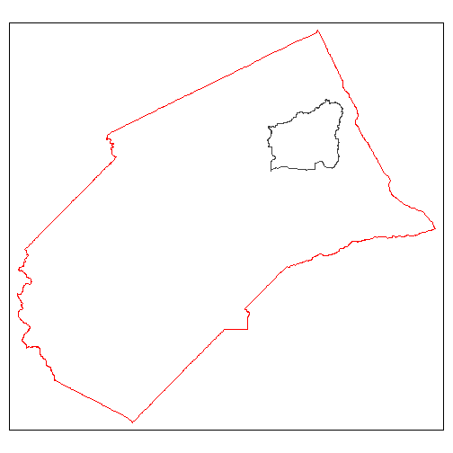
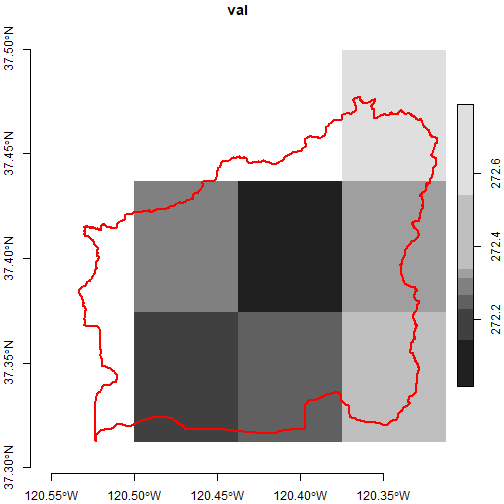
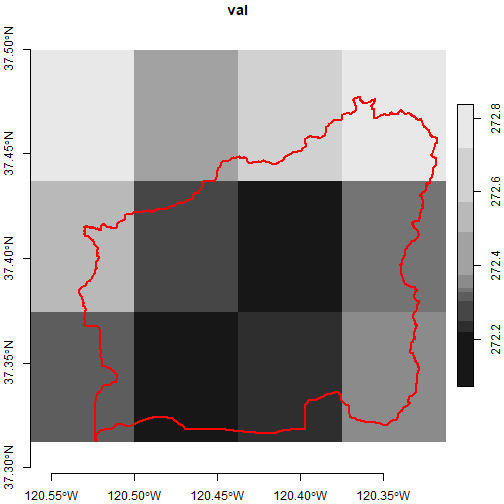
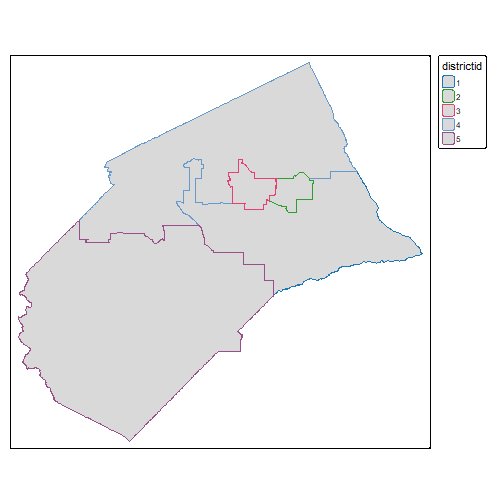
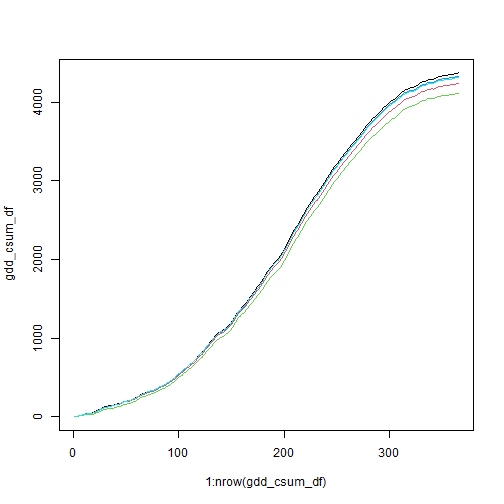
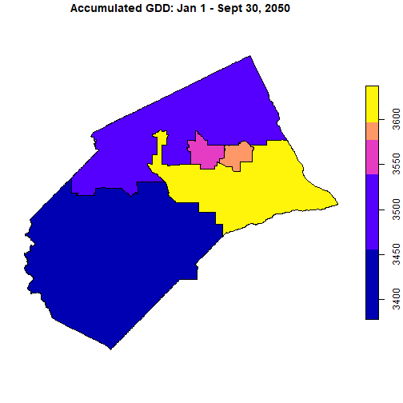

<style type="text/css">
p.indented2 {margin-left:2em;}
</style>


## Think of rasters as arrays

The term 'raster' is pretty familiar and intuitive to anyone with a little experience with remote sensing or even photography. However to work effectively and efficiently with raster data from Cal-Adapt using the powerful functions from the stars package, you'll get more mileage if you think of your data in terms of **arrays**.

Like rasters, arrays are structures for organizing data in multiple dimensions, including regular grids and layers (i.e., bands). Rasters are a kind of array, but arrays are more general and extensible than rasters. For example arrays can have more than 3 dimensions. Below we will convert Cal-Adapt raster data into six dimensional arrays, where the dimensions include x, y, date, gcm, scenario, and climate variable.

You might ask - why would anyone want to work with a 6-dimensional array, instead the more intuitive raster format where the layers represent slices of time? If you only have a single 3D raster to deal with, then yes the standard raster methods and functions would probably suffice. However if you're dealing with data from climate models, you're probably going to have to work with many rasters, representing different emission scenarios, GCMs, and climate variables. Quite likely your analysis will also have to apply the same analysis to several rasters, and combine or compare the results.

In the [Rasters Part I](rasters-pt1.html) vignette, we saw how to work programmatically with individual stars objects saved in a list, with the assistance of a list 'index' created by `ca_stars_index()`. But this approach can be klunky. By combining all your rasters into a high dimensional array, you can write code which is a lot more concise, consistent, and (eventually) intuitive. In this vignette, we'll see how combine all the 3D stars objects you downloaded from Cal-Adapt into a single six-dimensional stars object, or climate data cube, and slice and dice the data using square bracket notation and dplyr verbs for analysis.

## Import Merced County raster data

Start by loading the packages we'll use:


``` r
library(caladaptr)
library(dplyr)
library(sf)
library(stars)
library(magrittr)
library(tmap)
library(lubridate)
```

Next, we import the TIF files we downloaded in [Rasters Part I](rasters-pt1.html).


``` r
data_dir <- tools::R_user_dir("caladaptr", which = "data")
merced_dir <- file.path(data_dir, "merced")
merced_tifs_fn <- list.files(merced_dir, pattern = ".tif$", full.names = TRUE)
basename(merced_tifs_fn)
#>  [1] "tasmax_day_CanESM2_rcp45_fips-06047.tif"    "tasmax_day_CanESM2_rcp85_fips-06047.tif"    "tasmax_day_CNRM-CM5_rcp45_fips-06047.tif"  
#>  [4] "tasmax_day_CNRM-CM5_rcp85_fips-06047.tif"   "tasmax_day_HadGEM2-ES_rcp45_fips-06047.tif" "tasmax_day_HadGEM2-ES_rcp85_fips-06047.tif"
#>  [7] "tasmax_day_MIROC5_rcp45_fips-06047.tif"     "tasmax_day_MIROC5_rcp85_fips-06047.tif"     "tasmin_day_CanESM2_rcp45_fips-06047.tif"   
#> [10] "tasmin_day_CanESM2_rcp85_fips-06047.tif"    "tasmin_day_CNRM-CM5_rcp45_fips-06047.tif"   "tasmin_day_CNRM-CM5_rcp85_fips-06047.tif"  
#> [13] "tasmin_day_HadGEM2-ES_rcp45_fips-06047.tif" "tasmin_day_HadGEM2-ES_rcp85_fips-06047.tif" "tasmin_day_MIROC5_rcp45_fips-06047.tif"    
#> [16] "tasmin_day_MIROC5_rcp85_fips-06047.tif"
```

Import the TIF files as a list of stars objects:


``` r
mercd_stars_lst <- ca_stars_read(merced_tifs_fn)
names(mercd_stars_lst)
#>  [1] "tasmax_day_CanESM2_rcp45_fips-06047"    "tasmax_day_CanESM2_rcp85_fips-06047"    "tasmax_day_CNRM-CM5_rcp45_fips-06047"  
#>  [4] "tasmax_day_CNRM-CM5_rcp85_fips-06047"   "tasmax_day_HadGEM2-ES_rcp45_fips-06047" "tasmax_day_HadGEM2-ES_rcp85_fips-06047"
#>  [7] "tasmax_day_MIROC5_rcp45_fips-06047"     "tasmax_day_MIROC5_rcp85_fips-06047"     "tasmin_day_CanESM2_rcp45_fips-06047"   
#> [10] "tasmin_day_CanESM2_rcp85_fips-06047"    "tasmin_day_CNRM-CM5_rcp45_fips-06047"   "tasmin_day_CNRM-CM5_rcp85_fips-06047"  
#> [13] "tasmin_day_HadGEM2-ES_rcp45_fips-06047" "tasmin_day_HadGEM2-ES_rcp85_fips-06047" "tasmin_day_MIROC5_rcp45_fips-06047"    
#> [16] "tasmin_day_MIROC5_rcp85_fips-06047"
```

## Create a 6D data cube

`ca_stars_6d()` takes a list of 3D stars objects and returns a 6D stars object. The new dimensions are generated from the Cal-Adapt metadata that was first saved in sidecar files when you downloaded the TIF files, and imported along with the TIFs when you ran `ca_stars_read()`.

There are two important requirements for combining multiple 3D stars objects into one 6D stars object:

1. The stars objects (TIFs) must all cover for same spatial area.

2. The climate variables of the individual stars objects must use the same units. For example you can combine *tasmin* and *tasmax* into a 6D raster, because their units are both degrees Kelvin. But you can't combine temperature and precipitation.

Turn the list of 3D stars objects into a 6 stars object:


``` r
(mercd_stars_6d <- ca_stars_6d(mercd_stars_lst))
#> stars object with 6 dimensions and 1 attribute
#> attribute(s), summary of first 1e+05 cells:
#>          Min.  1st Qu.   Median     Mean  3rd Qu.     Max.  NA's
#> val  276.0979 285.4992 287.7837 287.9336 290.1285 299.0094 58748
#> dimension(s):
#>          from   to     offset   delta refsys point             values x/y
#> x           1   20     -121.2  0.0625 WGS 84 FALSE               NULL [x]
#> y           1   16      37.69 -0.0625 WGS 84 FALSE               NULL [y]
#> scenario    1    2         NA      NA     NA    NA       rcp45, rcp85    
#> gcm         1    4         NA      NA     NA    NA CanESM2,...,MIROC5    
#> date        1 7670 2045-01-01  1 days   Date    NA               NULL    
#> cvar        1    2         NA      NA     NA    NA     tasmax, tasmin
```

Note the addition of dimensions for `scenario`, `gcm`, and `cvar`. In this example, these dimensions have 2 or more values, but even if there was only one value in the list of stars objects they will still be included in the stars object returned by `ca_stars_6d()`.

These extra dimensions can be used to subset the stars object. For example if we just wanted the climate variables for emissions scenario rcp85, GCM MIROC5, and Jan-March, we could write an expression for `filter()`:


``` r
(mercd_stars_6d %>%
  filter(scenario == "rcp85", gcm == "MIROC5", month(date) <= 3))
#> stars object with 6 dimensions and 1 attribute
#> attribute(s), summary of first 1e+05 cells:
#>          Min.  1st Qu.   Median     Mean  3rd Qu.     Max.  NA's
#> val  278.0172 286.6794 289.8948 290.3535 293.5023 303.4041 58748
#> dimension(s):
#>          from   to offset   delta refsys point                    values x/y
#> x           1   20 -121.2  0.0625 WGS 84 FALSE                      NULL [x]
#> y           1   16  37.69 -0.0625 WGS 84 FALSE                      NULL [y]
#> scenario    1    1     NA      NA     NA    NA                     rcp85    
#> gcm         1    1     NA      NA     NA    NA                    MIROC5    
#> date        1 1895     NA      NA   Date    NA 2045-01-01,...,2065-03-31    
#> cvar        1    2     NA      NA     NA    NA            tasmax, tasmin
```

## Subsetting with square brackets

An alternative way of subsetting a stars object is with square brackets, similar to how you can subset matrices or arrays in base R.

The template for subsetting our 6D array looks like:

<p class="indented2" style="font-family:monospace;">
my_6d_stars_object[*spatial object or a attribute*, *x-indices*, *y-indices*, *scenario indices*, *gcm indices*, *date indices*, *cvar-indices*]
</p>

<p class="indented2">
**TIP**: Square bracket notation is the *only* way you can subset rasters that have a single row or single column.
</p>

Square bracket notation is common with matrices and data frames in base R, but there are a couple of key differences between subsetting a stars object and a traditional matrix.

1. The first slot allows you to pass a spatial object, which will be used to perform a spatial query, or the name of an attribute. Hence there will be one extra comma in the square brackets. In this context *attribute* refers to the attributes of the stars object (i.e., names of the array  values), not a vector feature. Our 6D stars object only has one attribute, `val`, but stars object are capable of having multiple attributes for each element of the array.

2. The expressions for the dimensions can only accept indices, not logical values or dimension values. Expressions like `cvar == 'MIROC5'`, that would work fine to subset a regular matrix, won't work for a stars object. Logical expressions can of course be easily converted to indices using `which()`.

3. Similar to traditional subsetting, if you omit an expression all values for that dimension will be returned. Commas should not be omitted, unless there are no other expressions that follow.

\

### Example 1. Square bracket notation to subet multiple dimensions simultaneously

The following examples demonstrate how to subset with square brackets to get a subset consisting of:

i) emissions scenario: `rcp85`
ii) GCM: `CNRM-CM5` or `MIROC5`
iii) date: winter monthly only (December thru March)


``` r
(scen_idx <- mercd_stars_6d %>%
  st_get_dimension_values("scenario") %>%
  equals("rcp45") %>%
  which())
#> [1] 1

(gcm_idx <- mercd_stars_6d %>%
  st_get_dimension_values("gcm") %>%
  is_in( c("CNRM-CM5", "MIROC5")) %>%
  which())
#> [1] 2 4

date_idx <- mercd_stars_6d %>%
  st_get_dimension_values("date") %>%
  month() %>%
  is_in( c(12, 1, 2, 3)) %>%
  which()
str(date_idx)
#>  int [1:2546] 1 2 3 4 5 6 7 8 9 10 ...

mercd_stars_6d[ , , , scen_idx, gcm_idx, date_idx, ]
#> stars object with 6 dimensions and 1 attribute
#> attribute(s), summary of first 1e+05 cells:
#>          Min.  1st Qu.   Median     Mean  3rd Qu.     Max.  NA's
#> val  279.2779 285.8354 288.1668 288.8418 291.2101 304.4528 58748
#> dimension(s):
#>          from   to offset   delta refsys point                                              values x/y
#> x           1   20 -121.2  0.0625 WGS 84 FALSE                                                NULL [x]
#> y           1   16  37.69 -0.0625 WGS 84 FALSE                                                NULL [y]
#> scenario    1    1     NA      NA     NA    NA                                               rcp45    
#> gcm         1    2     NA      NA     NA    NA                                  CNRM-CM5, MIROC5      
#> date        1 2546     NA      NA   Date    NA [2045-01-01,2045-01-02),...,[2065-12-31,2066-01-01)    
#> cvar        1    2     NA      NA     NA    NA                                      tasmax, tasmin
```

### Example 2. Square bracket notation within a loop

If we wanted to aggregate pixel values across time using a function such as accumulated GDD, for all combinations of emissions scenario and GCM, we could use square bracket notation within a loop.

In the following example, a double loop is set up to loop through scenarios followed by GCMs. Cumulative GDD is then computed and saved to a list.


``` r
## Get the names for the scenarios and GCM. We will loop through these.
(scen_names <- mercd_stars_6d %>% st_get_dimension_values("scenario"))
#> [1] "rcp45" "rcp85"
(gcm_names <- mercd_stars_6d %>% st_get_dimension_values("gcm"))
#> [1] "CanESM2"    "CNRM-CM5"   "HadGEM2-ES" "MIROC5"

## Select a range of dates in 2050. If we wanted all years this could also go into a loop.
date_idx <- mercd_stars_6d %>%
  st_get_dimension_values("date") %>%
  year() %>%
  `==`(2050) %>%
  which()

## Create a pixel aggregation function that computes the accumulated GDD.
## The argument x will be a 2-column matrix where the rows are dates and
## and the columns are cvars (tasmax and tasmin)
gdd_csum <- function(x, basetemp) {
 cumsum( (apply(x - 273, MARGIN = 1, sum) / 2) - basetemp)
}

## Create a blank list to hold the results
gdd_stars_lst <- list()

for (sc_idx in 1:length(scen_names)) {

  ## Create a first level list for this scenario
  gdd_stars_lst[[scen_names[sc_idx]]] <- list()

  for (gcm_idx in 1:length(gcm_names)) {

    ## Add the stars element to the first level list
    gdd_stars_lst[[scen_names[sc_idx]]][[gcm_names[gcm_idx]]] <-
      mercd_stars_6d[ , , , sc_idx, gcm_idx, date_idx, ] %>%
      st_apply(MARGIN = c("x", "y", "scenario", "gcm"),
                           FUN = gdd_csum, basetemp = 7,
                           .fname = "my_gdd_csum", single_arg = TRUE) %>%
      setNames("gdd_csum")
  }
}

sapply(gdd_stars_lst, names)
#>      rcp45        rcp85       
#> [1,] "CanESM2"    "CanESM2"   
#> [2,] "CNRM-CM5"   "CNRM-CM5"  
#> [3,] "HadGEM2-ES" "HadGEM2-ES"
#> [4,] "MIROC5"     "MIROC5"
```

## Spatial Subsetting

You can spatially subset a stars object by passing a sf object to the first slot in the square brackets, or by using `st_crop()`. The two methods are equivalent. sf object must be in the same CRS as the stars object.

For example suppose we were only interested in the Black Rascal Creek HUC10 watershed, which lies in Merced County:


``` r
mercd_bnd_sf <- ca_aoipreset_geom("counties") %>%
  filter(fips == "06047") %>%
  select(name, state_name, fips) %>%
  st_transform(4326)
#> Reading layer `counties' from data source `C:\Users\Andy\AppData\Local\R\cache\R\caladaptr\counties.gpkg' using driver `GPKG'
#> Simple feature collection with 87 features and 54 fields
#> Geometry type: MULTIPOLYGON
#> Dimension:     XY
#> Bounding box:  xmin: -13871160 ymin: 3833648 xmax: -12625080 ymax: 5416187
#> Projected CRS: WGS 84 / Pseudo-Mercator

black_rascal_creek_sf <- ca_aoipreset_geom("hydrounits") %>%
  filter(huc10 == "1804000114") %>%
  st_transform(4326)
#> Reading layer `hydrounits' from data source `C:\Users\Andy\AppData\Local\R\cache\R\caladaptr\hydrounits.gpkg' using driver `GPKG'
#> Simple feature collection with 958 features and 15 fields
#> Geometry type: MULTIPOLYGON
#> Dimension:     XY
#> Bounding box:  xmin: -13863190 ymin: 3808721 xmax: -12735560 ymax: 5186222
#> Projected CRS: WGS 84 / Pseudo-Mercator

tm_shape(mercd_bnd_sf) +
  tm_borders(col = "red") +
  tm_shape(black_rascal_creek_sf) +
  tm_borders()
```



To subset our 6D stars object with square bracket notation, we simply put a sf object in the first slot:


``` r
(mercd_stars_6d[black_rascal_creek_sf, , , , , , ])
#> stars object with 6 dimensions and 1 attribute
#> attribute(s), summary of first 1e+05 cells:
#>          Min.  1st Qu.   Median     Mean  3rd Qu.     Max.  NA's
#> val  278.0972 292.3456 300.7236 300.3874 308.6533 318.9679 41668
#> dimension(s):
#>          from   to     offset   delta refsys point             values x/y
#> x          12   15     -121.2  0.0625 WGS 84 FALSE               NULL [x]
#> y           4    6      37.69 -0.0625 WGS 84 FALSE               NULL [y]
#> scenario    1    2         NA      NA     NA    NA       rcp45, rcp85    
#> gcm         1    4         NA      NA     NA    NA CanESM2,...,MIROC5    
#> date        1 7670 2045-01-01  1 days   Date    NA               NULL    
#> cvar        1    2         NA      NA     NA    NA     tasmax, tasmin
```

\

<p class="indented2">
**TIP**: If you pass a sf object in slot 1 of square brakets, the rest of the slots are ignored and the remaining commas can be omitted. Hence you can't spatially subset a stars object while simultaneously subsetting along dimension(s). Spatial subsetting an dimension subsetting need to be in separate expressions.
</p>

\

Here's what spatial subsetting looks like with `st_crop()`:


``` r
(brc_stars_6d <- mercd_stars_6d %>% st_crop(black_rascal_creek_sf, crop = TRUE))
#> stars object with 6 dimensions and 1 attribute
#> attribute(s), summary of first 1e+05 cells:
#>          Min.  1st Qu.   Median     Mean  3rd Qu.     Max.  NA's
#> val  278.0972 292.3456 300.7236 300.3874 308.6533 318.9679 41668
#> dimension(s):
#>          from   to     offset   delta refsys point             values x/y
#> x          12   15     -121.2  0.0625 WGS 84 FALSE               NULL [x]
#> y           4    6      37.69 -0.0625 WGS 84 FALSE               NULL [y]
#> scenario    1    2         NA      NA     NA    NA       rcp45, rcp85    
#> gcm         1    4         NA      NA     NA    NA CanESM2,...,MIROC5    
#> date        1 7670 2045-01-01  1 days   Date    NA               NULL    
#> cvar        1    2         NA      NA     NA    NA     tasmax, tasmin
```

`crop = TRUE` (the default) tells it to reduce the extent of cropped object. Alternately it would keep the original number of rows and columns and set those outside the cropped are to NA.

To verify we can plot the subset area (with additional filters to just get one layer) overlaid by the watershed boundary:


``` r
plot(brc_stars_6d %>% filter(scenario == "rcp45", gcm == "MIROC5",
                             date == as.Date("2050-01-01"), cvar == "tasmin"),
     axes = TRUE, reset = FALSE)
plot(black_rascal_creek_sf %>% st_geometry(), border = "red", lwd = 2, add = TRUE)
```



This plot reflects the intersection rule that `st_crop()` applies to the pixels along the edges of the polygon. In order for a pixel to be counted as part of the intersection, the center needs to be within the polygon boundary. If you wanted to err on the side of inclusion, you could crop using the extent of the watershed boundary:


``` r
(brc_bb_stars_6d <- mercd_stars_6d %>%
   st_crop(black_rascal_creek_sf %>% st_bbox() %>% st_as_sfc(), crop = TRUE))
#> stars object with 6 dimensions and 1 attribute
#> attribute(s), summary of first 1e+05 cells:
#>          Min.  1st Qu.   Median     Mean  3rd Qu.     Max.
#> val  278.0972 292.3031 300.6886 300.3325 308.5641 318.9679
#> dimension(s):
#>          from   to     offset   delta refsys point             values x/y
#> x          12   15     -121.2  0.0625 WGS 84 FALSE               NULL [x]
#> y           4    6      37.69 -0.0625 WGS 84 FALSE               NULL [y]
#> scenario    1    2         NA      NA     NA    NA       rcp45, rcp85    
#> gcm         1    4         NA      NA     NA    NA CanESM2,...,MIROC5    
#> date        1 7670 2045-01-01  1 days   Date    NA               NULL    
#> cvar        1    2         NA      NA     NA    NA     tasmax, tasmin

plot(brc_bb_stars_6d %>% filter(scenario == "rcp45", gcm == "MIROC5",
                             date == as.Date("2050-01-01"), cvar == "tasmin"),
     axes = TRUE, reset = FALSE)
plot(black_rascal_creek_sf %>% st_geometry(), border = "red", lwd = 2, add = TRUE)

```



## Spatial Aggregation

Spatial aggregation combines extracting pixel values for spatial features with an aggregation function like `mean` that collapses the values into a single number for each feature. The output is a stars vector cube, which is like a sf object however the attribute table is a multidimensional array.

You can use [`aggregate()`](https://r-spatial.github.io/stars/reference/aggregate.stars.html) for spatial aggregations with stars objects. `aggregate()` can also be used to aggregate values over time, but you can't do both in the same call. When used for spatial aggregation, the inputs into `aggregate()` include a stars object and a sf object.

Unlike the more flexible `st_apply()`, the `aggregate()` can only aggregate one attribute (layer) at a time. In other words, if you need to combine time series data into a single metric (such as GDD), and also aggregate the results by polygons, you have to break them into different steps. You can either aggregate the time data by polygon and then compute GDD metric, or compute the GDD metric by pixel (using `st_apply()`) and then aggregate those by polygon. The choice of order will affect the results.

### Compute Accumulated GDD for Merced County Supervisor Districts

To illustrate how temporal and spatial aggregation can be combined, we'll compute the projected accumulated GDD for the Merced County Board of Supervisors Districts for one calendar year, one emissions scenario, and one GCM. We'll first compute daily GDD for each pixel, so that we can take advantage of the fine scale resolution of the data. Next we'll use `aggregate()` to get the mean daily GDD for each district. Lastly, we'll go back to `st_apply()` to generate the cumulative sum of the mean daily GDD for each district.

Begin by importing the supervisor district boundaaries ([source](https://geostack-mercedcounty.opendata.arcgis.com/)):


``` r
mercd_bos_dist_fn <- file.path(merced_dir, "mercd_bos_dist.geojson") %>% normalizePath()

if (!file.exists(mercd_bos_dist_fn)) {
  download.file("https://raw.githubusercontent.com/ucanr-igis/caladaptr-res/main/geoms/merced_bos_districts.geojson", mercd_bos_dist_fn, quiet = TRUE)
}

(mercd_bos_dist_sf <- st_read(mercd_bos_dist_fn, quiet = TRUE) %>%
  select(districtid))
#> Simple feature collection with 5 features and 1 field
#> Geometry type: MULTIPOLYGON
#> Dimension:     XY
#> Bounding box:  xmin: -121.2487 ymin: 36.74039 xmax: -120.0521 ymax: 37.63337
#> Geodetic CRS:  WGS 84
#>   districtid                       geometry
#> 1          1 MULTIPOLYGON (((-120.5824 3...
#> 2          4 MULTIPOLYGON (((-121.0675 3...
#> 3          5 MULTIPOLYGON (((-120.6155 3...
#> 4          2 MULTIPOLYGON (((-120.5048 3...
#> 5          3 MULTIPOLYGON (((-120.5953 3...

tm_shape(mercd_bos_dist_sf) + tm_fill(col = "districtid")
```



Next we simplify the task by creating a stars object with daily min / max temp for just one year, one emissions scenario, and GCM:


``` r
(mercd_2050_stars <- mercd_stars_6d %>%
  filter(scenario == "rcp45", gcm == "MIROC5", year(date) == 2050))
#> stars object with 6 dimensions and 1 attribute
#> attribute(s):
#>          Min.  1st Qu.   Median    Mean  3rd Qu.     Max.   NA's
#> val  268.8781 282.9231 289.3158 291.674 300.5461 320.2531 137240
#> dimension(s):
#>          from  to     offset   delta refsys point         values x/y
#> x           1  20     -121.2  0.0625 WGS 84 FALSE           NULL [x]
#> y           1  16      37.69 -0.0625 WGS 84 FALSE           NULL [y]
#> scenario    1   1         NA      NA     NA    NA          rcp45    
#> gcm         1   1         NA      NA     NA    NA         MIROC5    
#> date        1 365 2050-01-01  1 days   Date    NA           NULL    
#> cvar        1   2         NA      NA     NA    NA tasmax, tasmin
```

Next, compute the daily GDD (see the [Rasters Part 1](rasters-pt1.html) vignette for details):


``` r
gdd_daily_2args <- function(x1, x2, basetemp) {((x1 + x2) / 2) - 273.15 - basetemp}

(mercd_2050_dlygdd_stars <- mercd_2050_stars %>%
    st_apply(MARGIN = c("x", "y", "scenario", "gcm", "date"),
             FUN = gdd_daily_2args, basetemp = 7,
             .fname = "dly_gdd", single_arg = FALSE))
#> stars object with 5 dimensions and 1 attribute
#> attribute(s):
#>               Min. 1st Qu.   Median     Mean  3rd Qu.     Max.  NA's
#> dly_gdd  -6.116125  5.6051 11.43466 11.52398 17.02358 27.52923 68620
#> dimension(s):
#>          from  to     offset   delta refsys point values x/y
#> x           1  20     -121.2  0.0625 WGS 84 FALSE   NULL [x]
#> y           1  16      37.69 -0.0625 WGS 84 FALSE   NULL [y]
#> scenario    1   1         NA      NA     NA    NA  rcp45    
#> gcm         1   1         NA      NA     NA    NA MIROC5    
#> date        1 365 2050-01-01  1 days   Date    NA   NULL
```

Now we're ready to use `aggregate()` to get the average daily GDD for each Supervisor district. We are averaging across the polygons, but the daily values (i.e., time dimension) are still kept separate because we're going to need to create the cumulative sum in the final step.


``` r
(bod_2050_dlygdd_stars <- mercd_2050_dlygdd_stars %>%
  aggregate(by = mercd_bos_dist_sf, FUN = mean))
#> stars object with 4 dimensions and 1 attribute
#> attribute(s):
#>               Min.  1st Qu.   Median     Mean  3rd Qu.     Max.
#> dly_gdd  -2.937308 5.640863 11.66823 11.71801 17.26827 26.58949
#> dimension(s):
#>          from  to     offset  delta refsys point                                                        values
#> geometry    1   5         NA     NA WGS 84 FALSE MULTIPOLYGON (((-120.5824...,...,MULTIPOLYGON (((-120.5953...
#> scenario    1   1         NA     NA     NA    NA                                                         rcp45
#> gcm         1   1         NA     NA     NA    NA                                                        MIROC5
#> date        1 365 2050-01-01 1 days   Date    NA                                                          NULL
```

We now have 365 daily GDD values for each of 5 poglyons. Our last step is to create the cumulative sum:


``` r
bod_2050_csumgdd_stars <- bod_2050_dlygdd_stars %>%
  st_apply(MARGIN = c("geometry", "scenario", "gcm"),
           FUN = cumsum, .fname = "date") %>%
  aperm(c(2,3,4,1)) %>%
  setNames("csum_gdd")

## Copy the properties of the 'date' dimension
st_dimensions(bod_2050_csumgdd_stars)["date"] <- st_dimensions(bod_2050_dlygdd_stars)["date"]

bod_2050_csumgdd_stars
#> stars object with 4 dimensions and 1 attribute
#> attribute(s):
#>                 Min.  1st Qu.  Median    Mean  3rd Qu.     Max.
#> csum_gdd  -0.6124481 443.5684 1775.67 1990.72 3553.634 4376.372
#> dimension(s):
#>          from  to     offset  delta refsys point                                                        values
#> geometry    1   5         NA     NA WGS 84 FALSE MULTIPOLYGON (((-120.5824...,...,MULTIPOLYGON (((-120.5953...
#> scenario    1   1         NA     NA     NA    NA                                                         rcp45
#> gcm         1   1         NA     NA     NA    NA                                                        MIROC5
#> date        1 365 2050-01-01 1 days   Date    NA                                                          NULL
```

Plot the accumulated curves (one curve for each Supervisor District):


``` r
gdd_csum_df <- bod_2050_csumgdd_stars[, , , , drop=TRUE] %>%
  pull(1) %>%
  t() %>%
  as.data.frame() %>%
  setNames(c("Dist1", "Dist2", "Dist3", "Dist4", "Dist5"))

matplot(x = 1:nrow(gdd_csum_df), y = gdd_csum_df, type="l", lty = 1)
```



Plot the accumulated GDD per Supervisor district as of Sept 30, 2050.


``` r
plot(bod_2050_csumgdd_stars %>% filter(date == as.Date("2050-09-30")),
     main = "Accumulated GDD: Jan 1 - Sept 30, 2050")
```




