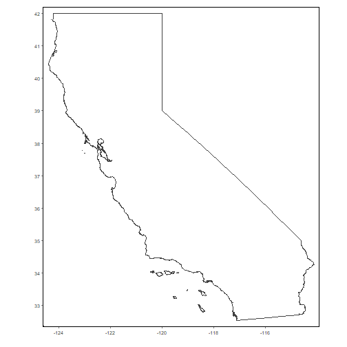
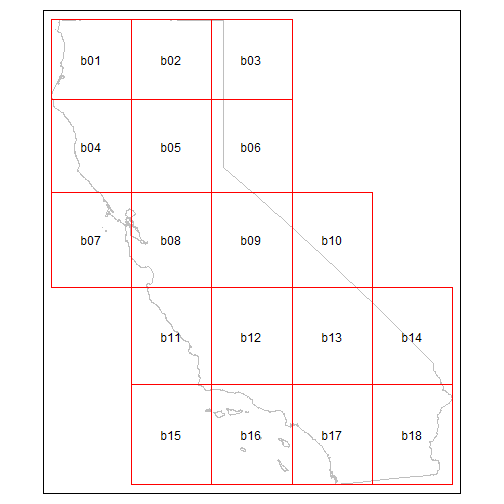
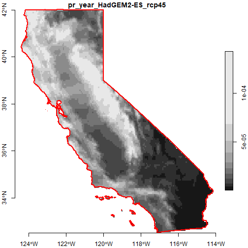
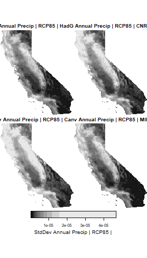

<style type="text/css">
p.indented2 {margin-left:2em;}
</style>


## Introdution

The Cal-Adapt API is a great way to get rasters, because you can specify exactly the area you want, the climate variable(s) you want, and the time frame you want. However raster files are inherently large, and there's an upper limit on how large of an area you get with one call. Hence we need some strategies to download and work with rasters for large areas (such as the state of California).

This vignette outlines an approach for downloading and working with rasters for large areas. The essence of the strategy is to 1) downloading rasters in a series of blocks that collectively cover the entire area-of-interest, and 2) mosaic the individual blocks to get one seamless raster. We'll also see how you can combine multiple 3D mosaiced rasters into a single six-dimensional raster, as explained in [Part 2](rasters-pt2.html), and use parallel processing to speed up pixelwise operations.

But first...

### Downloading NetCDF Files

An alternative to downloading rasters through the API is to simply download the source NetCDF files from the [Cal-Adapt Data Server](http://albers.cnr.berkeley.edu/data/). NetCDF files for the full extent of Cal-Adapt's LOCA downscaled data at a daily time scale are available for download by FTP/HTTP. You can import NetCDF files into R using `stars::read_stars()` as well as other packages. `caladaptr` does not provide any functions or support for the original NetCDF data.

{style="width:363px; height:390px;"} \

*NetCDF files for the full extent of Cal-Adapt's LOCA downscaled climate data are available for download from the Cal-Adapt Data Server*

## Break-up a large area-of-interest into blocks

To illustrate working with large areas, in this example we'll download TIFs for 50 years of annual precipitation data for several scenarios and GCMs, and the entire state of California.

First load packages:


``` r
library(caladaptr)
library(dplyr)
library(sf)
library(stars)
library(magrittr)
library(tmap)
tmap_mode("plot")
```

We begin by importing the state boundary:


``` r
ca_bnd_url <- "https://raw.githubusercontent.com/ucanr-igis/caladaptr-res/main/geoms/ca_bnd.geojson"
ca_bnd_sf <- st_read(ca_bnd_url, quiet = TRUE)
tm_shape(ca_bnd_sf) + tm_borders() + tm_grid(labels.show = TRUE, lines = FALSE)
```



\

The entire state is far too big to use in an API call, but we can break it up into blocks that are 20,000 mi^2^ or less using `ca_biggeom_blocks()`:


``` r
ca_bnd_blocks_sf <- ca_biggeom_blocks(ca_bnd_sf, block_area_mi2 = 20000)

tm_shape(ca_bnd_sf) +
  tm_borders(col = "gray") +
  tm_shape(ca_bnd_blocks_sf) +
  tm_borders(col = "red") +
  tm_text("id")
```



## Download TIFs

The first step to download TIFs is to construct an API request. We'll make a request for yearly precipitation totals for 50 years, 2 emissions scenarios, and 4 GCMs:


``` r
## Create a CAP
ca_pr_cap <- ca_loc_sf(loc = ca_bnd_blocks_sf, idfld = "id") %>%
  ca_gcm(gcms[1:4]) %>%
  ca_period("year") %>%
  ca_cvar("pr") %>%
  ca_scenario(c("rcp45", "rcp85")) %>%
  ca_years(start = 2050, end = 2099)

ca_pr_cap %>% ca_preflight(check_for = "getrst")
#> General issues
#>  - none found
#> Issues for downloading rasters
#>  - none found
```

\

Next we download the TIFs by calling `ca_getrst_stars()`. This may take a few minutes, but we don't have to monitor it.

\

<p class="indented2">
**TIP**: A good practice when downloading large amounts of data is to be mindful where it gets saved, and use `overwrite = FALSE` so you don't download the same raster twice. If you're downloading data for several projects / locations, create a data download directory for each one so the TIFs for blocked areas don't get mixed up.
</p>

\


``` r
data_dir <- tools::R_user_dir("caladaptr", which = "data")
ca_pryr_dir <- file.path(data_dir, "ca_pr-year") %>% normalizePath(mustWork = FALSE)
if (!file.exists(ca_pryr_dir)) dir.create(ca_pryr_dir, recursive = TRUE)

ca_pryr_tifs <- ca_pr_cap %>%
  ca_getrst_stars(out_dir = ca_pryr_dir, mask = TRUE, quiet = TRUE,
                  normalize_path = TRUE, overwrite = FALSE)

ca_pryr_tifs %>% basename() %>% str()
#>  chr [1:144] "pr_year_HadGEM2-ES_rcp45_id-b01.tif" "pr_year_CNRM-CM5_rcp45_id-b01.tif" "pr_year_CanESM2_rcp45_id-b01.tif" ...
```

## Import TIFs and mosaic them

After you've downloaded TIFs in blocks, the next step is to use `ca_stars_read()` to import them in R as list of stars objects:


``` r
ca_pryr_blcks_stars_lst <- ca_pryr_tifs %>%
  ca_stars_read()

length(ca_pryr_blcks_stars_lst)
#> [1] 144

names(ca_pryr_blcks_stars_lst) %>% head(20)
#>  [1] "pr_year_HadGEM2-ES_rcp45_id-b01" "pr_year_CNRM-CM5_rcp45_id-b01"   "pr_year_CanESM2_rcp45_id-b01"    "pr_year_MIROC5_rcp45_id-b01"    
#>  [5] "pr_year_HadGEM2-ES_rcp85_id-b01" "pr_year_CNRM-CM5_rcp85_id-b01"   "pr_year_CanESM2_rcp85_id-b01"    "pr_year_MIROC5_rcp85_id-b01"    
#>  [9] "pr_year_HadGEM2-ES_rcp45_id-b02" "pr_year_CNRM-CM5_rcp45_id-b02"   "pr_year_CanESM2_rcp45_id-b02"    "pr_year_MIROC5_rcp45_id-b02"    
#> [13] "pr_year_HadGEM2-ES_rcp85_id-b02" "pr_year_CNRM-CM5_rcp85_id-b02"   "pr_year_CanESM2_rcp85_id-b02"    "pr_year_MIROC5_rcp85_id-b02"    
#> [17] "pr_year_HadGEM2-ES_rcp45_id-b03" "pr_year_CNRM-CM5_rcp45_id-b03"   "pr_year_CanESM2_rcp45_id-b03"    "pr_year_MIROC5_rcp45_id-b03"
```

\

<p class="indented2">
**TIP: Monitoring memory usage**. The default mode of importing stars objects is for them to be read into memory. Depending on the size of your study area, the number of layers, and the amount of RAM in your computer, this can potentially consume a lot of memory, and in extreme cases slow your computer to a crawl.
</p>

<p class="indented2">
There are several packages you can use to monitor how much memory different R objects are using. To see how much memory an object is using with base R, you can run `object.size(x) %>% format(units = "Mb")`.
</p>

<p class="indented2">
If your stars objects are too big for memory, you can be selective about which layers are imported and when. Deleting objects when no longer needed can also help. Alternately you can import TIFs as *stars proxy* objects, by passing `proxy = TRUE` to `ca_stars_read()`. Stars proxy objects are more like pointers to the files on disk, so they are very small. Data is only read when actually needed for analysis or plotting. For more info, see the vignette on [stars proxy objects](https://r-spatial.github.io/stars/articles/stars2.html).
</p>

\

At this point we have a list with 144 stars objects, representing several GCMs, scenarios, and 18 blocks that collectively cover all of California. That's still pretty unwieldy, but we can mosaic them with `ca_stars_mosaic()`. This will return either a list of stars objects (`combine_6d = FALSE`, default), or a single stars object (`combine_6d = TRUE`).

We'll start by creating a list of mosaiced rasters (the default). Our list will have one 3D raster for each dataset (slug). The `geom_mask` argument tells it we want the mosaic returned masked by the original area-of-interest (in this case the state boundary):


``` r
ca_pryr_blcks_mos_lst <- ca_pryr_blcks_stars_lst %>%
  ca_stars_mosaic(geom_mask = ca_bnd_sf)
#>  - mosaicing 18 stars rasters for pr_year_HadGEM2-ES_rcp45
#>  - mosaicing 18 stars rasters for pr_year_CNRM-CM5_rcp45
#>  - mosaicing 18 stars rasters for pr_year_CanESM2_rcp45
#>  - mosaicing 18 stars rasters for pr_year_MIROC5_rcp45
#>  - mosaicing 18 stars rasters for pr_year_HadGEM2-ES_rcp85
#>  - mosaicing 18 stars rasters for pr_year_CNRM-CM5_rcp85
#>  - mosaicing 18 stars rasters for pr_year_CanESM2_rcp85
#>  - mosaicing 18 stars rasters for pr_year_MIROC5_rcp85

names(ca_pryr_blcks_mos_lst)
#> [1] "pr_year_HadGEM2-ES_rcp45" "pr_year_CNRM-CM5_rcp45"   "pr_year_CanESM2_rcp45"    "pr_year_MIROC5_rcp45"     "pr_year_HadGEM2-ES_rcp85"
#> [6] "pr_year_CNRM-CM5_rcp85"   "pr_year_CanESM2_rcp85"    "pr_year_MIROC5_rcp85"
```

Our list of 144 stars objects has been reduced to 8, each of which covers the entire state of California. Let's look at the properties of the first one:


``` r
ca_pryr_blcks_mos_lst[[1]]
#> stars object with 3 dimensions and 1 attribute
#> attribute(s), summary of first 1e+05 cells:
#>                                   Min.     1st Qu.      Median        Mean      3rd Qu.         Max.  NA's
#> pr_year_HadGEM2-ES_rcp45  2.348845e-07 7.36848e-06 1.62481e-05 2.30751e-05 3.314904e-05 0.0001480115 57527
#> dimension(s):
#>      from  to offset   delta refsys x/y
#> x       1 165 -124.4  0.0625 WGS 84 [x]
#> y       1 153  42.06 -0.0625 WGS 84 [y]
#> year    1  50   2050       1     NA
```

Plot the first year:


``` r
plot(ca_pryr_blcks_mos_lst[[1]] %>% filter(year == 2050), axes = TRUE, reset = FALSE)
plot(ca_bnd_sf %>% st_geometry(), border = "red", lwd = 2, axes = TRUE, add = TRUE)
```



## Create a 6D mosaic

Next, we'll mosaic the 144 3D rasters again, but this time we'll add `combine_6d = TRUE` to tell it we want a single 6D stars object back:


``` r
ca_pryr_blcks_mos_stars <- ca_pryr_blcks_stars_lst %>%
  ca_stars_mosaic(geom_mask = ca_bnd_sf, combine_6d = TRUE)
#>  - mosaicing 18 stars rasters for pr_year_HadGEM2-ES_rcp45
#>  - mosaicing 18 stars rasters for pr_year_CNRM-CM5_rcp45
#>  - mosaicing 18 stars rasters for pr_year_CanESM2_rcp45
#>  - mosaicing 18 stars rasters for pr_year_MIROC5_rcp45
#>  - mosaicing 18 stars rasters for pr_year_HadGEM2-ES_rcp85
#>  - mosaicing 18 stars rasters for pr_year_CNRM-CM5_rcp85
#>  - mosaicing 18 stars rasters for pr_year_CanESM2_rcp85
#>  - mosaicing 18 stars rasters for pr_year_MIROC5_rcp85

ca_pryr_blcks_mos_stars
#> stars object with 6 dimensions and 1 attribute
#> attribute(s), summary of first 1e+05 cells:
#>              Min.      1st Qu.       Median         Mean     3rd Qu.         Max.  NA's
#> val  2.348845e-07 9.056052e-06 2.114469e-05 2.904023e-05 4.29896e-05 0.0001875527 57527
#> dimension(s):
#>          from  to offset   delta refsys                values x/y
#> x           1 165 -124.4  0.0625 WGS 84                  NULL [x]
#> y           1 153  42.06 -0.0625 WGS 84                  NULL [y]
#> scenario    1   2     NA      NA     NA          rcp45, rcp85    
#> gcm         1   4     NA      NA     NA HadGEM2-ES,...,MIROC5    
#> year        1  50   2050       1     NA                  NULL    
#> cvar        1   1     NA      NA     NA                    pr
```

For further discussion and examples of working with 6D climate cubes, see the [Rasters Part 2](rasters-pt2.html) vignette.

Compute the inter-annual variance in precipitation. One of the potential impacts of climate change is increased variability in precipitation. This calculation will tell us relatively speaking which parts of the state may experience more inter-annual variance in precipitation from 2050-2099.


``` r
(ca_pryr_sd_stars <- ca_pryr_blcks_mos_stars %>%
  st_apply(MARGIN = c("x", "y", "scenario", "gcm", "cvar"),
           FUN = sd))
#> stars object with 5 dimensions and 1 attribute
#> attribute(s):
#>             Min.      1st Qu.       Median         Mean      3rd Qu.         Max.   NA's
#> sd  5.237296e-07 2.693959e-06 5.454798e-06 7.165256e-06 1.023519e-05 4.661779e-05 116688
#> dimension(s):
#>          from  to offset   delta refsys                values x/y
#> x           1 165 -124.4  0.0625 WGS 84                  NULL [x]
#> y           1 153  42.06 -0.0625 WGS 84                  NULL [y]
#> scenario    1   2     NA      NA     NA          rcp45, rcp85    
#> gcm         1   4     NA      NA     NA HadGEM2-ES,...,MIROC5    
#> cvar        1   1     NA      NA     NA                    pr
```

We can plot the results by GCM for one emissions scenario.

<p class="indented2">
**TIP**: Note the use of `adrop()` below, which drops all dimensions with a range of 1. This is useful in this case because the stars [`plot()`](https://r-spatial.github.io/stars/reference/plot.html) function creates subplots for each level of the *first* non-spatial dimension. Therefore we want to get rid of all non-spatial dimensions that have a range of 1 (like cvar and scenario), so that subplots will be made for the first remaining dimension that has multiple values (in this case GCM).
</p>


``` r
plot(ca_pryr_sd_stars %>% filter(scenario == "rcp85") %>% adrop(),
      main = "StdDev Annual Precip | RCP85 |")
```




## Parallel Processing

`st_apply()` supports parallelization thru the [`parallel`]() package, which comes with base R. Parallelization splits the work among different cores on your computer (most computers these days have multipore cores). This can improve performance for pixelwise operations, particularly when the aggregation function is computationally intensive ([more info](https://bookdown.org/rdpeng/rprogdatascience/parallel-computation.html)).

Let's compare the amount of time it takes to compute the standard deviation of inter-annual precipitation, with and without parallelization, on a computer that can bring 6 cores into service:


``` r
## Without parallelization
system.time(ca_pryr_blcks_mos_stars %>%
  st_apply(MARGIN = c("x", "y", "scenario", "gcm", "cvar"),
           FUN = sd))
#>    user  system elapsed 
#>    1.83    0.00    1.86

## With parallelization
library(parallel)
my_clust <- makeCluster(6)
system.time(ca_pryr_blcks_mos_stars %>%
  st_apply(MARGIN = c("x", "y", "scenario", "gcm", "cvar"),
           FUN = sd,
           CLUSTER = my_clust))
#>    user  system elapsed 
#>    0.56    0.41    1.15
stopCluster(my_clust)
```


